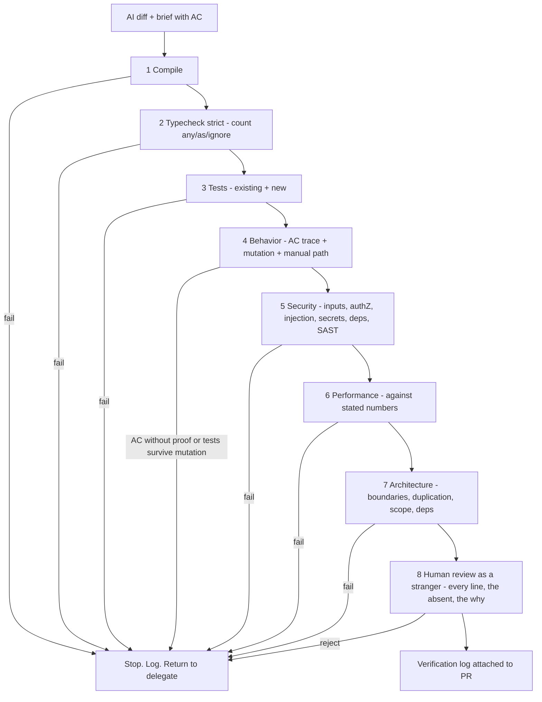

# Module 8.7 — التحقّق من كود AI
## AI Verification: the mandatory 8-step chain — Compile → Typecheck → Tests → Behavior → Security → Performance → Architecture → Human Review; tests that actually test; reviewing AI code as a stranger's code; the verification log

> **المستوى:** Level 8 | **الموقع:** [7 من 11]
> **السابق:** [M8.6 — AI Delegation](module-8.6-ai-delegation.md) | **التالي:** [M8.8 — AI Failure Modes](module-8.8-ai-failure-modes.md)

---

## 1. المتطلبات
> **قبل أن تتعلم هذا، يجب أن تفهم:**
- [ ] الاختبار: الهرم، ما يُثبته وما لا يُثبته، التغطية مقابل الصحّة — [L4-M4.11](../level-4-software-engineering-foundations/module-4.11-testing.md)
- [ ] مراجعة الكود كغريب — [L6-M6.2](../level-6-professional-engineering/module-6.2-code-review.md)
- [ ] قائمة فحص الأمن (OWASP) — [L5-M5.4](../level-5-building-real-software/module-5.4-security.md)
- [ ] هندسة الأداء: قياس لا تخمين — [L7-M7.8](../level-7-advanced-systems/module-7.8-performance-engineering.md)
- [ ] CI/CD كبوّابات آلية — [L5-M5.12](../level-5-building-real-software/module-5.12-ci-cd.md)
- [ ] الادّعاء مقابل الدليل؛ الاختبارات المحمية؛ AC في الموجز — [L8-M8.1](module-8.1-what-changes.md), [L8-M8.4](module-8.4-ai-agents.md), [L8-M8.6](module-8.6-ai-delegation.md)

## 2. أهداف التعلّم
بعد هذه الوحدة ستستطيع:
1. تشغيل **سلسلة التحقّق الثمانية** بالترتيب، وشرح لماذا الترتيب مهمّ (الأرخص والأكثر حسمًا أولًا؛ لا معنى لمراجعة بشرية لكود لا يُترجَم) ولماذا **تتوقّف عند أول فشل**.
2. التمييز بين **اختبار يختبر** و**اختبار يمرّ**: كشف الاختبارات الحشوية (tautological) والمولَّدة من الكود، واستخدام **اختبار الطفرة** اليدوي ("اكسر المنطق؛ هل يفشل؟") كدليل.
3. تطبيق خطوة **Behavior**: تتبّع كل AC إلى اختبار ناجح + تجربة يدوية للمسارات التي لا تُختبر آليًا (M8.3).
4. تطبيق **مراجعة كود AI كغريب**: لا افتراض حسن نيّة، تركيز على ما لا يُرى (ما **لم** يُكتب: التحقّق من المدخلات، التفويض، الحدود)، وقراءة كل سطر ستُوقّع عليه.
5. إنتاج **سجلّ تحقّق** (verification log) قابل للقراءة الآلية: لكل خطوة، الأمر، النتيجة، الدليل، ومن نفّذها — ليُرفق بالـ PR ويُفحص في CI.
6. موازنة عمق التحقّق مع المخاطر: ما يُشغَّل دائمًا، وما يُعمَّق في مسارات الحدود الصلبة (M8.10).

## 3. شرح للمبتدئ
كل ما سبق في L8 يصبّ هنا. الموجز (M8.6) حدّد ما يجب أن يكون؛ السياق (M8.5) أعطى النموذج ما يحتاجه؛ الوكيل (M8.4) أنتج diff و"تمّ ✅". الآن السؤال الوحيد الذي يهمّ: **كيف نعرف؟** M8.1 قالت: الادّعاء لا يُقبل، الدليل يُقبل. هذه الوحدة هي آلة إنتاج الأدلّة.

**لماذا سلسلة، ولماذا بهذا الترتيب؟** لأن أنواع الأدلّة مختلفة التكلفة والحسم. "يُترجَم" يستغرق ثوانيَ ويُسقط نصف الهراء؛ "المراجعة البشرية" تستغرق ساعة وانتباهًا نادرًا. تُرتَّب من الأرخص/الأكثر آلية إلى الأغلى/الأكثر بشرية، و**تتوقّف عند أول فشل**: لا تُهدر ساعة مراجعة على كود سيفشل typecheck. ولأن كل خطوة تُجيب عن سؤال مختلف — ولا تُغني عن التي بعدها:

| # | الخطوة | السؤال الذي تُجيب عنه | ما لا تُجيب عنه |
|---|---|---|---|
| 1 | **Compile / Build** | هل هذا كود أصلًا؟ هل الاستيرادات موجودة؟ | أي شيء عن الصحّة |
| 2 | **Typecheck** (strict) | هل الأشكال متّسقة؟ هل هناك `any` يُخفي شيئًا؟ | المنطق |
| 3 | **Tests** (موجودة + جديدة) | هل كُسر شيء كان يعمل؟ هل تمرّ اختبارات AC؟ | هل الاختبارات تختبر شيئًا |
| 4 | **Behavior** | هل كل AC له دليل؟ هل الاختبارات الجديدة تفشل حين يُكسر المنطق؟ هل المسار اليدوي كما طُلب؟ | ما لم يُكتب في AC |
| 5 | **Security** | المدخلات غير الموثوقة؟ التفويض؟ الأسرار؟ الحقن؟ الاعتمادات؟ | الأداء، التصميم |
| 6 | **Performance** | هل سيتحمّل الحجم المذكور في المتطلبات؟ N+1؟ ذاكرة؟ | هل كان يجب بناؤه هكذا |
| 7 | **Architecture** | هل في المكان الصحيح؟ يحترم الحدود؟ لا تكرار؟ لا اعتماد جديد؟ | النوايا |
| 8 | **Human Review** | هل أفهم كل سطر؟ هل كان يجب بناؤه أصلًا؟ ما **الغائب**؟ | — |

**الخطوات 1–2: الأساس الذي يُهمَل لأنه "بديهي".** كود AI يُستورد منه ما لا يوجد (M8.8)، ويُستخدم فيه `any` و`as` و`!` لإسكات المُدقّق. القاعدة: typecheck **صارم** على الملفات المُعدَّلة، وعدّ `any`/`as unknown as`/`@ts-ignore`/`!` الجديدة = صفر إلا بتبرير في التعليق. هذه الخطوة آلية 100% ولا تحتاج رأيًا.

**الخطوة 3 مقابل الخطوة 4: "تمرّ" ≠ "تختبر".** هنا أكبر فخّ في التحقّق من كود AI. النموذج الذي كتب الكود يكتب اختبارات **تُثبّت ما كتبه** — بما فيه أخطاؤه — ويُنتج أنماطًا مميّزة:
- **الاختبار الحشوي:** `expect(add(2,2)).toBe(add(2,2))` أو `expect(result).toBeDefined()` أو `expect(fn).not.toThrow()` كتأكيد وحيد.
- **تأكيد على التنفيذ لا السلوك:** يتحقّق أن `repository.save` استُدعي، لا أن الطلب حُفظ بالقيم الصحيحة.
- **اختبار بلا تأكيد** أو مع `try { … } catch {}` يبتلع الفشل.
- **mock لكل شيء** حتى يصبح الاختبار يختبر الـ mocks.
- **اختبار "سعيد" فقط** رغم أن AC تحوي حالات رفض.

الدليل الحاسم على أن الاختبار يختبر هو **الطفرة اليدوية**: اعكس شرطًا، احذف سطر التفويض، غيّر `<` إلى `<=` — إن بقيت الاختبارات خضراء فهي لا تختبر ذلك. §7 يُؤتمت هذا جزئيًا (كاشف أنماط + مُشغّل طفرات بسيط). و**تتبّع AC ↔ اختبار** (M8.3) يُكمل الصورة: AC بلا اختبار = لا دليل.

**الخطوة 5: الأمن — ما لم يُكتب أخطر ممّا كُتب.** قائمة قصيرة تُطبَّق على كل diff: (1) كل مدخل من خارج حدّ الثقة (HTTP, queue, file, env) يُتحقّق منه بمخطط؟ (2) كل مسار يصل إلى بيانات يسأل "من؟" (authZ بالمستأجر/المالك) لا "هل مسجّل؟" فقط؟ (3) لا تركيب نصّي في SQL/أوامر/HTML/CSV؟ (4) لا أسرار في الكود أو السجلّات أو رسائل الخطأ؟ (5) اعتمادات جديدة؟ (لماذا؟ من يصونها؟ — M8.9 سلسلة التوريد) (6) ماسح آلي (SAST, `npm audit`) أخضر؟ الأدوات تلتقط (3) و(6)؛ (1) و(2) يلتقطها إنسان يقرأ ويسأل "أين التحقّق من أن هذا الطلب يخصّ هذا المستخدم؟".

**الخطوة 6: الأداء — مقابل الأرقام في المتطلبات.** ليس "هل هو سريع؟" بل "R3 قالت 200k صف بذاكرة ثابتة — أين الدليل؟". ابحث عن الأنماط التي يُنتجها AI بغزارة: تحميل كل شيء في الذاكرة (`findAll()` ثم `filter`)، N+1 (استعلام داخل حلقة)، `await` متسلسل لما يمكن أن يتوازى، إعادة حساب داخل حلقة، `JSON.parse` لملف ضخم بدل stream. شغّل الاختبار بالحجم المذكور مرّة واحدة وسجّل الرقم (M7.8).

**الخطوة 7: المعمارية — الكود الجيّد في المكان الخطأ.** هل يحترم حدود الوحدات (استيراد من `public.ts` فقط)? هل أُضيف اعتماد خارج القيود؟ هل كُرّرت دالّة موجودة في `shared/`؟ هل أُنشئت تجريدات لا حاجة لها (واجهة بتنفيذ واحد، مصنع لكائن واحد — M8.8)? هل تغيّر ملف خارج نطاق الموجز؟ معظم هذا آلي (lint للحدود، كاشف تكرار، diff ⊆ الملفات المسموحة) والباقي سؤال واحد للمراجع: "لو كتبتُ هذا بنفسي، أين كنت سأضعه؟"

**الخطوة 8: المراجعة البشرية كغريب.** M6.2 علّمتك المراجعة؛ الفرق هنا: (أ) **لا حسن نيّة مُفترض** — ليس لأن النموذج خبيث بل لأنه لا يملك نيّة؛ (ب) **ركّز على الغائب** — النموذج يُنتج ما طُلب بثقة، وما لم يُطلب لا يظهر: الحالة الحدّية، الرسالة الخاطئة، `finally`، التراجع عند الفشل؛ (ج) **اقرأ كل سطر** تُوقّع عليه — إن كان الـ diff أكبر من انتباهك فالمشكلة في التحجيم (M8.6) لا في المراجعة؛ (د) **اسأل "لماذا"** لكل قرار ليس في الموجز — إن كانت الإجابة "النموذج اختار"، فهو قرار لم يتّخذه أحد بعد؛ (هـ) **اسأل "هل كان يجب بناؤه؟"** — الخطوات 1–7 تُثبت أنه بُني صحيحًا، لا أنه الشيء الصحيح.

**سجلّ التحقّق.** ناتج السلسلة ليس "✅" بل وثيقة: لكل خطوة — الأمر الذي شُغّل، الحالة، الدليل (مخرجات مقتطعة/رابط/رقم)، من نفّذها (آلة أو اسم)، ومتى. يُرفق بالـ PR، ويفحصه CI (كل الخطوات موجودة وناجحة؛ الخطوة 8 باسم بشري)، ويُصبح جزءًا من تاريخ المستودع — فحين تقع حادثة بعد شهرين تعرف ما فُحص وما لم يُفحص. M8.1 سمّت هذا "دفتر الأدلّة"؛ هنا شكله الملموس.

## 4. النموذج الذهني
**"ثماني بوّابات، كلٌّ تُجيب عن سؤال مختلف، من الأرخص إلى الأغلى، وتتوقّف عند أول فشل — والناتج سجلّ لا شعور."**

```text
diff ─▶ 1 Compile ─▶ 2 Typecheck ─▶ 3 Tests ─▶ 4 Behavior ─▶ 5 Security ─▶ 6 Performance ─▶ 7 Architecture ─▶ 8 Human ─▶ MERGEABLE
          │            │              │           │              │             │                 │               │
          ✗            ✗              ✗           ✗              ✗             ✗                 ✗               ✗
          └────────────┴──────────────┴───────────┴──────────────┴─────────────┴─────────────────┴───────────────┴──▶ STOP · log · back to delegate/spec

     آلي ◀──────────────────────────────────────────────────────────────────────────────────────────────▶ بشري
     ثوانٍ                                                                                              ساعة
```

## 5. الرسم التوضيحي


## 6. مثال بسيط
```typescript
// AI أنتج دالّة واختبارها. الاختبار يمرّ. هل يختبر؟
export function canRefund(order: { status: string; paidMinor: number; refundedMinor: number }, amountMinor: number): boolean {
  if (order.status !== "paid") return false;
  return order.refundedMinor + amountMinor <= order.paidMinor;
}
// الاختبار المولَّد:
test("canRefund works", () => {
  const order = { status: "paid", paidMinor: 1000, refundedMinor: 0 };
  expect(canRefund(order, 500)).toBeDefined();          // ← حشوي: أي boolean "معرَّف"
  expect(() => canRefund(order, 500)).not.toThrow();    // ← حشوي
});
// الطفرة اليدوية: غيّر <= إلى >= — الاختبار ما زال أخضر. إذن لا يختبر شيئًا.
// الاختبار من AC:
test("AC-3: refund cannot exceed paid amount (cumulative)", () => {
  const order = { status: "paid", paidMinor: 1000, refundedMinor: 700 };
  expect(canRefund(order, 300)).toBe(true);
  expect(canRefund(order, 301)).toBe(false);            // ← الحدّ بالضبط
});
test("AC-4: unpaid orders cannot be refunded", () => {
  expect(canRefund({ status: "pending", paidMinor: 1000, refundedMinor: 0 }, 1)).toBe(false);
});
// الآن الطفرة تُفشل الاختبار ← دليل. وما الغائب؟ amountMinor سالب! AC-5 جديدة: المبلغ > 0.
```

## 7. مثال كود
ثلاث أدوات: (1) **مُشغّل السلسلة** بثماني خطوات قابلة للحقن (كل خطوة دالّة تُعيد دليلًا)، يتوقّف عند أول فشل، ويُنتج سجلّ تحقّق JSON مع فاحص للسجلّ يرفض سجلًّا بخطوة ناقصة أو خطوة 8 بلا اسم بشري؛ (2) **كاشف الاختبارات الحشوية** على نصّ الاختبار (أنماط `toBeDefined` وحيدة، `not.toThrow` وحيدة، `assert.ok(true)`، لا تأكيد، try/catch يبتلع، مقارنة الشيء بنفسه)؛ (3) **مُشغّل طفرات بسيط**: يُطبّق طفرات نصّية على كود المصدر (`<=`↔`<`، `===`↔`!==`، `&&`↔`||`، `true`↔`false`، حذف `return false`) ويُشغّل الاختبارات المُعطاة كدوال ضدّ الكود المُطفَّر عبر `new Function` — في بيئة الدورة بسيطة وآمنة لأن الكود كودنا.

```text
m87-ai-verification/
├─ src/chain.ts
├─ src/test-quality.ts
└─ src/verification.test.ts
```

```typescript
// src/chain.ts
// سلسلة التحقّق الثمانية: خطوات قابلة للحقن، توقّف عند أول فشل، سجلّ قابل للفحص
export const STEPS = ["compile", "typecheck", "tests", "behavior", "security", "performance", "architecture", "human-review"] as const;
export type Step = (typeof STEPS)[number];
export interface StepResult { ok: boolean; evidence: string; command?: string; by: string }   // by: "ci" | اسم إنسان
export type StepRunner = () => StepResult | Promise<StepResult>;
export interface LogEntry { step: Step; ok: boolean; evidence: string; command?: string; by: string; at: string; durationMs: number }
export interface VerificationLog { task: string; entries: LogEntry[]; outcome: "mergeable" | "stopped"; stoppedAt?: Step }

export async function runChain(task: string, runners: Record<Step, StepRunner>, now: () => number = Date.now): Promise<VerificationLog> {
  const entries: LogEntry[] = [];
  for (const step of STEPS) {
    const t0 = now(); const r = await runners[step](); const durationMs = now() - t0;
    entries.push({ step, ok: r.ok, evidence: r.evidence.slice(0, 500), command: r.command, by: r.by, at: new Date(t0).toISOString(), durationMs });
    if (!r.ok) return { task, entries, outcome: "stopped", stoppedAt: step };
  }
  return { task, entries, outcome: "mergeable" };
}

// فاحص السجلّ (يُشغَّل في CI على السجلّ المرفق بالـ PR): كل الخطوات، بالترتيب، ناجحة، والمراجعة البشرية باسم
export function auditLog(log: VerificationLog): { ok: boolean; problems: string[] } {
  const problems: string[] = [];
  if (log.outcome !== "mergeable") problems.push(`outcome is ${log.outcome}${log.stoppedAt ? ` at ${log.stoppedAt}` : ""}`);
  const seen = log.entries.map((e) => e.step);
  STEPS.forEach((s, i) => { if (seen[i] !== s) problems.push(`step ${i + 1} should be ${s}, found ${seen[i] ?? "nothing"}`); });
  for (const e of log.entries) {
    if (!e.ok) problems.push(`${e.step} failed: ${e.evidence}`);
    if (!e.evidence.trim()) problems.push(`${e.step}: empty evidence`);
    if (/^(ok|done|passed|looks good|✅)\.?$/i.test(e.evidence.trim())) problems.push(`${e.step}: evidence is a claim, not evidence ("${e.evidence}")`);
  }
  const human = log.entries.find((e) => e.step === "human-review");
  if (human && (human.by === "ci" || /bot|agent|ai|model/i.test(human.by))) problems.push(`human-review must be signed by a person, got "${human.by}"`);
  const behavior = log.entries.find((e) => e.step === "behavior");
  if (behavior && !/AC-?\d/i.test(behavior.evidence)) problems.push("behavior evidence does not reference acceptance criteria");
  return { ok: problems.length === 0, problems };
}
```

```typescript
// src/test-quality.ts
// (أ) كاشف الاختبارات الحشوية بالأنماط؛ (ب) مُشغّل طفرات نصّي بسيط
export interface TestSmell { line: number; smell: string; snippet: string }

const SMELLS: { re: RegExp; smell: string }[] = [
  { re: /\.toBeDefined\(\)|assert\.ok\([^)]*!==\s*undefined\)|assert\.notEqual\([^,]+,\s*undefined\)/, smell: "asserts only that a value exists" },
  { re: /\.not\.toThrow\(\)|assert\.doesNotThrow/, smell: "asserts only that nothing throws" },
  { re: /assert\.ok\(true\)|expect\(true\)\.toBe\(true\)|assert\.equal\(1,\s*1\)/, smell: "tautology" },
  { re: /expect\((.+?)\)\.(toBe|toEqual)\(\1\)|assert\.(equal|deepEqual)\((.+?),\s*\4\)/, smell: "compares a value with itself" },
  { re: /catch\s*(\([^)]*\))?\s*\{\s*\}/, smell: "empty catch swallows failures" },
  { re: /toHaveBeenCalled\(\)\s*;?\s*$/, smell: "asserts a call happened, not what it did" },
];

export function detectTestSmells(source: string): { smells: TestSmell[]; testsWithoutAssert: string[] } {
  const smells: TestSmell[] = [];
  source.split("\n").forEach((line, i) => { for (const s of SMELLS) if (s.re.test(line)) smells.push({ line: i + 1, smell: s.smell, snippet: line.trim().slice(0, 80) }); });
  // اختبارات بلا أي تأكيد: نقسم على test(/it( ونبحث عن expect|assert داخل الجسم
  const testsWithoutAssert: string[] = [];
  const re = /\b(?:test|it)\(\s*["'`]([^"'`]+)["'`]\s*,\s*(?:async\s*)?(?:\([^)]*\)|\w+)\s*=>\s*\{/g;
  let m: RegExpExecArray | null;
  while ((m = re.exec(source))) {
    let depth = 1, j = re.lastIndex; while (j < source.length && depth > 0) { if (source[j] === "{") depth++; else if (source[j] === "}") depth--; j++; }
    const body = source.slice(re.lastIndex, j); if (!/\b(expect|assert)\b/.test(body)) testsWithoutAssert.push(m[1]!);
  }
  return { smells, testsWithoutAssert };
}

// طفرات نصّية: كل واحدة تُنتج نسخة من المصدر؛ "الاختبار يختبر" إذا قتل الطفرة (فشل عليها)
export const MUTATIONS: { name: string; apply: (src: string) => string | null }[] = [
  { name: "<= → <", apply: (s) => (s.includes("<=") ? s.replace("<=", "<") : null) },
  { name: "< → <=", apply: (s) => (/[^<]<[^=<]/.test(s) ? s.replace(/([^<])<([^=<])/, "$1<=$2") : null) },
  { name: "=== → !==", apply: (s) => (s.includes("===") ? s.replace("===", "!==") : null) },
  { name: "&& → ||", apply: (s) => (s.includes("&&") ? s.replace("&&", "||") : null) },
  { name: "return false → return true", apply: (s) => (s.includes("return false") ? s.replace("return false", "return true") : null) },
  { name: "+ → -", apply: (s) => (/\w \+ \w/.test(s) ? s.replace(/(\w) \+ (\w)/, "$1 - $2") : null) },
];

export interface MutationReport { total: number; killed: number; survived: { mutation: string }[]; score: number }
// source: جسم دالّة JS بسيط يُعرّف `fn`; tests: دوال تأخذ fn وترمي عند الفشل
export function mutationTest(source: string, tests: ((fn: (...a: any[]) => any) => void)[]): MutationReport {
  const compile = (src: string) => new Function(`${src}; return fn;`)() as (...a: any[]) => any;
  const passesAll = (fn: (...a: any[]) => any) => tests.every((t) => { try { t(fn); return true; } catch { return false; } });
  if (!passesAll(compile(source))) throw new Error("tests must pass on the original source");
  const survived: { mutation: string }[] = []; let total = 0;
  for (const m of MUTATIONS) { const mutated = m.apply(source); if (mutated === null) continue; total++; let fn: (...a: any[]) => any; try { fn = compile(mutated); } catch { continue; } if (passesAll(fn)) survived.push({ mutation: m.name }); }
  const killed = total - survived.length;
  return { total, killed, survived, score: total ? killed / total : 1 };
}
```

```typescript
// src/verification.test.ts
import { test } from "node:test";
import assert from "node:assert/strict";
import { runChain, auditLog, STEPS, type Step, type StepRunner } from "./chain.ts";
import { detectTestSmells, mutationTest } from "./test-quality.ts";

const ok = (evidence: string, by = "ci"): StepRunner => () => ({ ok: true, evidence, by });
const allGood: Record<Step, StepRunner> = {
  compile: ok("tsc -b: 0 errors"), typecheck: ok("tsc --noEmit --strict: 0 errors; new any/as/ignore: 0"),
  tests: ok("node --test: 42 pass, 0 fail (5 new)"), behavior: ok("AC-12.1..AC-12.4 → 4 passing tests; mutation score 0.86; manual: export opened in LibreOffice"),
  security: ok("semgrep 0 findings; npm audit 0 high; authZ check present at export.ts:31; csv injection test AC-12.3"),
  performance: ok("200k rows: RSS 61→64 MB, 3.1 s (R3 ≤ 5 s)"), architecture: ok("imports only from public.ts; no new deps; diff ⊆ brief files; dup-check 0"),
  "human-review": ok("read all 212 lines; asked why streaming not job → DEC-41; nothing absent found", "sara"),
};

test("السلسلة تتوقّف عند أول فشل ولا تُشغّل ما بعده؛ السجلّ يُسجّل مكان التوقّف", async () => {
  let humanRan = false;
  const runners = { ...allGood, tests: (() => ({ ok: false, evidence: "node --test: 41 pass, 1 fail — AC-12.3 escaping", by: "ci" })) as StepRunner, "human-review": (() => { humanRan = true; return { ok: true, evidence: "x", by: "sara" }; }) as StepRunner };
  const log = await runChain("TASK-412", runners);
  assert.equal(log.outcome, "stopped"); assert.equal(log.stoppedAt, "tests"); assert.equal(log.entries.length, 3); assert.equal(humanRan, false);
  assert.equal(auditLog(log).ok, false);
});

test("سجلّ كامل يمرّ؛ أدلّة من نوع 'ok' أو مراجعة موقّعة بـ bot أو behavior بلا AC تُرفض", async () => {
  const good = await runChain("TASK-412", allGood);
  assert.equal(good.outcome, "mergeable"); assert.deepEqual(good.entries.map((e) => e.step), [...STEPS]); assert.deepEqual(auditLog(good), { ok: true, problems: [] });
  const claimy = await runChain("T", { ...allGood, security: ok("ok") });
  assert.ok(auditLog(claimy).problems[0]!.includes("claim, not evidence"));
  const botSigned = await runChain("T", { ...allGood, "human-review": ok("reviewed", "review-bot") });
  assert.ok(auditLog(botSigned).problems.some((p) => p.includes("signed by a person")));
  const noAc = await runChain("T", { ...allGood, behavior: ok("manually clicked around, looks right") });
  assert.ok(auditLog(noAc).problems.some((p) => p.includes("acceptance criteria")));
});

test("كاشف الاختبارات الحشوية: toBeDefined/not.toThrow/catch فارغ/مقارنة بالنفس/بلا تأكيد", () => {
  const src = `
    test("canRefund works", () => { const o = {}; expect(canRefund(o, 5)).toBeDefined(); expect(() => canRefund(o, 5)).not.toThrow(); });
    test("save", async () => { try { await repo.save(x); } catch {} });
    test("same", () => { expect(total(items)).toEqual(total(items)); });
    test("no assert at all", () => { const r = compute(1); console.log(r); });
    test("real", () => { assert.equal(canRefund({ status: "paid", paidMinor: 1000, refundedMinor: 700 }, 301), false); });
  `;
  const r = detectTestSmells(src);
  const kinds = r.smells.map((s) => s.smell);
  assert.ok(kinds.includes("asserts only that a value exists")); assert.ok(kinds.includes("asserts only that nothing throws"));
  assert.ok(kinds.includes("empty catch swallows failures")); assert.ok(kinds.includes("compares a value with itself"));
  assert.deepEqual(r.testsWithoutAssert, ["save", "no assert at all"]);
});

test("اختبار الطفرة: الاختبارات الحشوية تُبقي كل الطفرات حيّة؛ اختبارات AC تقتلها", () => {
  const source = `function fn(order, amount) { if (order.status !== "paid") return false; return order.refundedMinor + amount <= order.paidMinor; }`;
  const vibeTests = [(fn: any) => { if (fn({ status: "paid", paidMinor: 1000, refundedMinor: 0 }, 500) === undefined) throw new Error(); }];
  const weak = mutationTest(source, vibeTests);
  assert.equal(weak.killed, 0); assert.ok(weak.total >= 3);
  const acTests = [
    (fn: any) => { if (fn({ status: "paid", paidMinor: 1000, refundedMinor: 700 }, 300) !== true) throw new Error("AC-3 boundary ok"); },
    (fn: any) => { if (fn({ status: "paid", paidMinor: 1000, refundedMinor: 700 }, 301) !== false) throw new Error("AC-3 over"); },
    (fn: any) => { if (fn({ status: "pending", paidMinor: 1000, refundedMinor: 0 }, 1) !== false) throw new Error("AC-4 unpaid"); },
  ];
  const strong = mutationTest(source, acTests);
  assert.equal(strong.survived.length, 0); assert.equal(strong.score, 1);
  assert.throws(() => mutationTest(source, [(fn: any) => { if (fn({ status: "paid", paidMinor: 1, refundedMinor: 0 }, 5) !== true) throw new Error(); }]), /must pass on the original/);
});
```

**تشغيل:** `npx tsx --test src/*.test.ts`. في مشروعك الحقيقي استبدل الـ runners بأوامر فعلية (`tsc`, `node --test`, `semgrep`, سكربت حمل) واجعل `auditLog` بوّابة في CI — فلا يُدمج PR مولَّد بلا سجلّ كامل موقّع.

## 8. مثال من العالم الحقيقي
**التغطية 94% والعطل الذي عبرها.** فريق اعتمد على التغطية كبوّابة لكود AI: لا دمج تحت 90%. خلال ثلاثة أشهر ارتفعت التغطية من 71% إلى 94% — والعيوب المُسرَّبة إلى الإنتاج **ارتفعت** أيضًا. التحقيق: معظم الاختبارات الجديدة مولَّدة في نفس جلسة الكود؛ 38% منها بتأكيد وحيد من نوع `toBeDefined`/`not.toThrow`/`toHaveBeenCalled`؛ 11% بلا تأكيد أصلًا. التغطية حقيقية — الأسطر تُنفَّذ — لكن لا شيء يُؤكَّد. أضافوا ثلاث بوّابات: كاشف الحشو (يرفض الاختبارات بتأكيد وجودي وحيد)، اختبار طفرة على الملفات المُعدَّلة مع حدّ أدنى 70%، وتتبّع AC ↔ اختبار. التغطية هبطت إلى 85% (حُذفت اختبارات لا تختبر)، والعيوب المُسرَّبة عادت تحت مستوى ما قبل AI خلال شهرين. الاقتباس من الـ retro: "كنّا نقيس كم من الكود يُشغَّل أثناء الاختبار؛ لم نكن نقيس كم من الكود يُختبر."

## 9. مثال من الإنتاج
**سجلّ تحقّق حقيقي مرفق بـ PR (مُقتطع):**

```json
{
  "task": "TASK-412 partial refunds",
  "outcome": "mergeable",
  "entries": [
    { "step": "compile",      "ok": true, "by": "ci",   "command": "pnpm build",                        "evidence": "0 errors (12.4s)" },
    { "step": "typecheck",    "ok": true, "by": "ci",   "command": "pnpm tsc --noEmit --strict",        "evidence": "0 errors; new any:0 as:1 (refund.ts:44 justified: zod output) ts-ignore:0" },
    { "step": "tests",        "ok": true, "by": "ci",   "command": "pnpm test",                         "evidence": "318 pass 0 fail; new: 7; protected tests unchanged (sha ok)" },
    { "step": "behavior",     "ok": true, "by": "ci",   "command": "pnpm trace && pnpm mutate --changed","evidence": "AC-412.1..7 → 7 passing; mutation 19/22 killed (0.86); survivors: logging lines" },
    { "step": "security",     "ok": true, "by": "ci+sara", "command": "semgrep --config p/owasp; pnpm audit", "evidence": "0 findings; 0 high; manual: authZ at refund.ts:31 (owner||admin), idempotency key required (AC-412.5), amount>0 (AC-412.6)" },
    { "step": "performance",  "ok": true, "by": "ci",   "command": "pnpm bench refund",                 "evidence": "p95 41ms @ 200 rps (R3 ≤ 100ms); 1 query per refund (no N+1)" },
    { "step": "architecture", "ok": true, "by": "ci",   "command": "pnpm arch-check && pnpm dup-check", "evidence": "boundaries ok; deps unchanged; diff ⊆ brief files (3/3); duplicates: 0" },
    { "step": "human-review", "ok": true, "by": "sara", "evidence": "read 280/280 lines; asked: why not DB constraint only? → both (DEC-3); absent: refund on disputed order → added AC-412.8 as follow-up TASK-415" }
  ]
}
```

لاحظ: الـ `as` الوحيد مُبرَّر بموقعه؛ الاختبارات المحمية مُتحقَّق من بصمتها؛ الطفرات الناجية مُسمّاة (سطور تسجيل — مقبولة)؛ خطوة الأمن مزدوجة (آلة + إنسان) لأن المسار مالي؛ والمراجعة البشرية وجدت **غائبًا** (الطلب المتنازع عليه) وحوّلته إلى مهمّة — هذا هو ما لا تفعله الخطوات 1–7.

## 10. أخطاء شائعة في الفهم
| الخطأ | الصواب |
|---|---|
| "الاختبارات تمرّ = الكود صحيح" | تمرّ = لم يُكسر ما تختبره الاختبارات. إن كانت لا تختبر شيئًا فلا دليل. الطفرة تكشف. |
| "التغطية العالية = تحقّق جيّد" | التغطية تقيس التنفيذ لا التأكيد؛ 100% تغطية مع صفر تأكيدات ممكنة. |
| "مراجعة AI للكود تُغني عن المراجعة البشرية" | تُغني عن جزء من الخطوات 5–7؛ الخطوة 8 (الفهم، الغائب، "لماذا"، "هل كان يجب") بشرية بتعريفها. |
| "التحقّق الكامل لكل PR مبالغة" | الخطوات 1–3 و7 آلية ورخيصة دائمًا؛ العمق في 4–6 و8 يتناسب مع المخاطر، لكن لا خطوة تُحذف. |
| "السجلّ بيروقراطية" | السجلّ هو الفرق بين "اعتقدنا أننا فحصنا" و"فحصنا"؛ وهو ما تقرؤه عند الحادثة. |
| "إن فشلت خطوة أُصلحها وأُكمل" | أصلح، ثم **أعد السلسلة من البداية**؛ الإصلاح قد يكسر ما سبق. |

## 11. أخطاء شائعة في التطبيق
1. **السماح للنموذج بتشغيل التحقّق وإبلاغك بالنتيجة.** "شغّلت الاختبارات وكلّها تمرّ" ادّعاء. العلاج: التحقّق في CI/بيئة لا يملكها الوكيل (M8.4)، والسجلّ تُنتجه الآلة.
2. **اختبارات AC تُكتب بعد الكود في نفس الجلسة.** العلاج: قبل التوليد ومحمية (M8.6)، أو على الأقلّ في جلسة منفصلة من AC فقط.
3. **تجاهل الطفرات الناجية.** العلاج: كل ناجية إمّا اختبار مفقود أو كود ميّت — قرار صريح لكلٍّ.
4. **خطوة أمن = ماسح فقط.** العلاج: سؤالا "أين التحقّق من المدخل؟" و"أين التحقّق من المالك؟" يدويان على كل diff يلمس بيانات.
5. **أداء بلا أرقام.** العلاج: الرقم من المتطلب، والقياس مرّة واحدة بالحجم المذكور، ويُسجَّل.
6. **مراجعة بشرية لـ diff أكبر من الانتباه.** العلاج: ارفض بسبب الحجم؛ قسّم (M8.6)؛ لا تُوقّع على ما لم تقرأه.

## 12. تمرين تصحيح
**الوضع:** سجلّ تحقّق كامل وأخضر لـ PR "حدّ معدّل تسجيل الدخول". بعد أسبوع: مهاجم نفّذ 50,000 محاولة على حساب واحد دون أن يُحظر.

**المهمّة:**
1. اقرأ السجلّ: behavior = "AC-1..3 → 3 passing; mutation 5/5". الاختبارات تُؤكّد أن المحاولة 11 تُعيد 429 — **بنفس IP**. المهاجم استخدم IPs متعدّدة؛ المفتاح كان `ip` فقط بينما الموجز قال `email+IP`.
2. أي خطوة كان يجب أن تلتقط ذلك؟ (Behavior: AC-2 نصّت على "per email+IP" والاختبار فحص IP فقط — التتبّع وُجد لكن **الاختبار لم يُطابق نصّ الـ AC**. والمراجعة البشرية: "أين المفتاح؟" سؤال من سطر.)
3. أضف إلى فاحص السجلّ: AC التي تحوي "و"/"+" بين شرطين تحتاج اختبارًا لكل شرط على حدة (تغيير أحدهما يجب أن يُغيّر النتيجة).
4. أعد تشغيل الطفرة بعد إضافة طفرة "احذف جزءًا من مفتاح مركّب" — هل الاختبار الأصلي يقتلها؟ (لا.) اكتب الاختبار الذي يقتلها.
5. **تأمّل:** السجلّ كان صادقًا وكاملًا وأخضر — والثغرة مرّت. ما الذي يُعلّمك هذا عن حدود التحقّق الآلي وعن قيمة سؤال "ما الغائب؟" في الخطوة 8؟

## 13. تمرين معماري
**الوضع:** صمّم "منصّة تحقّق" لمنظّمة بـ 40 مستودعًا، حيث تُصبح السلسلة الثمانية إلزامية لكل PR مولَّد (ومُستحسنة لغيره).

**المهمّة:**
1. لكل خطوة: الأداة، أين تُشغَّل (محلّيًا؟ CI؟ بيئة معزولة؟)، من يملك إعدادها، وما يُمنع الوكيل من لمسه.
2. صمّم تدرّج العمق: ما الذي يُشغَّل على كل PR، وما يُضاف لمسارات الحدود الصلبة (M8.10) (مراجعة أمن مزدوجة، اختبار حمل، موافقة ثانية).
3. مخطط سجلّ التحقّق كعقد بين المستودعات: الحقول الإلزامية، التوقيع، التخزين، البحث عند الحوادث ("أرني كل PR مولَّد لمس `auth/` في الشهر الماضي وطفراته الناجية").
4. كيف تمنع "تحسين المقياس بدل الهدف" (M6.1): فرق تكتب اختبارات تقتل الطفرات دون أن تختبر AC؟ ما المقياس المضادّ؟
5. قدّم كـ Assumption / Constraint / Tradeoff / Risk / Recommendation، مع تقدير زمن السلسلة لكل PR وأثره على التدفّق، وكيف تُبقيه تحت 15 دقيقة للآلي.

## 14. العلاقة بعصر AI
هذه الوحدة هي الجواب العملي على M8.1: تكلفة الكتابة هبطت، فتكلفة التحقّق هي الهندسة. كل ما تعلّمته عن الاختبار (M4.11) والمراجعة (M6.2) والأمن (M5.4) والأداء (M7.8) والمعمارية (M4.7/6.9) يُجمَع هنا في سلسلة واحدة بسجلّ. M8.8 التالية تُعطيك **ما تبحث عنه** في كل خطوة (أنماط فشل AI المحدّدة)، M8.9 تُضيف تهديدات لا يراها الماسح العادي، M8.10 تُحدّد متى تُضاعف الخطوة 8، وM8.11 تُشغّل السلسلة في كل دورة. وفي Project 8 ستُشغّلها على كود AI حقيقي — والمطلوب أن تجد ما لم يجده النموذج في نفسه.

## 15. ما يجب إتقانه
- الخطوات الثماني بالترتيب، السؤال الذي تُجيب عنه كلٌّ منها، والتوقّف عند أول فشل.
- الفرق بين "يمرّ" و"يختبر"؛ أنماط الاختبار الحشوي؛ الطفرة اليدوية كدليل.
- تتبّع AC ↔ اختبار كجوهر خطوة Behavior.
- المراجعة كغريب: كل سطر، الغائب، "لماذا"، "هل كان يجب".
- سجلّ التحقّق: شكله، ما يرفضه الفاحص، ولماذا هو جزء من تاريخ المستودع.

## 16. ما يجب فهمه
- اختبار الطفرة كمقياس، وقراءة الطفرات الناجية.
- تدرّج العمق بحسب المخاطر دون حذف خطوة.
- لماذا يجب أن تعمل السلسلة في بيئة لا يملكها الوكيل.

## 17. ما يمكن تأجيله
- أدوات الطفرة الصناعية (Stryker وما شابه) وضبطها على مستودع كبير.
- اختبارات الخصائص (property-based) والاختبار القائم على النماذج كخطوة 4 متقدّمة.
- التحقّق الشكلي (formal verification) للمسارات الحرجة.

## 18. الخلاصة
"تمّ ✅" ادّعاء؛ سلسلة التحقّق تُحوّله إلى دليل أو ترفضه. ثماني خطوات، من الأرخص إلى الأغلى — Compile، Typecheck، Tests، Behavior، Security، Performance، Architecture، Human Review — كلٌّ تُجيب عن سؤال مختلف، وتتوقّف عند أول فشل، وتعمل في بيئة لا يملكها من كتب الكود. أخطر فخّ هو الاختبار الذي يمرّ ولا يختبر: اكشفه بالأنماط والطفرة والتتبّع إلى AC. المراجعة البشرية الأخيرة ليست "قراءة سريعة" بل قراءة كل سطر كغريب بحثًا عن الغائب وسؤال "لماذا" و"هل كان يجب". والناتج ليس شعورًا بالثقة بل سجلّ تحقّق — ما ستقرؤه حين تسأل بعد شهرين: ماذا فحصنا فعلًا؟

## 19. المراجع الرسمية
- Google — "Software Engineering at Google", ch. 11–14 (Testing Overview, Unit Testing, Test Doubles, Larger Testing) — ما يجعل الاختبار يختبر.
- Stryker Mutator — documentation — اختبار الطفرة عمليًا في JS/TS.
- OWASP — "Code Review Guide" و"ASVS" — قائمة الأمن في الخطوة 5.
- Martin Fowler — "Test Coverage" (bliki) — لماذا التغطية مؤشّر على ما لم يُختبر، لا دليل على ما اختُبر.
- SLSA — Supply-chain Levels for Software Artifacts — سجلّات التحقّق والأدلّة كجزء من سلسلة التوريد.
- Kent Beck — "Test-Driven Development: By Example" — الاختبار قبل الكود، الذي يُصبح "اختبارات مسبقة محمية" في عصر AI.

---

### المصطلحات في هذه الوحدة
| English | العربية |
|---|---|
| Verification chain | سلسلة التحقّق (الخطوات الثماني) |
| Stop on first failure | التوقّف عند أول فشل |
| Tautological test | اختبار حشوي (يمرّ دائمًا) |
| Mutation testing | اختبار الطفرة |
| Mutation score | درجة الطفرة (نسبة الطفرات المقتولة) |
| Surviving mutant | طفرة ناجية (لم يفشل عليها اختبار) |
| Assertion | تأكيد |
| Behavior verification | التحقّق السلوكي (AC ↔ اختبار + مسار يدوي) |
| Verification log | سجلّ التحقّق |
| Evidence vs claim | دليل مقابل ادّعاء |
| Review as a stranger | المراجعة كغريب |
| The absent | الغائب (ما لم يُكتب) |
