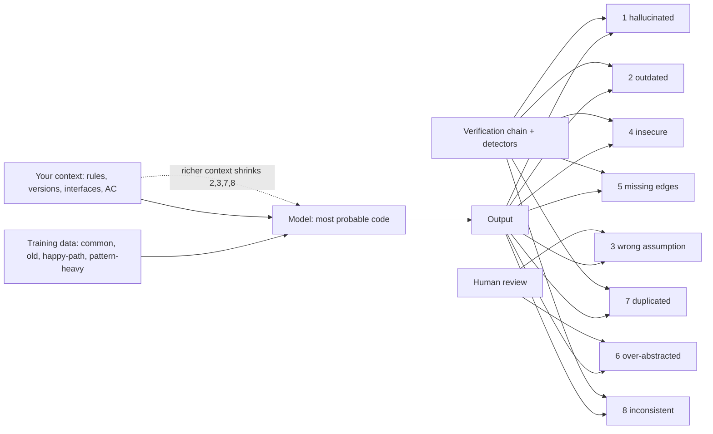

# Module 8.8 — أنماط فشل كود AI
## AI Failure Modes: hallucinated APIs, outdated APIs, wrong assumptions, security vulnerabilities, incomplete edge cases, excessive abstraction, duplicated logic, inconsistent architecture — with real examples and detectors

> **المستوى:** Level 8 | **الموقع:** [8 من 11]
> **السابق:** [M8.7 — AI Verification](module-8.7-ai-verification.md) | **التالي:** [M8.9 — AI Security](module-8.9-ai-security.md)

---

## 1. المتطلبات
- [ ] سلسلة التحقّق الثمانية — [L8-M8.7](module-8.7-ai-verification.md)
- [ ] الأخطاء ومعالجتها والحالات الحدّية — [L1-M1.9](../level-1-programming/module-1.9-errors.md)
- [ ] التجريد والتغليف ومتى يُصبح التجريد ضررًا — [L4-M4.6](../level-4-software-engineering-foundations/module-4.6-abstraction-encapsulation-modularity.md), [L4-M4.9](../level-4-software-engineering-foundations/module-4.9-design-patterns.md)
- [ ] ثغرات OWASP الشائعة — [L5-M5.4](../level-5-building-real-software/module-5.4-security.md)
- [ ] التزامن في منطق الأعمال (سباقات) — [L5-M5.6](../level-5-building-real-software/module-5.6-concurrency-business-logic.md)
- [ ] الهاشات لكشف التكرار — [L3-M3.1](../level-3-core-computer-science/module-3.1-arrays-hash-maps.md)

## 2. أهداف التعلّم
بعد هذه الوحدة ستستطيع:
1. التعرّف على **ثمانية أنماط فشل** مميّزة لكود AI، وشرح **لماذا** يُنتجها النموذج (الآلية، لا "لأنه يُخطئ").
2. لكل نمط: **العلامة** في الكود، **الخطوة** من سلسلة التحقّق التي تلتقطه، و**الكاشف** الآلي أو السؤال البشري.
3. تمييز الفشل الذي يُلتقط آليًا (استيراد وهمي، API مهجور، تكرار، حدود معمارية) من الذي يحتاج إنسانًا (افتراض خاطئ، حالة حدّية غائبة، تجريد زائد).
4. استخدام قائمة الحالات الحدّية القياسية (فارغ، واحد، كثير، حدّ، سالب، null، unicode، تزامن، فشل خارجي، إعادة تسليم) كفحص إلزامي على كل دالّة مولَّدة.
5. تحويل كل نمط إلى **وقاية في الموجز/السياق** (M8.5/8.6) لا فقط كشف بعد الوقوع.

## 3. شرح للمبتدئ
النموذج اللغوي يُولّد الكود الأكثر احتمالًا بالنظر إلى السياق وبيانات التدريب. هذه الجملة تُفسّر **كل** أنماط الفشل أدناه: ما هو "محتمل" ليس بالضرورة موجودًا (هلوسة)، ولا حديثًا (مهجور)، ولا مناسبًا لمشروعك (افتراض خاطئ)، ولا آمنًا (الكود الشائع على الإنترنت غير آمن غالبًا)، ولا كاملًا (الأمثلة تُغطّي المسار السعيد)، ولا بسيطًا (الأمثلة التعليمية مليئة بالأنماط)، ولا متّسقًا مع ما كُتب قبل عشر دقائق في ملف آخر (كل توليد محلّي). الأنماط ليست عشوائية؛ هي **انحيازات منهجية** يمكنك توقّعها والبحث عنها.

**1. APIs وهمية (hallucinated).** دالّة أو خيار أو حزمة لا توجد: `fs.promises.readJson()`, `array.findLastIndexOf()`, خيار `{ timeout }` في API لا يقبله، أو حزمة npm باسم معقول غير موجودة. **الآلية:** الاسم "يبدو" كما ينبغي أن يكون بحسب الأنماط المجاورة. **العلامة:** يفشل في Compile/Typecheck إن كانت الأنواع صارمة والحزمة مُثبَّتة؛ **لكن** في JS بلا أنواع، أو مع `any`، أو مع حزمة وهمية **قد تكون سجّلها مهاجم** (slopsquatting — M8.9)، يمرّ إلى وقت التشغيل. **الكاشف:** typecheck صارم + allowlist للحزم (كل `import` من حزمة غير موجودة في `package.json` المعتمد = فشل) + لا تثبيت تلقائي لحزم يقترحها النموذج.

**2. APIs مهجورة (outdated).** الكود صحيح… لإصدار قديم: `new Buffer()`, `request` بدل `fetch`, `moment` بدل `Temporal`/`date-fns`, `bodyParser` منفصل في Express 5, `crypto.createCipher` (محذوف)، bcrypt بعامل 10، `substr`. **الآلية:** بيانات التدريب فيها عقد من الأمثلة القديمة أكثر من أمثلة الشهر الماضي. **العلامة:** تحذيرات إهمال، أو يعمل بشكل غير آمن. **الكاشف:** قائمة APIs مهجورة خاصّة بمشروعك (lint rule) + إصدار المكتبات في السياق (M8.5) + "استخدم API إصدار X" في القيود.

**3. افتراضات خاطئة (wrong assumptions).** أخطر الأنماط لأنه صامت: الكود صحيح لمشكلة مختلفة قليلًا. أمثلة متكرّرة: المستخدم مسجّل = مُصرَّح له؛ الوقت محلّي بدل UTC؛ المعرّفات أرقام متسلسلة؛ المدخل نظيف؛ العملية تنجح أو تُرمي (لا حالة ثالثة: نجحت جزئيًا)؛ الحدث يُسلَّم مرّة واحدة (M7.2)؛ قاعدة البيانات واحدة (لا replica lag)؛ النصّ ASCII؛ المال float؛ القائمة صغيرة تُحمَّل كلّها. **الآلية:** الافتراض الأشيع في الأمثلة يُطبَّق دون إعلان. **الكاشف:** بشري أساسًا — سؤال "ما الذي يفترضه هذا السطر؟" + AC سلبية في الموجز + الإصرار في السياق على الحقائق غير الشائعة في مشروعك ("multi-tenant"، "at-least-once"، "UTC"، "minor units").

**4. ثغرات أمنية.** تركيب SQL نصّيًا، `innerHTML`، مقارنة أسرار بـ `===` (توقيت)، `Math.random()` للرموز، JWT بـ `alg: none` مقبول، CORS `*` مع credentials، مسار ملف من المدخل بلا تطبيع (path traversal)، تسجيل كلمة المرور، `eval`، التحقّق في الواجهة فقط، أخطاء تكشف وجود المستخدم. **الآلية:** الكود الآمن أقلّ شيوعًا في بيانات التدريب من الكود "الذي يعمل"؛ ودراسات متعدّدة وجدت أن نسبة معتبرة من المقتطفات المولَّدة تحوي ثغرة معروفة. **الكاشف:** SAST + أنماط ممنوعة في lint + سؤالا المدخل/المالك (M8.7 خطوة 5) + متطلبات أمن صريحة في الموجز.

**5. حالات حدّية ناقصة.** المسار السعيد مُحكَم، ثم: قائمة فارغة، عنصر واحد، `null` في حقل اختياري، صفر، سالب، الحدّ بالضبط (`<` أم `<=`؟)، نصّ فارغ، unicode/RTL/emoji، أرقام ضخمة، تاريخ 29 فبراير، مهلة الشبكة، فشل منتصف المعاملة، نفس الطلب مرّتين. **الآلية:** الأمثلة التعليمية لا تحوي هذه الحالات. **الكاشف:** قائمة حدّيات قياسية تُطبَّق على كل دالّة (أداة §7 تُولّدها من التوقيع)، + طلب صريح في الموجز "اذكر الحالات الحدّية التي **لم** تعالجها".

**6. تجريد زائد (over-abstraction).** واجهة بتنفيذ واحد، مصنع لكائن واحد، `BaseService<T>` عام لـ CRUD واحد، 4 طبقات لاستدعاء يمرّ عبرها دون تحويل، ملف `types.ts` بـ 30 نوعًا لـ 3 دوال، خيارات إعداد لا يستخدمها أحد. **الآلية:** الكود "الاحترافي" في بيانات التدريب مليء بالأنماط؛ النموذج يُحاكي الشكل لا الحاجة. **الضرر:** كل تجريد تكلفة قراءة وتعديل دائمة (M4.6: التجريد يُستحقّ حين يُخفي تعقيدًا حقيقيًا أو يُغيّر بديلًا حقيقيًا). **الكاشف:** عدّاد "واجهة بتنفيذ واحد" + نسبة ملفات/أسطر + سؤال المراجع "لو حذفت هذه الطبقة، ماذا أخسر؟" + قيد في الموجز "لا تجريدات إلا لبديل موجود الآن".

**7. منطق مكرّر (duplicated logic).** `formatMoney` ثالثة، `isValidEmail` خامسة، نسخة من دالّة في `shared/` معدّلة قليلًا، نفس التحقّق في المعالج والخدمة والمستودع. **الآلية:** النموذج يرى نافذة السياق لا المستودع؛ ما لم يُرفق لا يوجد (M8.5). **الضرر:** اختلاف السلوك بين النسخ مع الوقت (الثغرة تُصلَح في واحدة). **الكاشف:** كاشف تكرار (هاش للدوال بعد التطبيع — §7) + إرفاق `shared/index.ts` دائمًا + قاعدة "ابحث قبل أن تكتب أداة مساعدة".

**8. معمارية غير متّسقة (inconsistent architecture).** الوحدة A تستخدم المستودعات والوحدة B (المولَّدة اليوم) تستعلم مباشرة؛ أخطاء بـ `AppError` هنا و`throw new Error("string")` هناك؛ zod في مسار وتحقّق يدوي في آخر؛ أسماء بأسلوبين؛ استيراد من أعماق وحدة أخرى متجاوزًا `public.ts`. **الآلية:** كل توليد محلّي وبلا ذاكرة لما وُلّد سابقًا؛ وبدون قواعد صريحة يُنتج "الأسلوب الأشيع" لا أسلوبك. **الكاشف:** lint معماري (حدود الاستيراد، أنماط ممنوعة) + `AGENTS.md` بالاتفاقيات + مثال مرجعي في السياق.

**قاعدة البحث.** حين تقرأ كود AI، لا تقرأ "هل هذا صحيح؟" بعمومية؛ اقرأ بالقائمة: هل كل استيراد موجود؟ هل كل API حديث؟ ما الافتراضات؟ أين المدخل غير الموثوق والمالك؟ ما الحالات الحدّية العشر؟ ما التجريد الذي لا يُخفي شيئًا؟ ما الذي يوجد مثله في `shared/`? هل يُشبه الملفات المجاورة؟ ثماني أسئلة، كل واحدة تلتقط فئة.

## 4. النموذج الذهني
**"النموذج يُولّد الأشيع، لا الأصحّ: الأشيع قد لا يوجد، قد يكون قديمًا، قد يفترض مشروعًا آخر، قد يكون غير آمن، سعيدًا فقط، مُفرطًا في الشكل، مكرّرًا، وغير متّسق مع ما وُلّد قبله."** ثمانية انحيازات، ثمانية فحوص.

```text
النمط                   الآلية                              تلتقطه خطوة      كاشف
1 Hallucinated API       الاسم "المحتمل" لا الموجود           1–2            typecheck strict + package allowlist
2 Outdated API           التدريب أقدم من مكتباتك              2, 5           deprecated-list lint + versions in context
3 Wrong assumption       الافتراض الأشيع يُطبَّق صامتًا         4, 8           بشري: "ماذا يفترض هذا السطر؟" + AC سلبية
4 Security vuln          الكود الشائع غير آمن                 5              SAST + banned patterns + input/owner questions
5 Missing edge cases     الأمثلة سعيدة                        4              checklist من التوقيع + "ما لم تعالجه؟"
6 Over-abstraction       محاكاة شكل "الاحترافي"               7, 8           single-impl interface counter + "ماذا أخسر لو حذفت؟"
7 Duplicated logic       يرى السياق لا المستودع               7              normalized-hash dup detector + shared/ in context
8 Inconsistent arch      كل توليد محلّي بلا ذاكرة             7              boundary lint + AGENTS.md + reference example
```

## 5. الرسم التوضيحي


## 6. مثال بسيط
```typescript
// كود مولَّد لـ "احسب إجمالي السلّة مع الخصم" — ثمانية أنماط في 15 سطرًا
import { sumBy } from "lodash-utils";                                   // 1: حزمة وهمية (lodash موجودة، lodash-utils لا)
import moment from "moment";                                            // 2: مهجور (المشروع يستخدم date-fns)
interface ICartTotalStrategy { compute(items: Item[]): number }         // 6: واجهة بتنفيذ واحد
class DefaultCartTotalStrategy implements ICartTotalStrategy {
  compute(items: Item[]) {
    const subtotal = items.reduce((s, i) => s + i.price * i.qty, 0);   // 3: price float (المشروع minor units)
    const discount = subtotal > 100 ? subtotal * 0.1 : 0;              // 5: حدّ: 100 بالضبط؟ سلّة فارغة؟ qty سالب؟
    return subtotal - discount;
  }
}
export function cartTotal(items: Item[], couponCode: string) {
  const coupon = db.query(`SELECT * FROM coupons WHERE code = '${couponCode}'`); // 4: SQL injection، 8: استعلام خام (المشروع: repositories)
  if (coupon && moment(coupon.expires).isAfter(moment())) { /* ... */ }         // 2 + 3: timezone
  const isValidEmail = (e: string) => /\S+@\S+/.test(e);                        // 7: موجودة في shared/validation
  return new DefaultCartTotalStrategy().compute(items);
}
```

## 7. مثال كود
حزمة كواشف تعمل على نصّ الكود (بلا تحليل نحوي كامل — كافية للتعليم وللـ CI كطبقة أولى): (1) **استيرادات وهمية/غير معتمدة** مقابل `package.json` + قائمة الوحدات المدمجة؛ (2) **APIs مهجورة** من قائمة قابلة للتهيئة؛ (3) **أنماط غير آمنة** (تركيب SQL، `innerHTML`, `Math.random` للرموز، `eval`, مقارنة أسرار)؛ (4) **تكرار** عبر هاش دوال مُطبَّعة؛ (5) **تجريد زائد**: واجهات بتنفيذ واحد؛ (6) **حدود معمارية**: استيراد من أعماق وحدة أخرى؛ (7) **قائمة حدّيات** مُولَّدة من توقيع دالّة؛ وتقرير موحَّد يُصنّف كل نتيجة بنمطها وخطوة السلسلة التي تلتقطها.

```text
m88-ai-failure-modes/
├─ src/detectors.ts
└─ src/detectors.test.ts
```

```typescript
// src/detectors.ts
// كواشف أنماط فشل AI على نصّ الكود — طبقة أولى رخيصة قبل المراجعة البشرية
export type Pattern = "hallucinated-api" | "outdated-api" | "security" | "duplicated-logic" | "over-abstraction" | "inconsistent-architecture" | "missing-edge-cases";
export interface Finding { pattern: Pattern; file: string; line?: number; message: string; chainStep: number }
export type Files = Map<string, string>;

const NODE_BUILTINS = new Set(["fs", "path", "crypto", "http", "https", "url", "os", "events", "stream", "util", "assert", "child_process", "buffer", "zlib", "net", "dns", "readline", "worker_threads", "perf_hooks", "test"]);

export function detectUnknownImports(files: Files, declaredDeps: Set<string>): Finding[] {
  const out: Finding[] = [];
  for (const [file, src] of files) src.split("\n").forEach((line, i) => {
    const m = line.match(/^\s*import\s[^'"]*['"]([^'"]+)['"]|require\(\s*['"]([^'"]+)['"]\s*\)/); const spec = m?.[1] ?? m?.[2]; if (!spec) return;
    if (spec.startsWith(".") || spec.startsWith("/")) return;
    const bare = spec.startsWith("node:") ? spec.slice(5) : spec; const pkg = bare.startsWith("@") ? bare.split("/").slice(0, 2).join("/") : bare.split("/")[0]!;
    if (NODE_BUILTINS.has(pkg) || declaredDeps.has(pkg)) return;
    out.push({ pattern: "hallucinated-api", file, line: i + 1, message: `import "${spec}" is not a declared dependency — hallucinated or unapproved package (never auto-install)`, chainStep: 1 });
  });
  return out;
}

export const DEFAULT_DEPRECATED: { re: RegExp; use: string }[] = [
  { re: /new Buffer\(/, use: "Buffer.from / Buffer.alloc" }, { re: /crypto\.createCipher\(/, use: "crypto.createCipheriv" },
  { re: /\bmoment\(/, use: "date-fns / Temporal (project convention)" }, { re: /\.substr\(/, use: ".slice / .substring" },
  { re: /\brequest\(\s*\{/, use: "fetch" }, { re: /bodyParser\.json\(\)/, use: "express.json()" }, { re: /bcrypt\.hash\([^,]+,\s*(?:[1-9]|10)\)/, use: "argon2id or bcrypt cost ≥ 12" },
  { re: /\bnew Date\([^)]*\)\.getYear\(/, use: "getFullYear" }, { re: /url\.parse\(/, use: "new URL()" },
];
export function detectDeprecated(files: Files, list = DEFAULT_DEPRECATED): Finding[] {
  const out: Finding[] = [];
  for (const [file, src] of files) src.split("\n").forEach((line, i) => { for (const d of list) if (d.re.test(line)) out.push({ pattern: "outdated-api", file, line: i + 1, message: `outdated API (${d.re.source.slice(0, 30)}…) — use ${d.use}`, chainStep: 2 }); });
  return out;
}

const INSECURE: { re: RegExp; msg: string }[] = [
  { re: /(query|execute|raw)\(\s*`[^`]*\b(SELECT|INSERT|UPDATE|DELETE)\b[^`]*\$\{|(query|execute|raw)\(\s*['"][^'"]*\b(SELECT|INSERT|UPDATE|DELETE)\b[^'"]*['"]\s*\+/i, msg: "SQL built by string concatenation/interpolation — use parameters" },
  { re: /\.innerHTML\s*=/, msg: "innerHTML assignment — XSS; use textContent or a sanitizer" },
  { re: /Math\.random\(\)[\s\S]{0,60}(token|secret|session|password|otp|code)/i, msg: "Math.random for a secret — use crypto.randomBytes/randomUUID" },
  { re: /\beval\(|new Function\(/, msg: "dynamic code execution" },
  { re: /(token|secret|signature|hash)\s*===\s*\w+|\w+\s*===\s*(token|secret|signature|hash)\b/i, msg: "secret comparison with === — use crypto.timingSafeEqual" },
  { re: /cors\(\s*\{\s*origin:\s*['"]\*['"][^}]*credentials:\s*true/i, msg: "CORS * with credentials" },
  { re: /(console\.log|logger\.\w+)\([^)]*password/i, msg: "password in logs" },
  { re: /path\.join\([^)]*req\.(params|query|body)/, msg: "path from request without normalization — path traversal" },
];
export function detectInsecure(files: Files): Finding[] {
  const out: Finding[] = [];
  for (const [file, src] of files) src.split("\n").forEach((line, i) => { for (const p of INSECURE) if (p.re.test(line)) out.push({ pattern: "security", file, line: i + 1, message: p.msg, chainStep: 5 }); });
  return out;
}

// تكرار: نُطبّع جسم كل دالّة (أسماء المعرّفات → _، مسافات، تعليقات) ونُقارن الهاشات
const FN_RE = /(?:function\s+(\w+)\s*\([^)]*\)|(?:const|let)\s+(\w+)\s*=\s*(?:async\s*)?\([^)]*\)\s*=>)\s*\{/g;
function fnBody(src: string, start: number): string { let d = 0, i = start; for (; i < src.length; i++) { if (src[i] === "{") d++; else if (src[i] === "}") { d--; if (d === 0) break; } } return src.slice(start, i + 1); }
const normalize = (s: string) => s.replace(/\/\/.*$/gm, "").replace(/\/\*[\s\S]*?\*\//g, "").replace(/\b[A-Za-z_$][\w$]*\b/g, (w) => (/^(return|if|else|for|while|const|let|var|new|throw|await|async|function|true|false|null|undefined|typeof)$/.test(w) ? w : "_")).replace(/\s+/g, "");
function hash(s: string): number { let h = 2166136261; for (let i = 0; i < s.length; i++) { h ^= s.charCodeAt(i); h = Math.imul(h, 16777619); } return h >>> 0; }
export function detectDuplicates(files: Files, minBodyChars = 40): Finding[] {
  const seen = new Map<number, { file: string; name: string }>(); const out: Finding[] = [];
  // shared/ أولًا: الأصل هو ما في shared، والمكرّر هو ما وُلّد خارجها
  const ordered = [...files].sort(([a], [b]) => Number(b.startsWith("shared/")) - Number(a.startsWith("shared/")));
  for (const [file, src] of ordered) for (const m of src.matchAll(FN_RE)) {
    const name = m[1] ?? m[2] ?? "anon"; const body = fnBody(src, m.index! + m[0].length - 1); const norm = normalize(body); if (norm.length < minBodyChars) continue;
    const h = hash(norm); const prev = seen.get(h);
    if (prev && !(prev.file === file && prev.name === name)) out.push({ pattern: "duplicated-logic", file, message: `${name} duplicates ${prev.name} in ${prev.file} — reuse it (was it in the context?)`, chainStep: 7 });
    else seen.set(h, { file, name });
  }
  return out;
}

export function detectOverAbstraction(files: Files): Finding[] {
  const out: Finding[] = []; const all = [...files.values()].join("\n");
  for (const [file, src] of files) for (const m of src.matchAll(/\binterface\s+(\w+)/g)) {
    const name = m[1]!; const impls = (all.match(new RegExp(`implements\\s+(?:[\\w, ]*\\b)?${name}\\b`, "g")) ?? []).length;
    const isData = !/\(\s*[^)]*\)\s*:/.test(fnBody(src, src.indexOf("{", m.index!)));   // واجهة بيانات (بلا توقيعات دوال) مقبولة
    if (!isData && impls === 1) out.push({ pattern: "over-abstraction", file, message: `interface ${name} has exactly one implementation — abstraction without an alternative; inline it until a second implementation exists`, chainStep: 7 });
    if (/^I[A-Z]/.test(name) && impls <= 1) out.push({ pattern: "over-abstraction", file, message: `"${name}": I-prefixed interface with ≤1 implementation — pattern mimicry`, chainStep: 7 });
  }
  for (const [file, src] of files) if (/class\s+\w*Factory\b/.test(src) && (src.match(/\bnew\s+\w+\(/g) ?? []).length <= 1) out.push({ pattern: "over-abstraction", file, message: "Factory creating a single concrete type", chainStep: 7 });
  return out;
}

// حدود: استيراد من أعماق وحدة أخرى (غير public.ts)؛ الوحدة = أول مقطع من المسار
export function detectBoundaryViolations(files: Files, publicFile = "public"): Finding[] {
  const out: Finding[] = [];
  for (const [file, src] of files) { const mod = file.split("/")[0]!; src.split("\n").forEach((line, i) => {
    const m = line.match(/from\s+['"](\.{1,2}\/[^'"]+)['"]/); if (!m) return;
    const parts = file.split("/").slice(0, -1); for (const seg of m[1]!.split("/")) { if (seg === "..") parts.pop(); else if (seg !== ".") parts.push(seg); }
    const target = parts.join("/"); const targetMod = target.split("/")[0]!;
    if (targetMod !== mod && targetMod !== "shared" && !target.endsWith(`/${publicFile}`)) out.push({ pattern: "inconsistent-architecture", file, line: i + 1, message: `imports ${target} across module boundary — only ${targetMod}/${publicFile} is allowed`, chainStep: 7 });
  }); }
  return out;
}

// قائمة حدّيات من توقيع دالّة: لكل معامل بحسب نوعه
export function edgeCaseChecklist(signature: string): string[] {
  const out = new Set<string>(["same call twice (idempotency / double submit)", "external dependency fails or times out"]);
  const params = signature.match(/\(([^)]*)\)/)?.[1] ?? "";
  for (const p of params.split(",").map((s) => s.trim()).filter(Boolean)) {
    const [rawName, type = ""] = p.split(":").map((s) => s.trim()) as [string, string?];
    const optional = rawName.endsWith("?"); const name = rawName.replace(/\?$/, ""); const t = type.replace(/\s/g, "");
    if (/\[\]$|Array</.test(t)) { out.add(`${name}: empty array`); out.add(`${name}: single element`); out.add(`${name}: very large (10^5+) — memory/time`); out.add(`${name}: duplicates`); }
    if (/^number/.test(t)) { out.add(`${name}: 0`); out.add(`${name}: negative`); out.add(`${name}: exactly at the boundary (< vs <=)`); out.add(`${name}: NaN / Infinity / non-integer`); out.add(`${name}: float money? use minor units`); }
    if (/^string/.test(t)) { out.add(`${name}: empty string`); out.add(`${name}: whitespace only`); out.add(`${name}: unicode / RTL / emoji / combining marks`); out.add(`${name}: very long`); out.add(`${name}: injection characters (quotes, <, =, newline)`); }
    if (optional || /undefined|null/.test(t)) out.add(`${name}: absent / null`);
    if (/Date|time|at$/i.test(name + t)) { out.add(`${name}: timezone / DST / leap day`); out.add(`${name}: in the past / far future`); }
    if (/id$/i.test(name)) out.add(`${name}: belongs to another tenant/user (authZ)`);
  }
  return [...out];
}

export function report(files: Files, declaredDeps: Set<string>): Finding[] {
  return [...detectUnknownImports(files, declaredDeps), ...detectDeprecated(files), ...detectInsecure(files), ...detectDuplicates(files), ...detectOverAbstraction(files), ...detectBoundaryViolations(files)].sort((a, b) => a.chainStep - b.chainStep);
}
```

```typescript
// src/detectors.test.ts
import { test } from "node:test";
import assert from "node:assert/strict";
import { report, edgeCaseChecklist, detectDuplicates, type Files } from "./detectors.ts";

const generated = `import { sumBy } from "lodash-utils";
import moment from "moment";
import { randomBytes } from "node:crypto";
import { OrderRepository } from "../orders/infra/order.repository";
interface ICartTotalStrategy { compute(items: number[]): number }
class DefaultCartTotalStrategy implements ICartTotalStrategy { compute(items: number[]) { return items.reduce((s, i) => s + i, 0); } }
export function cartTotal(items: number[], couponCode: string) {
  const coupon = db.query(\`SELECT * FROM coupons WHERE code = '\${couponCode}'\`);
  const token = Math.random().toString(36); const sessionToken = token;
  const isValidEmail = (e: string) => { const trimmed = e.trim().toLowerCase(); if (trimmed.length === 0) return false; return /^[^@\\s]+@[^@\\s]+\\.[^@\\s]+$/.test(trimmed); };
  const buf = new Buffer("x"); const expired = moment(coupon.expires).isBefore(moment());
  return new DefaultCartTotalStrategy().compute(items);
}`;
const shared = `export const isEmail = (value: string) => { const v = value.trim().toLowerCase(); if (v.length === 0) return false; return /^[^@\\s]+@[^@\\s]+\\.[^@\\s]+$/.test(v); };`;
const files: Files = new Map([["cart/total.ts", generated], ["shared/validation.ts", shared]]);
const deps = new Set(["lodash", "date-fns", "zod"]);

test("التقرير الموحَّد يلتقط الأنماط الستّة الآلية في ملف مولَّد واحد، مرتّبة بخطوة السلسلة", () => {
  const f = report(files, deps);
  const by = (p: string) => f.filter((x) => x.pattern === p);
  assert.equal(by("hallucinated-api").length, 2);                             // lodash-utils, moment (غير معتمدة)
  assert.ok(by("hallucinated-api").every((x) => x.message.includes("never auto-install")));
  assert.ok(by("outdated-api").some((x) => x.message.includes("Buffer.from")) && by("outdated-api").some((x) => x.message.includes("date-fns")));
  assert.ok(by("security").some((x) => x.message.startsWith("SQL built")) && by("security").some((x) => x.message.includes("Math.random")));
  assert.equal(by("duplicated-logic").length, 1); assert.ok(by("duplicated-logic")[0]!.message.includes("isEmail in shared/validation.ts"));
  assert.ok(by("over-abstraction").some((x) => x.message.includes("exactly one implementation")));
  assert.ok(by("inconsistent-architecture")[0]!.message.includes("only orders/public is allowed"));
  assert.deepEqual([...new Set(f.map((x) => x.chainStep))], [1, 2, 5, 7]);
});

test("ملف نظيف لا يُنتج نتائج؛ واجهة بيانات بلا دوال وواجهة بتنفيذين ليستا تجريدًا زائدًا", () => {
  const clean: Files = new Map([
    ["orders/export.ts", `import { z } from "zod";\nimport { escapeCell } from "../shared/csv";\nimport { PaymentsApi } from "../payments/public";\nexport interface Row { id: string; total: number }\nexport interface Store { get(id: string): Row }\nclass MemStore implements Store { get(id: string) { return { id, total: 0 }; } }\nclass PgStore implements Store { get(id: string) { return { id, total: 1 }; } }\nexport function exportCsv(rows: Row[]) { return rows.map((r) => escapeCell(String(r.total))).join("\\n"); }`],
  ]);
  assert.deepEqual(report(clean, deps), []);
});

test("قائمة الحدّيات تُشتقّ من التوقيع: مصفوفة، رقم، نصّ، اختياري، تاريخ، معرّف", () => {
  const list = edgeCaseChecklist("function refund(orderId: string, amountMinor: number, items: Item[], note?: string, scheduledAt?: Date)");
  for (const needle of ["items: empty array", "amountMinor: 0", "amountMinor: negative", "exactly at the boundary", "orderId: belongs to another tenant/user (authZ)", "note: absent / null", "scheduledAt: timezone / DST / leap day", "same call twice", "external dependency fails"]) assert.ok(list.some((l) => l.includes(needle)), needle);
  assert.ok(list.length >= 15);
  assert.equal(detectDuplicates(new Map([["a.ts", "function f(a){return a}"]])).length, 0);   // أجسام قصيرة تُتجاهل
});
```

**تشغيل:** `npx tsx --test src/*.test.ts`. أضف `report` كخطوة في CI قبل المراجعة البشرية: النتائج ليست أحكامًا نهائية (قد تكون هناك أسباب) لكن كل واحدة تحتاج **تبريرًا مكتوبًا** في الـ PR — وهذا وحده يُغيّر ما يصل إلى المراجع.

## 8. مثال من العالم الحقيقي
**الحزمة التي لم تكن موجودة — ثم صارت.** باحثون في الأمن لاحظوا أن نماذج توليد الكود تقترح، بثبات، أسماء حزم غير موجودة (في دراسة واسعة على مئات آلاف العيّنات، نحو خُمس الحزم المقترحة لم تكن موجودة في السجلّ، وكثير منها تكرّر عبر طلبات مختلفة). المهاجم لا يحتاج إلّا أن **يُسجّل** الاسم المهلوس بحزمة خبيثة وينتظر: المطوّر (أو الوكيل بالمستوى 3 مع `npm install` مسموح) يُثبّت ما اقترحه النموذج، ويُنفَّذ سكربت التثبيت بصلاحياته. سُمّي هذا **slopsquatting**. تجربة توضيحية شهيرة: باحث سجّل حزمة باسم كان النموذج يقترحه بإصرار ووضع فيها كودًا غير ضارّ يُبلّغ عن التثبيتات — فحصل على آلاف التنزيلات خلال أشهر، بينها من شركات كبرى.

ما يُعلّمه بلغة الوحدة: النمط 1 (هلوسة) ليس "خطأ ترجمة" بسيطًا يلتقطه tsc؛ هو **سطح هجوم** (M8.9). الوقاية: لا تثبيت تلقائي أبدًا، allowlist للحزم، تحقّق من عمر الحزمة وعدد مُصينيها وتنزيلاتها قبل الإضافة، وقفل الإصدارات. ونفس الآلية تنطبق على APIs وهمية داخل حزم حقيقية: تعمل في الاختبار بـ `any` وتنفجر في الإنتاج.

## 9. مثال من الإنتاج
**قواعد lint خاصّة بالفريق مشتقّة من أنماط فشل AI المُلاحَظة (مقتطف من إعداد ESLint + semgrep):**

```yaml
# .semgrep/ai-patterns.yml — قواعد كُتبت بعد كل حادثة/مراجعة لنمط متكرّر
rules:
  - id: raw-sql-outside-repository
    pattern: $DB.query(...)
    paths: { exclude: ["**/infra/*.repository.ts"] }
    message: "Raw SQL outside a repository (AI pattern 8: inconsistent architecture). Use <module>/infra/*Repository."
    severity: ERROR
  - id: money-as-float
    patterns: [{ pattern: "$X * 0.$Y" }, { pattern-inside: "function $F(...) { ... }" }]
    paths: { include: ["**/payments/**", "**/billing/**"] }
    message: "Fractional arithmetic on money (AI pattern 3: wrong assumption). Use integer minor units + shared/money."
    severity: ERROR
  - id: auth-without-owner-check
    pattern: |
      router.$M($PATH, requireAuth, async (req, res) => { ... $REPO.findById(req.params.id) ... })
    pattern-not: |
      router.$M($PATH, requireAuth, async (req, res) => { ... assertOwner(...) ... })
    message: "Authenticated but no ownership/tenant check (AI pattern 3+4). Call assertOwner/assertTenant."
    severity: ERROR
  - id: single-impl-interface
    # يُنفَّذ بسكربت detectOverAbstraction في CI؛ النتيجة تعليق لا فشل (قرار بشري)
```

وفي `AGENTS.md` قسم "Known AI pitfalls here" بخمسة أسطر مشتقّة من نفس القائمة — لأن **الوقاية في السياق أرخص من الكشف في CI**، والكشف في CI أرخص من المراجعة، والمراجعة أرخص من الحادثة. الفريق يُراجع هذه القواعد ربع سنويًا: ما لم يُطلق خلال 3 أشهر يُحذف (M8.5: تعفّن السياق).

## 10. أخطاء شائعة في الفهم
| الخطأ | الصواب |
|---|---|
| "النماذج الأحدث لا تهلوس" | تهلوس أقلّ؛ والهلوسة الأقلّ أخطر لأنها تمرّ بلا شكّ. الكاشف يبقى. |
| "الكود المولَّد غير آمن بطبعه" | غير آمن **بالشيوع**: يُحاكي الكود الشائع، وهو غير آمن غالبًا. بمتطلبات أمن صريحة وفحص، يُصبح أفضل من متوسّط البشر. |
| "التجريد الزائد أفضل من القليل" | كل تجريد بلا بديل حقيقي تكلفة قراءة وتعديل دائمة؛ البساطة أرخص إلى أن يظهر البديل الثاني. |
| "التكرار مشكلة أسلوبية" | التكرار يُنتج تباعدًا سلوكيًا: الإصلاح يُطبَّق على نسخة وتبقى الأخرى — ثغرة مؤجّلة. |
| "الافتراض الخاطئ سيكشفه الاختبار" | الاختبار المولَّد يحمل نفس الافتراض. يكشفه إنسان يسأل "ماذا يفترض هذا؟" أو AC سلبية كُتبت من المواصفة. |
| "كواشف النصّ ساذجة" | هي طبقة أولى رخيصة تُغيّر ما يصل إلى المراجع؛ ليست بديلًا عن AST/SAST والمراجعة. |

## 11. أخطاء شائعة في التطبيق
1. **السماح للوكيل بـ `npm install`.** العلاج: الحزم الجديدة قرار بشري بـ ADR (M8.6 قيود) + allowlist.
2. **قائمة مهجورات عامّة فقط.** العلاج: قائمتك أنت — ما استُبدل في مشروعك وبماذا.
3. **قبول "واجهة للاختبار" كتبرير للتجريد.** العلاج: الاختبار يحتاج حدًّا قابلًا للاستبدال عند **I/O** فقط؛ لا واجهة لمنطق خالص.
4. **كاشف تكرار يُنتج ضجيجًا فيُعطَّل.** العلاج: حدّ أدنى لطول الجسم، تجاهل الاختبارات، وتعليق بدل فشل.
5. **فحص الحدّيات عقليًا.** العلاج: القائمة المُولَّدة من التوقيع تُلصق في الـ PR مع ✓/✗/n.a لكل بند.
6. **إصلاح النمط دون إصلاح مصدره.** العلاج: كل نمط مكتشف ← سؤال: ماذا كان ناقصًا في السياق/الموجز؟ وأضفه.

## 12. تمرين تصحيح
**الوضع:** تقرير الكواشف نظيف، السلسلة خضراء، والميزة "جدولة إرسال التقرير أسبوعيًا" تُرسل التقرير **مرّتين** لعملاء في منطقة زمنية معيّنة، وفي الأسبوع الذي يتغيّر فيه التوقيت الصيفي **لا تُرسله** أصلًا.

**المهمّة:**
1. اقرأ الكود: `nextRun = new Date(lastRun.getTime() + 7*24*3600*1000)` و`if (now.getHours() === 9)`. أي نمط؟ (3: افتراض — اليوم 24 ساعة دائمًا؛ الساعة بتوقيت الخادم.) لماذا لم يلتقطه أي كاشف؟ (الكود صحيح نحويًا وأمنيًا ومعماريًا؛ الافتراض دلالي.)
2. شغّل `edgeCaseChecklist` على `scheduleWeekly(lastRun: Date, tz: string)` — ستجد "timezone / DST / leap day". هل كان هذا البند في الـ PR؟ (لا؛ أو كان ✓ بلا اختبار.)
3. اكتب AC سلبية: "Given منطقة زمنية تُبدّل التوقيت الصيفي في الأسبوع القادم، When يُحسب nextRun، Then الساعة المحلّية 9:00 تبقى 9:00" واختبارها بـ `Temporal`/`date-fns-tz`.
4. أضف إلى قائمة المهجورات/الممنوعات: حساب الأيام بالضرب في `86400000` خارج `shared/time`.
5. **تأمّل:** الأنماط 3 و5 و6 تحتاج إنسانًا؛ ما السؤال الواحد الذي لو طُرح في المراجعة لكان كشف هذا؟ ("ماذا يفترض هذا السطر عن الزمن؟")

## 13. تمرين معماري
**الوضع:** أنت مسؤول عن "جودة الكود المولَّد" في منظّمة بـ 25 فريقًا. المطلوب نظام يُقلّل الأنماط الثمانية **قبل** الكشف.

**المهمّة:**
1. لكل نمط: ما الذي يُوضع في السياق (M8.5) أو الموجز (M8.6) لتقليله عند المصدر؟ وما الكاشف في CI؟ وما سؤال المراجع؟ (مصفوفة 8×3.)
2. صمّم حلقة تعلّم: كل نتيجة كاشف أو تعليق مراجعة يُصنَّف بنمط؛ شهريًا تُحسب النسب لكل فريق؛ ماذا يحدث حين يرتفع نمط ما؟ (قاعدة سياق جديدة؟ قاعدة lint؟ تدريب؟)
3. سلسلة التوريد: صمّم سياسة الحزم (allowlist، عمر، مُصينون، قفل، فحص سكربتات التثبيت) بحيث تُغلق slopsquatting تمامًا دون أن تشلّ الفرق.
4. ما المقياس الذي يُثبت أن النظام يعمل؟ (عيوب مُسرَّبة مُصنَّفة بالنمط لكل 1k سطر مولَّد؛ زمن المراجعة لكل PR.) وما المقياس المضادّ لمنع التلاعب؟
5. قدّم كـ Assumption / Constraint / Tradeoff / Risk / Recommendation، مع خطر "الكواشف تُعطّل لأنها مزعجة" وكيف تُقاومه (تعليق لا فشل للأنماط غير الحاسمة؛ ضبط دوري).

## 14. العلاقة بعصر AI
هذه الوحدة تُعطي سلسلة M8.7 **ما تبحث عنه**: بدل "راجع جيدًا" تحصل على ثماني فئات بآليات وكواشف وأسئلة. وهي تُغذّي ما قبلها: كل نمط يُترجَم إلى قاعدة سياق (M8.5) أو قسم موجز (M8.6) أو حدّ وكيل (M8.4: لا `npm install`). M8.9 تأخذ النمطين 1 و4 إلى مستواهما العدائي (حزم مُسجَّلة عمدًا، تعليمات مزروعة)، وM8.10 تُحدّد أين تُضاعَف المراجعة البشرية التي وحدها تلتقط الأنماط 3 و6. وفي Project 8 المطلوب الصريح: **ابحث عن ≥3 مشكلات في كود AI** — هذه القائمة هي خريطتك.

## 15. ما يجب إتقانه
- الأنماط الثمانية: العلامة، الآلية، الخطوة التي تلتقطها، الكاشف أو السؤال.
- الفرق بين ما يُلتقط آليًا (1، 2، 4 جزئيًا، 7، 8) وما يحتاج إنسانًا (3، 5، 6).
- قائمة الحدّيات القياسية وتطبيقها على كل دالّة مولَّدة.
- تحويل كل نمط مكتشف إلى وقاية في السياق/الموجز.
- لماذا الحزمة المهلوسة سطح هجوم لا مجرّد خطأ.

## 16. ما يجب فهمه
- كواشف النصّ كطبقة أولى وحدودها مقابل AST/SAST.
- حلقة التعلّم التنظيمية من الأنماط إلى القواعد.
- سياسة الحزم كدفاع ضدّ slopsquatting.

## 17. ما يمكن تأجيله
- كواشف قائمة على AST (ts-morph/ESLint custom rules) بدقّة أعلى.
- قياس أنماط الفشل كمّيًا عبر نماذج وإصدارات مختلفة.
- أدوات SCA/SBOM المتقدّمة لسلسلة التوريد.

## 18. الخلاصة
النموذج يُولّد الأشيع لا الأصحّ، وهذا يُفسّر ثمانية أنماط فشل يمكن توقّعها: APIs وهمية ومهجورة، افتراضات صامتة، ثغرات شائعة، حدّيات غائبة، تجريد يُحاكي الشكل، تكرار لما لم يُرَ، ومعمارية غير متّسقة لأن كل توليد محلّي. لكل نمط علامة وآلية وكاشف أو سؤال؛ نصفها آلي ونصفها بشري. اقرأ كود AI بالقائمة لا بالانطباع، حوّل كل نمط تكتشفه إلى وقاية في السياق والموجز، ولا تُثبّت حزمة اقترحها نموذج دون أن تتحقّق أنها موجودة — ومن يملكها.

## 19. المراجع الرسمية
- Spracklen et al. — "We Have a Package for You! A Comprehensive Analysis of Package Hallucinations by Code Generating LLMs" (USENIX Security 2025) — الأرقام وراء slopsquatting.
- Pearce et al. — "Asleep at the Keyboard? Assessing the Security of GitHub Copilot's Code Contributions" (IEEE S&P 2022) — نسبة الثغرات في الكود المولَّد وأنواعها.
- OWASP — "Top 10 for LLM Applications" (LLM09 Misinformation, LLM03 Supply Chain) — تسمية الأنماط 1 و4 كمخاطر.
- Node.js — "Deprecated APIs" documentation — المصدر الرسمي لقائمة المهجورات في بيئة Node.
- Semgrep — rule writing documentation — تحويل أنماط الفريق إلى قواعد قابلة للتنفيذ.
- Sandi Metz — "The Wrong Abstraction" — لماذا التجريد المبكّر أغلى من التكرار المؤقّت.

---

### المصطلحات في هذه الوحدة
| English | العربية |
|---|---|
| Hallucinated API | واجهة برمجية وهمية (غير موجودة) |
| Slopsquatting | تسجيل حزمة باسم مهلوس لاستغلال من يُثبّتها |
| Outdated / deprecated API | واجهة مهجورة |
| Wrong assumption | افتراض خاطئ صامت |
| Edge case | حالة حدّية |
| Over-abstraction | تجريد زائد |
| Single-implementation interface | واجهة بتنفيذ واحد |
| Duplicated logic | منطق مكرّر |
| Normalized hash | هاش بعد التطبيع (لكشف التكرار) |
| Boundary violation | انتهاك حدود الوحدات |
| Pattern mimicry | محاكاة الأنماط (شكل بلا حاجة) |
| Package allowlist | قائمة الحزم المسموحة |
