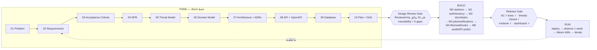

# Module 9.1 — مشروع التخرج، المسار A: بقيادة بشرية (Mode A — Human-led)
## Capstone SaaS, Mode A: full SDLC by hand, no code before the design is complete

> **قبل تعلّم هذا، يجب أن تفهم…** كل ما سبق. هذه الوحدة لا تُعلّم مفهومًا جديدًا — إنها **الامتحان العملي** لثمانية مستويات. إن كان هناك صندوق أدناه لا تستطيع تأشيره بصدق، فالمسار الصحيح هو العودة إليه الآن، لا "سأتعلّمه أثناء المشروع".

---

## 1. المتطلبات (Prerequisites)

- [ ] اجتزت Checkpoints 0–8 **بأقسامها الأربعة** — [Checkpoint 8](../level-8-ai-native-engineering/checkpoint-8.md)
- [ ] Project 6 يعمل عندك الآن بـ `docker compose up` مع CI أخضر — [Project 6](../projects/project-6-production-backend/README.md)
- [ ] تكتب متطلّبات ومعايير قبول بصيغة Given/When/Then وتُميّز المتطلّب غير القابل للإثبات — [M4.2](../level-4-software-engineering-foundations/module-4.2-requirements.md), [M4.3](../level-4-software-engineering-foundations/module-4.3-user-stories-acceptance-criteria.md)
- [ ] تبني نموذج تهديد (أصول، نقاط دخول، حدود ثقة، STRIDE) — [M5.5](../level-5-building-real-software/module-5.5-threat-modeling.md)
- [ ] تُصمّم بعملية الخطوات السبع وتكتب ADR — [M7.6](../level-7-advanced-systems/module-7.6-system-design-process.md), [M6.3](../level-6-professional-engineering/module-6.3-design-review-rfc-adr.md)
- [ ] تعرف ما تغيّر في المهنة وما لم يتغيّر، وتستطيع استخدام AI **كناقد** دون أن يكتب لك — [M8.1](../level-8-ai-native-engineering/module-8.1-what-changes.md), [M8.3](../level-8-ai-native-engineering/module-8.3-ai-assisted-sdlc.md)

---

## 2. أهداف التعلّم (Learning Objectives)

بعد إتمام المسار A ستكون قد:
1. حوّلت مشكلة مستخدم إلى **عشر وثائق تصميم مُراجَعة** قبل أول سطر كود، وتستطيع الدفاع عن كل قرار فيها.
2. بنيت SaaS متعدّد المستأجرين (multi-tenant) كاملًا بيدك: مصادقة، تفويض، معاملات، كاش، طوابير، ملفات، webhooks، سجلّ تدقيق، API احترافي.
3. أثبتّ **قابلية التتبّع** الكاملة: كل متطلّب → معيار قبول → اختبار → كود → مقياس، بأداة تفحصها آليًا.
4. شغّلت المنتج في بيئة شبيهة بالإنتاج بـ CI/CD وملاحظة وrunbook، ونفّذت تدريبات فشل عليه.
5. وثّقت بصدق ما كان صعبًا، وما غيّرته عن التصميم الأصلي ولماذا — وهو ما يُقرأ في المقابلات أكثر من الكود.

---

## 3. شرح للمبتدئ (Beginner Explanation)

### لماذا مرّتين؟ ولماذا بيدك أولًا؟

في Level 8 تعلّمت أن AI يُضاعف قدرة من يفهم. المسار A هو **إثبات الفهم**: إن استطعت بناء المنتج كاملًا بيدك، فأنت تملك ما يلزم للتحقّق من أي كود يكتبه غيرك — إنسانًا كان أو نموذجًا. المسار B (M9.2) يأتي بعده ليُثبت أنك تستطيع **توجيه** دون أن تفقد الملكية. من يبدأ بـ B دون A لا يعرف ما لا يعرفه.

### لماذا "لا كود قبل اكتمال التصميم"؟

لأن تكلفة تغيير القرار ترتفع مع كل طبقة تُبنى فوقه:

```
تغيير قرار "من يملك المستند؟"
  في وثيقة الـ domain model:        5 دقائق (سطر)
  بعد تصميم API:                     ساعة (3 endpoints + أخطاؤها)
  بعد تصميم DB:                      نصف يوم (جدول + ترحيل + فهارس)
  بعد التنفيذ والاختبارات:           يومان
  بعد الإطلاق وبيانات حقيقية:        أسبوع + ترحيل بيانات + حادثة محتملة
```

الخطوات 1–10 ليست بيروقراطية؛ إنها **أرخص مكان لارتكاب الأخطاء**. ستكتشف أثناء كتابة الـ threat model أن ميزة "مشاركة برابط" تحتاج تصميمًا مختلفًا كليًا؛ اكتشافها هناك يكلّف فقرة، واكتشافها في الأسبوع السادس يكلّف إعادة كتابة وحدة.

### ماذا يعني "بقيادة بشرية" حرفيًا؟

| مسموح لـ AI | ممنوع على AI |
|---|---|
| ناقد: "ما الذي نسيته في هذا الـ threat model؟" | كتابة أي كود إنتاج أو اختبار |
| مرجع: "ما توقيع `pg.Pool.query`؟" / "ما الفرق بين `SameSite=Lax` و`Strict`؟" | اتّخاذ قرار تصميم ("أيّهما أختار؟" → ممنوع؛ "ما مقايضات كلٍّ؟" → مسموح) |
| مُفسّر أخطاء: "ماذا يعني `40P01`؟" | كتابة الوثائق بدلًا منك (يمكنه مراجعة ما كتبت) |
| مولّد حالات اختبار **كأفكار** تُكتب أنت | توليد البيانات التجريبية إن كانت تُخفي عنك فهم الشكل |

كل استخدام يُسجَّل في `docs/ai-usage-log.md` بسطر: التاريخ، السؤال، ما فعلت بالإجابة. هذا السجلّ جزء من التسليم — ليس للرقابة بل لأنك ستقارنه بسجلّ المسار B.

### المنتج

**TeamDocs**: منصّة مستندات ومهام للفرق الصغيرة، متعدّدة المستأجرين. المواصفة الكاملة للميزات الإلزامية في [`09-capstone-overview.md`](../00-course-overview/09-capstone-overview.md). يمكنك استبدال الفكرة بأي SaaS **يحتوي كل الميزات الـ 18** — إن اخترت فكرتك، اكتب في `01-problem.md` جدول مطابقة يُظهر أين تعيش كل ميزة.

### الزمن

6–10 أسابيع بدوام جزئي. التوزيع الواقعي: **30% وثائق (الأسابيع 1–2.5)، 50% بناء، 20% تشغيل وتدريبات فشل وكتابة**. إن وجدت نفسك تكتب كودًا في اليوم الثالث، فأنت تهرب من الجزء الصعب.

---

## 4. النموذج الذهني (Mental Model)

### الوثائق هي النسخة الأولى من المنتج

كل وثيقة تُجيب سؤالًا، وكل سؤال لاحق يفترض إجابة السابق:

```
01 Problem        من؟ ما الألم؟ كيف نعرف أننا نجحنا؟        → بدونه: ميزات بلا سبب
02 Requirements   ماذا يفعل النظام (R-nn)؟                   → بدونه: نطاق مفتوح
03 AC             كيف نُثبت كل R (Given/When/Then)؟          → بدونه: "انتهى" بلا معنى
04 NFR            كم سريع/متاح/آمن/كبير — بأرقام؟            → بدونه: لا أساس لقرارات البنية
05 Threat model   من يُهاجم ماذا من أين؟ وما الدفاع؟          → بدونه: الأمن "لاحقًا" = أبدًا
06 Domain model   الكيانات، العلاقات، الثوابت (invariants)   → بدونه: الجداول تُصمَّم من الواجهة
07 Architecture   الحدود، الوحدات، ADRs                      → بدونه: كرة طين كبيرة
08 API            الموارد، الأخطاء، الصفحات، idempotency     → بدونه: عقد يتغيّر كل أسبوع
09 Database       المخطّط، الفهارس، خطّة الترحيل، RLS         → بدونه: بيانات مستأجر تظهر لآخر
10 Plan           المعالم، الترتيب، المخاطر، DoD               → بدونه: 6 أسابيع بلا شيء يعمل
```

### القاعدة الذهبية للتتبّع

> **لا متطلّب بلا AC، لا AC بلا اختبار، لا تهديد بلا دفاع مُختبَر، لا اختبار يُشير إلى AC غير موجود.**

ستبني أداة تفحص هذا آليًا (§7). الفكرة من M8.3 لكن هنا تطبّقها على عملك أنت.

### ثلاث مراحل، وبوّابتان

```
THINK  (1–10)  ──[Design Review Gate]──▶  BUILD (11–14)  ──[Release Gate]──▶  RUN (15–17)
 وثائق فقط                                كود + اختبارات + CI                 نشر + ملاحظة + تكرار
```

بوّابة مراجعة التصميم: مراجع خارجي (زميل، مرشد، أو — إن تعذّر — أنت بعد 48 ساعة بقائمة §9) يوقّع `Reviewed-by:` في رأس كل وثيقة. بوّابة الإطلاق: كل AC لها اختبار يمرّ، threat model بلا تهديد مفتوح، runbook مكتوب، لوحة ملاحظة تعمل.

---

## 5. الرسم التوضيحي (Visual Diagram)



```
التتبّع (ما تفحصه الأداة في §7):

  R-07 ──▶ AC-07.1 ──▶ tests/invitations.test.ts  @ac AC-07.1
      │         └─────▶ (لا اختبار)              ✗ gap: AC without test
      ├──▶ AC-07.2 ──▶ tests/invitations.test.ts  @ac AC-07.2
      └──▶ T-07  ──▶ mitigation: AC-07.3         ✓
  R-12 ──▶ (لا AC)                               ✗ gap: requirement without AC
  tests/x.test.ts @ac AC-99.1                     ✗ gap: unknown AC
```

---

## 6. مثال بسيط (Simple Example)

ميزة واحدة عبر الوثائق العشر، مُصغَّرة: **دعوة عضو إلى منظّمة**.

**01 Problem** — "مديرة فريق من 6 أشخاص تُشارك المستندات عبر البريد وتفقد النسخة الصحيحة. نجاحنا: 80% من مستندات الفريق تعيش في TeamDocs خلال شهر من التسجيل." (الدعوة ضرورية لأن القيمة تظهر فقط حين ينضمّ الفريق.)

**02 Requirements** — `R-07: يستطيع owner أو admin دعوة شخص بالبريد إلى منظّمته بدور محدّد؛ تنتهي الدعوة بعد 7 أيام؛ قبولها يُنشئ عضوية بالدور المحدّد.`

**03 AC** —
```
AC-07.1  Given admin في org A  When POST /orgs/A/invitations {email, role:"member"}
         Then 201 + دعوة pending + بريد يُرسَل خلال 60s (عبر الطابور)
AC-07.2  Given member (ليس admin)  When نفس الطلب  Then 403 ولا دعوة تُنشأ
AC-07.3  Given دعوة عمرها 8 أيام  When GET /invitations/{token}  Then 410 Gone
AC-07.4  Given نفس البريد مدعوّ وpending  When دعوة ثانية  Then 409 (لا ازدواج)
AC-07.5  Given admin في org A  When يدعو إلى org B  Then 404 (لا تسريب وجود B)
```

**04 NFR** — إرسال البريد غير متزامن (p95 للطلب < 200ms)؛ الدعوات لا تُفقد عند سقوط الـ worker (at-least-once + idempotent send).

**05 Threat** — `T-07: تسريب رابط الدعوة (بريد مُعاد توجيهه) → انضمام غير مصرَّح. الدفاع: token عشوائي 32 بايت، صلاحية 7 أيام (AC-07.3)، استعمال واحد، القبول يتطلّب تسجيل دخول بنفس البريد، تسجيل في audit log.`

**06 Domain** — `Invitation {id, orgId, email, role, token_hash, status: pending|accepted|expired|revoked, expiresAt, invitedBy}`. ثوابت: دعوة pending واحدة لكل (org, email)؛ `role ≠ owner` عبر الدعوة؛ القبول معاملة واحدة: تحديث الحالة + إنشاء العضوية.

**07 Architecture** — تعيش في وحدة `orgs/`؛ تنشر حدث `InvitationCreated` إلى outbox؛ وحدة `notifications/` تستهلكه. ADR-0004: "البريد عبر outbox لا استدعاء مباشر" (السبب: AC-07.1 + NFR الموثوقية).

**08 API** — `POST /v1/orgs/{orgId}/invitations` (Idempotency-Key مطلوب)، `GET /v1/invitations/{token}`، `POST /v1/invitations/{token}/accept`. أخطاء: 403 `forbidden`, 404 `not_found`, 409 `invitation_exists`, 410 `invitation_expired`.

**09 Database** —
```sql
CREATE TABLE invitations (
  id uuid PRIMARY KEY DEFAULT gen_random_uuid(),
  org_id uuid NOT NULL REFERENCES organizations(id),
  email citext NOT NULL,
  role text NOT NULL CHECK (role IN ('admin','member','viewer')),
  token_hash bytea NOT NULL UNIQUE,
  status text NOT NULL DEFAULT 'pending',
  expires_at timestamptz NOT NULL,
  invited_by uuid NOT NULL REFERENCES users(id),
  created_at timestamptz NOT NULL DEFAULT now()
);
CREATE UNIQUE INDEX invitations_one_pending ON invitations (org_id, email) WHERE status = 'pending';
ALTER TABLE invitations ENABLE ROW LEVEL SECURITY;  -- سياسة: org_id = current_setting('app.org_id')::uuid
```

**10 Plan** — المعلم M1 (auth + tenancy) يشمل R-07؛ DoD: AC-07.1–07.5 خضراء + T-07 مغلق + مسار يدوي موثّق.

لاحظ: **عشر فقرات قصيرة** غطّت ما كان سيصبح أسبوعًا من إعادة العمل لو اكتُشف "لا ازدواج" أو "لا تسريب وجود B" بعد البناء.

---

## 7. مثال كود (Code Example)

في المسار A الكود كلّه بيدك، فلن نُعطيك كود المنتج. ما نُعطيك إيّاه أداتان تفحصان **عملك**: بوّابة الوثائق وفاحص التتبّع. اكتبهما أولًا — فهما أول ما يعمل في CI قبل أي كود منتج.

```typescript
// src/tools/traceability.ts
// فاحص التتبّع: R → AC → test، T → mitigation. يعمل على خريطة ملفات (مسار → محتوى) ليُختبر بلا قرص.

export type Files = ReadonlyMap<string, string>;

export interface Gap { kind: GapKind; id: string; where: string; message: string }
export type GapKind =
  | "requirement-without-ac" | "ac-without-test" | "ac-without-requirement"
  | "test-with-unknown-ac" | "threat-without-mitigation" | "mitigation-with-unknown-ref"
  | "missing-doc" | "unreviewed-doc";

const REQUIRED_DOCS = [
  "01-problem", "02-requirements", "03-acceptance-criteria", "04-nfr", "05-threat-model",
  "06-domain-model", "07-architecture", "08-api", "09-database", "10-implementation-plan",
] as const;

const RE_REQ = /\bR-(\d{2})\b/g;                       // R-07
const RE_AC = /\bAC-(\d{2})\.(\d+)\b/g;                 // AC-07.1
const RE_THREAT_LINE = /^\s*[-|]?\s*T-(\d{2})\b(.*)$/gm; // سطر يبدأ بـ T-07 …
const RE_AC_TAG = /@ac\s+(AC-\d{2}\.\d+)/g;             // في الاختبارات: @ac AC-07.1

function uniq<T>(xs: Iterable<T>): T[] { return [...new Set(xs)]; }
function matches(re: RegExp, text: string): RegExpExecArray[] {
  re.lastIndex = 0; const out: RegExpExecArray[] = []; let m: RegExpExecArray | null;
  while ((m = re.exec(text)) !== null) out.push(m);
  return out;
}

/** بوّابة الوثائق: الوثائق العشر موجودة، غير فارغة، وتحمل سطر Reviewed-by. */
export function docsGate(files: Files, docsDir = "docs"): Gap[] {
  const gaps: Gap[] = [];
  for (const d of REQUIRED_DOCS) {
    const path = `${docsDir}/${d}.md`;
    const content = files.get(path);
    if (content === undefined || content.trim().length < 200) {
      gaps.push({ kind: "missing-doc", id: d, where: path, message: `الوثيقة ${d} مفقودة أو أقصر من 200 حرف` });
      continue;
    }
    if (!/^Reviewed-by:\s*\S+/m.test(content)) {
      gaps.push({ kind: "unreviewed-doc", id: d, where: path, message: `الوثيقة ${d} بلا سطر "Reviewed-by:"` });
    }
  }
  return gaps;
}

/** فاحص التتبّع: يقرأ المتطلّبات، معايير القبول، نموذج التهديد، والاختبارات. */
export function traceability(files: Files, opts: { docsDir?: string; testsDir?: string } = {}): Gap[] {
  const docsDir = opts.docsDir ?? "docs", testsDir = opts.testsDir ?? "tests";
  const req = files.get(`${docsDir}/02-requirements.md`) ?? "";
  const acDoc = files.get(`${docsDir}/03-acceptance-criteria.md`) ?? "";
  const threats = files.get(`${docsDir}/05-threat-model.md`) ?? "";
  const gaps: Gap[] = [];

  // المتطلّبات المعرَّفة = الأسطر التي تبدأ بـ R-nn (لا مجرد ذكرها)
  const requirements = uniq(matches(/^\s*[-|]?\s*\**R-(\d{2})\**\s*[:|]/gm, req).map((m) => `R-${m[1]}`));
  // معايير القبول المعرَّفة = الأسطر التي تبدأ بـ AC-nn.m
  const acs = uniq(matches(/^\s*[-|]?\s*\**AC-(\d{2})\.(\d+)\**\s*[:|\s]/gm, acDoc).map((m) => `AC-${m[1]}.${m[2]}`));
  const acsByReq = new Map<string, string[]>();
  for (const ac of acs) {
    const r = `R-${ac.slice(3, 5)}`;
    acsByReq.set(r, [...(acsByReq.get(r) ?? []), ac]);
  }

  // R بلا AC، وAC لمتطلّب غير موجود
  for (const r of requirements) if (!acsByReq.has(r)) gaps.push({ kind: "requirement-without-ac", id: r, where: `${docsDir}/02-requirements.md`, message: `${r} بلا أي معيار قبول` });
  for (const [r, list] of acsByReq) if (!requirements.includes(r)) for (const ac of list) gaps.push({ kind: "ac-without-requirement", id: ac, where: `${docsDir}/03-acceptance-criteria.md`, message: `${ac} يُشير إلى ${r} غير معرَّف` });

  // الاختبارات: كل ملف تحت tests/ يحمل وسوم @ac
  const tested = new Map<string, string[]>();
  for (const [path, content] of files) {
    if (!path.startsWith(`${testsDir}/`) || !/\.test\.(ts|js)$/.test(path)) continue;
    for (const m of matches(RE_AC_TAG, content)) {
      const ac = m[1]!;
      tested.set(ac, [...(tested.get(ac) ?? []), path]);
      if (!acs.includes(ac)) gaps.push({ kind: "test-with-unknown-ac", id: ac, where: path, message: `${path} يُشير إلى ${ac} غير معرَّف` });
    }
  }
  for (const ac of acs) if (!tested.has(ac)) gaps.push({ kind: "ac-without-test", id: ac, where: `${docsDir}/03-acceptance-criteria.md`, message: `${ac} بلا اختبار موسوم @ac` });

  // التهديدات: كل سطر T-nn يجب أن يذكر دفاعًا يُشير إلى AC أو R موجود
  for (const m of matches(RE_THREAT_LINE, threats)) {
    const id = `T-${m[1]}`, rest = m[2] ?? "";
    const refs = [...matches(RE_AC, rest).map((x) => `AC-${x[1]}.${x[2]}`), ...matches(RE_REQ, rest).map((x) => `R-${x[1]}`)];
    if (refs.length === 0) { gaps.push({ kind: "threat-without-mitigation", id, where: `${docsDir}/05-threat-model.md`, message: `${id} بلا دفاع يُشير إلى AC/R` }); continue; }
    for (const ref of refs) if (!acs.includes(ref) && !requirements.includes(ref)) gaps.push({ kind: "mitigation-with-unknown-ref", id, where: `${docsDir}/05-threat-model.md`, message: `${id} يُشير إلى ${ref} غير معرَّف` });
  }
  return gaps;
}

export function summarize(gaps: Gap[]): string {
  if (gaps.length === 0) return "traceability: 0 gaps ✓";
  const byKind = new Map<GapKind, number>();
  for (const g of gaps) byKind.set(g.kind, (byKind.get(g.kind) ?? 0) + 1);
  return [`traceability: ${gaps.length} gaps`, ...[...byKind].map(([k, n]) => `  ${k}: ${n}`), ...gaps.map((g) => `  - [${g.kind}] ${g.id} @ ${g.where}: ${g.message}`)].join("\n");
}
```

```typescript
// src/tools/traceability.test.ts
import { test } from "node:test";
import assert from "node:assert/strict";
import { docsGate, traceability } from "./traceability.ts";

const doc = (body: string, reviewed = true) => `${reviewed ? "Reviewed-by: sara (2026-10-20)\n" : ""}# Doc\n${body}\n${"x".repeat(220)}`;

function repo(overrides: Record<string, string> = {}): Map<string, string> {
  const base: Record<string, string> = {
    "docs/01-problem.md": doc("مديرة فريق…"),
    "docs/02-requirements.md": doc("- R-07: دعوة عضو بالبريد بدور محدّد.\n- R-08: تدوير رمز الدعوة."),
    "docs/03-acceptance-criteria.md": doc("AC-07.1: Given admin When POST Then 201\nAC-07.2: Given member When POST Then 403\nAC-08.1: Given … Then …"),
    "docs/04-nfr.md": doc("p95 < 200ms"),
    "docs/05-threat-model.md": doc("| T-07 | تسريب رابط الدعوة | token 32B + انتهاء (AC-07.2) |\n| T-08 | تخمين الرمز | معدّل (R-08) |"),
    "docs/06-domain-model.md": doc("Invitation…"), "docs/07-architecture.md": doc("modular monolith"),
    "docs/08-api.md": doc("POST /v1/orgs/{id}/invitations"), "docs/09-database.md": doc("invitations"),
    "docs/10-implementation-plan.md": doc("M1…"),
    "tests/invitations.test.ts": "// @ac AC-07.1\n// @ac AC-07.2\ntest('…')",
    "tests/rotation.test.ts": "// @ac AC-08.1\n",
  };
  return new Map(Object.entries({ ...base, ...overrides }));
}

test("مستودع متّسق: 0 فجوات وبوّابة الوثائق تمرّ", () => {
  const files = repo();
  assert.deepEqual(docsGate(files), []);
  assert.deepEqual(traceability(files), []);
});

test("متطلّب بلا AC، وAC بلا اختبار، واختبار يُشير إلى AC مجهول", () => {
  const files = repo({
    "docs/02-requirements.md": doc("- R-07: دعوة.\n- R-08: تدوير.\n- R-12: تصدير PDF."),
    "docs/03-acceptance-criteria.md": doc("AC-07.1: …\nAC-07.2: …\nAC-07.3: Given دعوة قديمة Then 410\nAC-08.1: …"),
    "tests/export.test.ts": "// @ac AC-99.1",
  });
  const kinds = traceability(files).map((g) => `${g.kind}:${g.id}`).sort();
  assert.deepEqual(kinds, ["ac-without-test:AC-07.3", "requirement-without-ac:R-12", "test-with-unknown-ac:AC-99.1"]);
});

test("تهديد بلا دفاع مُحال، ودفاع يُشير إلى AC غير معرَّف", () => {
  const files = repo({ "docs/05-threat-model.md": doc("| T-07 | تسريب | token عشوائي |\n| T-09 | IDOR | RLS (AC-30.1) |") });
  const kinds = traceability(files).map((g) => `${g.kind}:${g.id}`).sort();
  assert.deepEqual(kinds, ["mitigation-with-unknown-ref:T-09", "threat-without-mitigation:T-07"]);
});

test("بوّابة الوثائق: وثيقة مفقودة ووثيقة بلا مراجعة", () => {
  const files = repo({ "docs/04-nfr.md": doc("p95", false) });
  files.delete("docs/09-database.md");
  const kinds = docsGate(files).map((g) => `${g.kind}:${g.id}`).sort();
  assert.deepEqual(kinds, ["missing-doc:09-database", "unreviewed-doc:04-nfr"]);
});

test("ذكر R-07 داخل نصّ وثيقة أخرى لا يُعدّ تعريفًا له", () => {
  const files = repo({ "docs/02-requirements.md": doc("- R-07: دعوة.\n- R-08: تدوير.\nانظر أيضًا R-40 لاحقًا.") });
  assert.equal(traceability(files).filter((g) => g.id === "R-40").length, 0);
});
```

**كيف تستخدمه في المشروع:** سكربت `npm run gate:docs` يقرأ `docs/` و`tests/` من القرص (`fs.readdirSync` تعاودي → `Map`)، يطبع `summarize(gaps)`، ويخرج بـ 1 إن وُجدت فجوة. في CI يعمل **قبل** الاختبارات. في مرحلة THINK تسمح بـ `ac-without-test` فقط (لا اختبارات بعد)؛ عند بوّابة الإطلاق يجب أن يكون صفرًا.

---

## 8. مثال من العالم الحقيقي (Real-world Example)

**فريقان، نفس المنتج، نتيجتان.**

*الفريق الأول* بدأ بالكود في اليوم الأول: نموذج تسجيل، ثم مستندات، ثم "سنضيف المنظّمات لاحقًا". في الأسبوع الخامس أضافوا `org_id` إلى 14 جدولًا بترحيل يملأ القيمة من `user.org_id` — لكن مستخدمًا واحدًا يمكن أن يكون في منظّمتين، فاختاروا "الأولى". نتيجة: مشاركة مستند عبر منظّمتين أظهرت مهامًا من منظّمة أخرى لمستخدم ليس عضوًا فيها. اكتشفها عميل. ثلاثة أسابيع إصلاح + اعتذار.

*الفريق الثاني* كتب `06-domain-model.md` في اليوم الثالث: "المستخدم له عضويات متعدّدة؛ **كل طلب يعمل في سياق منظّمة واحدة** يُحدَّد من المسار `/orgs/{orgId}/…` ويُفرَض بـ RLS." ثلاثة أسطر. حين وصلوا إلى المشاركة عبر المنظّمات في الأسبوع السادس كان الجواب جاهزًا: ميزة جديدة بكيان `SharedLink` صريح، لا ثغرة.

الفرق لم يكن ذكاءً ولا خبرة؛ كان **ترتيب الأسئلة**. وهذا ما تُقاس عليه هنا: ليس هل بنيت TeamDocs، بل هل كانت الوثائق **تسبق** المشكلات أم تلحقها.

**ما تراه في الشركات الجيّدة:** وثيقة تصميم (design doc / RFC) قبل أي عمل يتجاوز أسبوعًا، تُراجَع في اجتماع واحد مع تعليقات مكتوبة؛ ADR لكل قرار يصعب عكسه؛ وقاعدة "لا PR بلا رابط إلى المتطلّب". ما ستبنيه هنا هو النسخة الفردية من هذه الثقافة.

---

## 9. مثال من الإنتاج (Production Example)

### خطّة المعالم مع Definition of Done

| معلم | المحتوى | DoD (كلّها إلزامية) |
|---|---|---|
| **M0** الهيكل | monorepo، `docker compose` (api, worker, pg, redis, mailpit)، CI (lint → typecheck → gate:docs → test → build)، هجرات، `/health` `/ready`، سجلّات JSON بـ `requestId` | `compose up` نظيف؛ CI أخضر على فرع فارغ؛ `gate:docs` يعمل بـ 0 فجوات (مع السماح المؤقّت لـ ac-without-test) |
| **M1** الهوية والمستأجر | تسجيل/دخول/خروج، جلسات بكوكي `__Host-`، hashing (argon2id)، حدّ معدّل على الدخول، منظّمات وعضويات وأدوار، RLS على كل جدول مستأجر، الدعوات (R-07) | كل AC للمصادقة والتفويض خضراء؛ **اختبار العزل**: 3 منظّمات × كل endpoint = لا تسريب؛ T-01…T-08 مغلقة |
| **M2** النواة | مستندات (إنشاء، إصدارات، صلاحيات resource-level)، مهام، تعليقات، بحث بسيط، صفحات cursor، `Idempotency-Key` على كل POST مُنشئ | AC خضراء؛ اختبار تزامن لكل read-modify-write؛ p95 < NFR على 10k مستند |
| **M3** غير المتزامن | outbox + worker، إشعارات داخل التطبيق + بريد، كاش الصلاحيات مع إبطال، مهام دورية (انتهاء الدعوات) | سقوط الـ worker أثناء 1,000 حدث = 0 فقدان، 0 تكرار مرئي؛ إبطال الكاش مُختبَر؛ سقوط Redis = تدهور لا عطل |
| **M4** الملفات والـ webhooks | رفع بتحقّق نوع/حجم، تخزين خارج DB، hook فحص فيروسات، روابط موقّعة بانتهاء؛ webhooks صادرة بإعادة وbackoff وidempotency، واردة بتوقيع HMAC ونافذة زمنية | ملف تنفيذي مُعاد تسميته يُرفض؛ رابط منتهٍ 403؛ webhook واردة بتوقيع خاطئ 401؛ مستقبِل يسقط 3× ثم يعود = تسليم واحد |
| **M5** التدقيق والـ API | سجلّ تدقيق append-only (قيد DB يمنع UPDATE/DELETE)، تصدير، إصدار `/v1`، أخطاء موحَّدة (RFC 9457)، OpenAPI يُولَّد ويُقارَن بالـ handlers في CI | كل فعل حسّاس له سطر تدقيق؛ `openapi diff` = 0؛ 100% AC خضراء؛ threat model مغلق |
| **M6** التشغيل | نشر على بيئة بعيدة (VPS/PaaS) بـ HTTPS وLB وبيئتين (staging/prod)، لوحة (RED + طوابير + DB)، تنبيهات، runbook، 6 تدريبات فشل، أسبوع ملاحظة | تدريبات موثّقة في `docs/failure-drills.md` قبل/بعد؛ تنبيه واحد على الأقل أُطلق وعُولج بالـ runbook؛ postmortem واحد |

### هيكل المستودع

```
capstone/
├── docs/            01…10 + adr/ + runbook.md + failure-drills.md + ai-usage-log.md + postmortems/
├── src/
│   ├── modules/     auth/ orgs/ documents/ tasks/ notifications/ files/ webhooks/ audit/
│   │   └── <m>/     public.ts (الواجهة الوحيدة المسموح استيرادها) · handlers.ts · service.ts · repo.ts · <m>.test.ts
│   ├── platform/    db/ (pool, tx, rls) · queue/ · cache/ · http/ (server, errors, idempotency) · observability/
│   ├── tools/       traceability.ts · boundaries.ts · openapi-diff.ts
│   └── main.ts      api · worker · scheduler (نفس الصورة، أمر مختلف)
├── tests/           integration/ (PG حقيقي) · e2e/ · load/ (k6 أو autocannon)
├── migrations/
├── .github/workflows/ci.yml
├── docker-compose.yml
└── README.md        كيف تُشغّل، كيف تختبر، كيف تنشر، أين اللوحة
```

**قاعدة الحدود** (تفحصها `tools/boundaries.ts` من M8.8): وحدة لا تستورد من وحدة أخرى إلا عبر `public.ts`؛ `platform/` لا يستورد من `modules/`؛ `handlers.ts` لا يستورد `repo.ts` مباشرة.

### تدريبات الفشل الستّة (M6)

1. أوقف PostgreSQL 30 ثانية تحت حمل → `/ready` يفشل، LB يُخرج النسخة، لا 500 بعد العودة، الطابور لم يفقد شيئًا.
2. أوقف Redis → الصلاحيات تُقرأ من DB (أبطأ، صحيحة)، حدّ المعدّل يتدهور إلى "سماح مع تنبيه" أو "منع" **بحسب ما قرّرت في ADR**.
3. اقتل الـ worker وسط دفعة بريد → لا بريد مكرّر للمستخدم (مفتاح idempotency عند المزوّد).
4. مزوّد البريد يُعيد 500 لعشر دقائق → backoff، لا retry storm، تنبيه، الطابور ينمو ثم يُصفّى.
5. webhook واردة مكرّرة ×5 → أثر واحد.
6. امتلأ القرص على خادم الـ API (ملفات مؤقّتة) → الرفع يفشل برسالة واضحة، باقي النظام يعمل، تنبيه.

---

## 10. أخطاء شائعة في الفهم (Common Misconceptions)

| الاعتقاد | الواقع |
|---|---|
| "الوثائق للشركات الكبيرة؛ أنا وحدي" | الوثائق أرخص مكان للخطأ **بغضّ النظر عن حجم الفريق**. وحدك تعني أنه لا أحد سيلتقط خطأك إلا ورقة تُراجعها بعد 48 ساعة. |
| "سأكتشف المتطلّبات أثناء البناء" | ستكتشف **بعض** المتطلّبات أثناء البناء مهما فعلت — وهذا ما خطوة 17 (Iteration) له. لكن الاكتشاف المتعمّد في 1–10 يلتقط 80% بتكلفة 10%. |
| "Mode A يعني ممنوع لمس AI" | ممنوع أن **يكتب**. مسموح أن يَنقد ويُجيب أسئلة مرجعية. الفرق هو من يتّخذ القرار ومن يفهم الناتج. |
| "لو اكتمل التصميم لن يتغيّر" | سيتغيّر. الفرق أن التغيير يُسجَّل (ADR جديد يُلغي قديمًا) بدل أن يحدث ضمنيًا في الكود. |
| "Multi-tenancy = عمود org_id" | العمود شرط لازم لا كافٍ. العزل يحتاج: سياق مستأجر لكل طلب، فرضًا في طبقة لا يمكن نسيانها (RLS)، واختبارًا عدائيًا لكل endpoint. |
| "اجتياز الاختبارات = اكتمال المعلم" | DoD يشمل التهديدات المغلقة، التزامن، التدهور، والتوثيق. الاختبارات شرط واحد من خمسة. |

---

## 11. أخطاء شائعة في التطبيق (Common Mistakes)

1. **البدء بالمصادقة كأوّل كود قبل الوثائق** لأنها "معروفة" — ثم اكتشاف أن نموذج المستأجر يُغيّر شكل الجلسة (جلسة لكل مستخدم أم لكل عضوية؟).
2. **AC بلا حالات سلبية**: كل R له AC "ينجح" فقط. القاعدة: لكل R على الأقل AC واحد بـ 4xx وواحد لحدّ.
3. **threat model كقائمة تهديدات بلا إحالة** — الأداة في §7 ترفضه: كل T يُشير إلى AC/R يُنفّذ الدفاع.
4. **تخطّي OpenAPI** ثم اكتشاف أن ثلاث handlers تُعيد أشكال خطأ مختلفة.
5. **المعاملات حول "ما أتذكّره" لا حول الثوابت**: اكتب الثابت في `06-domain-model.md` ثم اسأل "أي عملية قد تكسره؟" — تلك تحتاج معاملة/قفل/قيدًا.
6. **إبطال الكاش بالذاكرة** ("سأتذكّر أن أُبطل"): الإبطال حدث يُنشر من نفس المعاملة (outbox) لا سطر في الـ handler.
7. **سجلّ تدقيق يُكتب من الـ handler** بدل من طبقة الخدمة — فينسى الـ worker أن يُسجّل.
8. **إرجاء الملاحظة إلى M6** — السجلّات المنظّمة و`requestId` ومقاييس RED تُبنى في M0 وإلا ستُصحّح M3 أعمى.
9. **اختبارات تكامل على SQLite "لأنها أسرع"** — RLS والفهارس الجزئية وcitext وقفل الصفوف لا تعمل فيها؛ اختبر على PostgreSQL حقيقي في CI.
10. **عدم كتابة "ما غيّرته عن التصميم"** — قسم `docs/07-architecture.md#deviations` هو أهمّ ما يقرأه مقيِّم.

---

## 12. تمرين تصحيح (Debugging Exercise)

في الأسبوع السابع، أثناء تدريب الفشل رقم 3، تجد ما يلي:

```
# اختبار العزل (3 منظّمات × كل endpoint) أخضر منذ M1.
# تقرير مستخدم تجريبي: "تلقّيت إشعار 'تمّ تعيينك على مهمّة' لمهمّة لا أراها."
# السجلّ: notifications worker  event=TaskAssigned taskId=t_91 recipient=u_44 org=o_2
#          api  GET /v1/orgs/o_2/tasks/t_91  user=u_44  → 404
```

اكتب قبل فتح الحلّ: الطبقة، الدليل الأول، فرضية، تجربة بمتغيّر واحد، الإصلاح الجذري، "أين أيضًا؟".

<details><summary>الحل</summary>

**الطبقة:** حدّ المستأجر في المسار غير المتزامن. **الدليل:** `t_91` ينتمي لأي منظّمة فعلًا؟ (استعلام مباشر بدور superuser: `org_id = o_1`.) **الفرضية:** الـ worker يعمل بدور DB يتجاوز RLS (أو لا يضبط `app.org_id`)، فيقرأ المهمّة من منظّمة أخرى؛ `u_44` عضو في o_1 وo_2 معًا؛ الحدث نُشر بسياق o_1 لكن الإشعار كُتب بـ `org = o_2` (آخر سياق نشط في الـ worker — تسرّب حالة بين رسائل الطابور). **التجربة:** شغّل الـ worker بدور يفرض RLS وبدون ضبط `app.org_id` → تفشل القراءة؛ ثم اضبطه من حمولة الحدث لكل رسالة → الإشعار يُكتب لـ o_1 ويُرى. **الإصلاح الجذري:** (1) الحدث يحمل `orgId` صراحة، (2) الـ worker يفتح معاملة لكل رسالة ويضبط `SET LOCAL app.org_id` منها — لا من حالة مشتركة، (3) الـ worker لا يملك دور bypass، (4) **اختبار العزل يشمل الـ worker**: حدث من o_1 لمستخدم في منظّمتين → إشعار في o_1 فقط. **أين أيضًا؟** المهام الدورية، التصدير، أي شيء يعمل خارج طلب HTTP — العزل الذي يعيش في middleware فقط لا يحمي ما لا يمرّ بالـ middleware. **الدرس للوثائق:** `05-threat-model.md` كان يصف نقطة الدخول "HTTP" فقط؛ أضف "queue consumer" كنقطة دخول وT جديدًا.
</details>

---

## 13. تمرين معماري (Architecture Exercise)

ثلاثة قرارات ستتّخذها في `07-architecture.md`. لكلٍّ اكتب صفحة ACTRR مع **أرقام من NFR الخاصّة بك**، ثم ADR واحد:

1. **عزل المستأجر:** قاعدة واحدة + `org_id` + RLS، مقابل schema لكل مستأجر، مقابل قاعدة لكل مستأجر. ادرس: 500 منظّمة × 20 مستخدمًا؛ ترحيل مخطّط؛ نسخ احتياطي واستعادة لمستأجر واحد؛ تكلفة خطأ بشري في كلٍّ.
2. **الإشعارات:** استدعاء مزوّد البريد داخل الطلب، مقابل outbox + worker، مقابل خدمة إشعارات منفصلة. ادرس AC-07.1 (60 ثانية)، سقوط المزوّد 10 دقائق، 2,000 إشعار/دقيقة في الذروة، وما يحدث عند إعادة النشر.
3. **التخزين:** ملفات على القرص المحلّي، مقابل object storage بروابط موقّعة، مقابل تمرير عبر الـ API. ادرس: نسختان من الـ API خلف LB، ملف 200 MB، فحص الفيروسات غير متزامن، وحذف منظّمة (GDPR).

بعدها سؤال واحد: **أيّ القرارات الثلاثة أصعب عكسًا؟** ذاك هو الذي يستحقّ أطول مراجعة.

---

## 14. العلاقة بعصر AI (AI-era Relevance)

المسار A هو حيث تُنشئ **المرجع** الذي ستُقاس عليه في المسار B. حين يُنفّذ AI وحدة الـ webhooks في M9.2 ستعرف ما يعنيه "صحيح" لأنك بنيتها بيدك هنا، وستلتقط الافتراض الصامت لأنك اتّخذت القرار الصريح بنفسك.

استخدامات AI المسموحة هنا، بصيغ محدّدة من M8.3 (نقد لا توليد):
- بعد كل وثيقة: "اقرأ هذه الوثيقة كمراجع صارم. اذكر 5 أشياء ناقصة أو متناقضة. لا تقترح حلولًا."
- على نموذج التهديد: "ما نقاط الدخول التي لم أذكرها؟ ما الأصول التي لم أُسمّها؟"
- على الـ API: "ما حالات الخطأ غير المعرَّفة لكل endpoint؟"
- على الخطّة: "أي معلم يحمل أكبر مخاطرة تقنية مؤجَّلة؟"

وسجّل كل جلسة في `docs/ai-usage-log.md`. في نهاية المسار A ستقرأ السجلّ وتسأل: كم ملاحظة من AI غيّرت قرارًا فعلًا؟ هذا الرقم هو تقديرك الصادق لقيمة "AI كناقد" — وستحتاجه لتقرير M9.2.

---

## 15. ما يجب إتقانه (MUST MASTER)

- 🔴 ترتيب الأسئلة العشرة وسبب كل واحد؛ كتابة R/AC/NFR/T بصيغ قابلة للفحص الآلي؛ التتبّع الكامل بأداة؛ DoD متعدّد الأبعاد لكل معلم؛ عزل المستأجر في **كل** مسار (HTTP، worker، دوري)؛ تدريبات الفشل كجزء من التسليم؛ تسجيل الانحرافات عن التصميم.

## 16. ما يجب فهمه (SHOULD UNDERSTAND)

- 🟠 مقايضات نماذج الـ multi-tenancy الثلاثة؛ مقارنة OpenAPI بالـ handlers آليًا؛ تصميم روابط موقّعة وفحص الملفات؛ تقدير الزمن لكل معلم ومراجعة التقدير بعد كل معلم؛ كتابة postmortem لحادثة حقيقية صغيرة.

## 17. ما يمكن تأجيله (DEFER)

- ⚪ الفوترة الحقيقية (Stripe وما شابه) — يكفي "عمليات شبيهة بالفوترة" بمعاملات؛ البحث النصّي الكامل؛ تعدّد المناطق؛ SSO/SAML؛ واجهة أمامية متقدّمة (واجهة بسيطة أو عميل API تكفي لإثبات الـ e2e).

---

## 18. الخلاصة (Summary)

- المسار A يُثبت أنك **تستطيع** — وهو شرط أن تُوجّه غيرك لاحقًا.
- عشر وثائق قبل الكود ليست طقسًا؛ هي أرخص مكان للخطأ، وكل واحدة تُجيب سؤالًا تفترضه التالية.
- القاعدة الذهبية: لا R بلا AC، لا AC بلا اختبار، لا T بلا دفاع مُحال — وأداة تفحصها في CI قبل أي اختبار.
- سبعة معالم بـ DoD متعدّد الأبعاد (AC + تزامن + تهديدات + تدهور + توثيق)، وتدريبات فشل ستّة قبل أن تُسمّيه "يعمل".
- العزل يعيش حيث لا يمكن نسيانه (RLS + سياق لكل رسالة) ويُختبر عدائيًا في كل مسار.
- AI هنا ناقد ومرجع فقط — وسجلّ استخدامه جزء من التسليم لأنه سيُقارَن بالمسار B.

---

## 19. المراجع الرسمية (Official References)

- The Twelve-Factor App — https://12factor.net/
- OWASP Application Security Verification Standard (ASVS) — https://owasp.org/www-project-application-security-verification-standard/
- OWASP Threat Modeling Cheat Sheet — https://cheatsheetseries.owasp.org/cheatsheets/Threat_Modeling_Cheat_Sheet.html
- PostgreSQL Row Security Policies — https://www.postgresql.org/docs/current/ddl-rowsecurity.html
- OpenAPI Specification 3.1 — https://spec.openapis.org/oas/v3.1.0
- RFC 9457 Problem Details for HTTP APIs — https://www.rfc-editor.org/rfc/rfc9457
- C4 model — https://c4model.com/ · ADR — https://adr.github.io/
- Google SRE Workbook, "Postmortem Culture" — https://sre.google/workbook/postmortem-culture/

### المصطلحات
| English | العربية |
|---|---|
| Capstone | مشروع التخرّج (يجمع كل ما سبق في منتج واحد) |
| Human-led (Mode A) | بقيادة بشرية (AI ناقد ومرجع فقط) |
| Design review gate | بوّابة مراجعة التصميم (Reviewed-by على الوثائق العشر) |
| Release gate | بوّابة الإطلاق (AC = اختبارات، تهديدات مغلقة، runbook، لوحة) |
| Traceability tool | أداة التتبّع (R → AC → test، T → mitigation) |
| Definition of Done (DoD) | تعريف الاكتمال متعدّد الأبعاد لكل معلم |
| Milestone | معلم (M0–M6) |
| Tenant context | سياق المستأجر (يُضبط لكل طلب ولكل رسالة طابور) |
| Isolation test | اختبار العزل (3 منظّمات × كل endpoint وكل worker) |
| Failure drill | تدريب فشل (مُخطَّط، موثَّق قبل/بعد) |
| Deviations section | قسم الانحرافات عن التصميم (ما تغيّر ولماذا) |
| AI usage log | سجلّ استخدام AI (التاريخ، السؤال، ما فعلت بالإجابة) |
