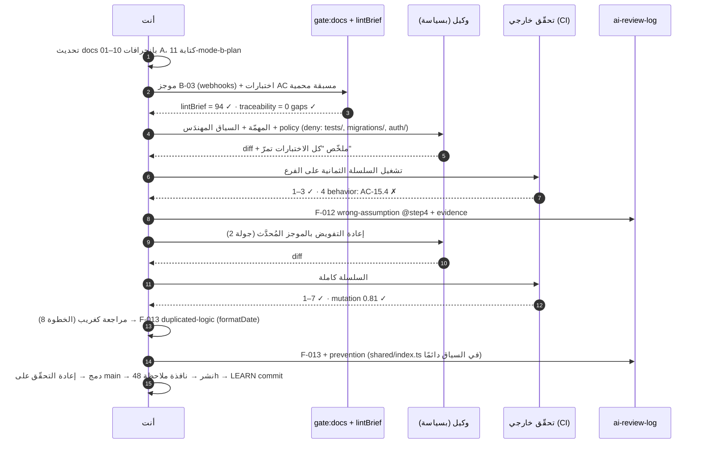

# Module 9.2 — مشروع التخرج، المسار B: بمساعدة AI (Mode B — AI-assisted)
## Capstone SaaS, Mode B: you own spec, architecture, constraints, acceptance criteria and tests; AI implements selected modules; you verify everything

> **قبل تعلّم هذا، يجب أن تفهم…** المسار A كاملًا (M9.1) — **لا تبدأ B قبل أن تُسلّم A**. السبب ليس طقسًا: في B ستحكم على كود لم تكتبه، والمرجع الوحيد الصادق للحكم هو نسخة بنيتها بيدك وتعرف أين كانت صعبة.

---

## 1. المتطلبات (Prerequisites)

- [ ] سلّمت المسار A: الوثائق العشر مُراجَعة، M0–M6 مكتملة، `gate:docs` = 0 فجوات، تدريبات الفشل موثّقة — [M9.1](module-9.1-capstone-mode-a.md)
- [ ] تكتب موجز تفويض بأقسامه السبعة ويمرّ `lintBrief` — [M8.6](../level-8-ai-native-engineering/module-8.6-ai-delegation.md)
- [ ] تُشغّل سلسلة التحقّق الثمانية وتُنتج سجلًّا يمرّ `auditLog`، وتقيس جودة الاختبارات بالطفرة — [M8.7](../level-8-ai-native-engineering/module-8.7-ai-verification.md)
- [ ] تقرأ كود AI بقائمة أنماط الفشل الثمانية والكواشف — [M8.8](../level-8-ai-native-engineering/module-8.8-ai-failure-modes.md)
- [ ] تُشغّل وكيلًا بسياسة (allow/ask/deny، مسارات محمية، تحقّق خارجي) وتعرف الحدود الصلبة — [M8.4](../level-8-ai-native-engineering/module-8.4-ai-agents.md), [M8.9](../level-8-ai-native-engineering/module-8.9-ai-security.md), [M8.10](../level-8-ai-native-engineering/module-8.10-human-in-the-loop.md)
- [ ] أتممت Project 8 ووجدت فيه ≥ 3 مشكلات بوقاية مُلتزَمة — [Project 8](../projects/project-8-ai-assisted/README.md)

---

## 2. أهداف التعلّم (Learning Objectives)

بعد إتمام المسار B ستكون قد:
1. أعدت بناء **3–5 وحدات** من TeamDocs بتفويض منظّم: موجز كامل، اختبارات مكتوبة مسبقًا، سياسة وكيل، سلسلة تحقّق، مراجعة كغريب.
2. أنتجت `docs/ai-review-log.md` موثَّقًا آليًا: كل مشكلة اكتُشفت في كود AI بفئتها وخطوة التقاطها ودليلها **ووقايتها المُلتزَمة**.
3. قرّرت — بمعيار مكتوب لا بالحدس — ما يُفوَّض وما لا يُفوَّض أبدًا في منتجك، ودافعت عن القرار.
4. قارنت المسارين بالأرقام: زمن، عيوب، نتائج السلسلة، جولات التفويض — وكتبت استنتاجًا صادقًا عن أين يُضاعفك AI وأين لا.
5. أثبتّ أن المنتج النهائي (A + وحدات B) يجتاز نفس بوّابة الإطلاق ونفس تدريبات الفشل دون تنازل.

---

## 3. شرح للمبتدئ (Beginner Explanation)

### ما الذي يتغيّر بين A وB؟ شيء واحد فقط

| | المسار A | المسار B |
|---|---|---|
| المشكلة والمتطلّبات والـ AC | أنت | أنت (نفس الوثائق، مُحدَّثة بانحرافات A) |
| البنية والـ ADRs والقيود | أنت | أنت |
| الاختبارات من الـ AC | أنت | أنت — **قبل** التفويض، محمية |
| **كتابة كود الوحدات المختارة** | أنت | **AI** (وكيل بسياسة) |
| التحقّق (8 خطوات) والمراجعة | أنت | أنت — بصرامة أكبر لأنك لم تكتبه |
| الدمج والنشر والملاحظة والتعلّم | أنت | أنت |

كل ما يملك قرارًا لا رجعة فيه يبقى عندك. ما يُفوَّض هو **التنفيذ ضمن عقد مكتوب**. إن وجدت نفسك تسأل النموذج "كيف يجب أن يعمل هذا؟" فقد عدت إلى vibe (M8.2) — السؤال المسموح هو "ما مقايضات هذين الخيارين اللذين كتبتهما؟".

### أي وحدات تُفوَّض؟

طبّق سياسة الطبقات من M8.2 §9 والحدود الصلبة من M8.10 على وحداتك:

```
لا تُفوَّض أبدًا (Tier 3 / حدّ صلب)        تُفوَّض بتحقّق كامل (Tier 1–2)
──────────────────────────────────         ─────────────────────────────────
auth (جلسات، hashing، إعادة التعيين)        webhooks الصادرة (تسليم، إعادة، backoff)
authZ وسياسات RLS                            مهمّة التصدير (CSV/JSON بتدفّق)
ترحيلات تلمس جداول المستأجر                  توزيع الإشعارات (fan-out من الأحداث)
العمليات الشبيهة بالفوترة                    معالجة الملفات (thumbnails، استخراج نصّ)
سياسة الوكيل نفسها والـ CI                   فهرسة البحث البسيطة
                                             سجلّ التدقيق: التصدير والاستعلام (لا الكتابة)
```

اختر **3 إلى 5** من العمود الأيمن. أقلّ من 3 لا يُعطيك بيانات للمقارنة؛ أكثر من 5 يجعل التحقّق سطحيًا. اكتب الاختيار وسببه في `docs/11-mode-b-plan.md`.

### ماذا تفعل بوحدات A الموجودة؟

الوحدات التي تُفوّضها **تُحذف وتُعاد كتابتها** من الموجز (فرع جديد `mode-b/<module>`). اختباراتها من A تبقى — هي الآن اختبارات مكتوبة مسبقًا محمية. هذا يمنحك مقارنة نادرة: نفس العقد، تنفيذان، نفس الاختبارات.

### الزمن

3–5 أسابيع. التوزيع: أسبوع لتحديث الوثائق + خطّة B + الموجزات (نعم، أسبوع كامل بلا توليد)، ثم دورة واحدة لكل وحدة (موجز → تفويض → تحقّق → مراجعة → دمج → ملاحظة → تعلّم)، ثم أسبوع ملاحظة وكتابة المقارنة.

---

## 4. النموذج الذهني (Mental Model)

### نفس الوثائق، أيدٍ مختلفة، نفس البوّابة

```
            ┌────────── أنت ──────────┐    ┌── AI ──┐    ┌───────────── أنت ─────────────┐
 docs 01–10 → brief (7 أقسام) → tests ─┼─→ implement ─┼─→ chain(8) → review → integrate → observe → learn
            └─ decisions, constraints ─┘    └ policy ┘    └── evidence, ai-review-log, prevention ──┘
```

البوّابة التي يمرّ بها كود B هي **حرفيًا** بوّابة الإطلاق في A: نفس `gate:docs`، نفس اختبارات AC، نفس اختبار العزل، نفس تدريبات الفشل. إن احتجت تخفيف أي شرط "لأن AI كتبه"، فذلك هو الاكتشاف الأهمّ في مشروعك — سجّله.

### المصطلح المركزي: Finding

كل ما تكتشفه في كود AI ولم يكن ليمرّ من مراجعتك يُسمّى **finding** ويُسجَّل بسبع خانات:

```
F-012 · module: webhooks · brief: B-03 · category: wrong-assumption (أنماط M8.8 الثمانية)
severity: high · caught-at: step 4 behavior (الخطوات الثماني)
evidence: اختبار AC-15.4 المسبق فشل: إعادة الإرسال بعد 3 فشل أرسلت الحمولة القديمة لا المحدَّثة
prevention: commit 3f9a1c — قاعدة في AGENTS.md: "الحمولة تُقرأ وقت الإرسال لا وقت الجدولة" + AC-15.7 جديد
```

بلا `prevention` مُلتزَم، الـ finding ملاحظة لا تعلّم (M8.11). الأداة في §7 ترفض السجلّ الناقص.

### ما تُقاس عليه

ليس "هل عمل AI" بل: **كم finding اكتشفت، في أي خطوة، وكم منها مُنعت من التكرار**. صفر findings = لم تراجع. كل findings في الخطوة 8 (المراجعة البشرية) = سلسلتك الآلية ضعيفة. معظمها في الخطوات 1–4 = سلسلتك جيّدة.

---

## 5. الرسم التوضيحي (Visual Diagram)



---

## 6. مثال بسيط (Simple Example)

موجز تفويض لوحدة واحدة، كما يجب أن يبدو في `docs/briefs/B-03-webhooks.md` (مُختصَر؛ الحقيقي ~120 سطرًا):

```markdown
# B-03 — Outgoing webhook delivery

## 1. الهدف
تسليم أحداث المنظّمة (document.created, task.assigned, …) إلى endpoints مسجَّلة من العميل،
at-least-once، بترتيب لكل endpoint، مع إعادة بـ backoff وتوقيع HMAC.

## 2. السياق (ما يُحمَّل للوكيل)
docs/06-domain-model.md#webhook · docs/08-api.md#webhooks · docs/07-architecture.md#outbox
src/modules/webhooks/public.ts (الواجهة الثابتة) · src/platform/queue/public.ts
src/modules/notifications/worker.ts (مثال worker موجود — اتّبع أسلوبه) · AGENTS.md

## 3. القيود
- لا تعديل خارج src/modules/webhooks/** (باستثناء لا شيء). الاختبارات والترحيلات محمية.
- استخدم platform/queue فقط؛ لا مكتبات جديدة؛ لا setTimeout للجدولة.
- التوقيع: HMAC-SHA256 على `${timestamp}.${body}` في رأس X-Signature مع X-Timestamp (ADR-0009).
- الحمولة تُقرأ من DB وقت الإرسال لا وقت الجدولة.

## 4. معايير القبول (محمية، موجودة في tests/webhooks/*.test.ts)
AC-15.1 … AC-15.6 (نجاح، 5xx → إعادة 1s/4s/16s/64s/… حتى 24h، 4xx → لا إعادة + تعطيل بعد 10،
ترتيب لكل endpoint، idempotency بـ delivery_id، توقيع صحيح)
AC-15.7 (سلبي): endpoint يستجيب ببطء 30s → مهلة 10s وتُعدّ فشلًا.

## 5. الأمن
- لا SSRF: رفض عناوين خاصّة/loopback/link-local عند التسجيل **وعند الإرسال** (DNS rebinding).
- السرّ لا يظهر في السجلّات؛ الحمولة تُنقَّح من حقول PII حسب docs/05-threat-model.md#T-15.

## 6. الاختبارات
- موجودة. لا تُعدَّل. إن رأيت اختبارًا خاطئًا: توقّف واكتب لماذا.
- أضف اختبارات وحدة للـ backoff والتوقيع فقط.

## 7. خارج النطاق
- webhooks الواردة · واجهة إدارة · إعادة التسليم اليدوي · مقاييس (موجودة في platform).

عند الشكّ: توقّف واسأل. لا تفترض.
```

ما يجعله موجزًا لا عنوانًا: كل قرار كان النموذج سيتّخذه نيابةً عنك (الخوارزمية، التوقيع، المهلة، SSRF، الترتيب) مكتوب — لأنك اتّخذته في A وتعرف ثمنه.

---

## 7. مثال كود (Code Example)

أداتان لهذا المسار: **فاحص خطّة التفويض** (هل اخترت ما يجوز تفويضه وبالشروط؟) و**فاحص سجلّ المراجعة** (هل كل finding كامل وقابل للفحص؟). كلاهما يعمل في CI.

```typescript
// src/tools/mode-b.ts
// (1) خطّة التفويض: أي وحدة تُفوَّض وتحت أي شروط. (2) سجلّ المراجعة: كل finding مكتمل.

export type Tier = 0 | 1 | 2 | 3;
export interface ModulePlan {
  module: string;
  tier: Tier;                       // من سياسة M8.2 §9
  touches: ReadonlyArray<"auth" | "authz" | "tenant-tables" | "payments" | "ci" | "agent-policy" | "none">;
  delegate: boolean;
  briefId?: string;                 // B-nn
  preWrittenTests?: ReadonlyArray<string>;  // مسارات ملفات اختبار موجودة قبل التفويض
  briefLintScore?: number;          // من lintBrief (M8.6)
}
export interface PlanIssue { module: string; code: string; message: string }

const HARD_GATE = new Set(["auth", "authz", "tenant-tables", "payments", "ci", "agent-policy"]);

export function checkDelegationPlan(plan: ReadonlyArray<ModulePlan>, existing: ReadonlySet<string>): PlanIssue[] {
  const issues: PlanIssue[] = [];
  const delegated = plan.filter((m) => m.delegate);
  if (delegated.length < 3) issues.push({ module: "*", code: "too-few", message: `فُوّضت ${delegated.length} وحدات؛ الحدّ الأدنى 3 للمقارنة` });
  if (delegated.length > 5) issues.push({ module: "*", code: "too-many", message: `فُوّضت ${delegated.length} وحدات؛ الحدّ الأقصى 5 ليبقى التحقّق عميقًا` });
  for (const m of delegated) {
    const hard = m.touches.filter((t) => HARD_GATE.has(t));
    if (m.tier === 3 || hard.length > 0) issues.push({ module: m.module, code: "hard-gate", message: `${m.module} يلمس ${hard.join("/") || "Tier 3"} — لا يُفوَّض في هذا المشروع` });
    if (!m.briefId || !/^B-\d{2}$/.test(m.briefId)) issues.push({ module: m.module, code: "no-brief", message: `${m.module} بلا موجز B-nn` });
    if ((m.briefLintScore ?? 0) < 90) issues.push({ module: m.module, code: "weak-brief", message: `${m.module}: lintBrief = ${m.briefLintScore ?? 0} < 90` });
    const tests = m.preWrittenTests ?? [];
    if (tests.length === 0) issues.push({ module: m.module, code: "no-pre-tests", message: `${m.module} بلا اختبارات مكتوبة مسبقًا` });
    for (const t of tests) if (!existing.has(t)) issues.push({ module: m.module, code: "missing-test-file", message: `${t} غير موجود قبل التفويض` });
  }
  return issues;
}

// ── سجلّ المراجعة ─────────────────────────────────────────────────────────────
export const CATEGORIES = [
  "hallucinated-api", "outdated-api", "wrong-assumption", "security-vulnerability",
  "missing-edge-case", "over-abstraction", "duplicated-logic", "inconsistent-architecture",
] as const;
export type Category = (typeof CATEGORIES)[number];
export const STEPS = ["compile", "typecheck", "tests", "behavior", "security", "performance", "architecture", "human-review"] as const;

export interface Finding {
  id: string; module: string; brief: string; category: Category; severity: "low" | "medium" | "high" | "critical";
  caughtAt: (typeof STEPS)[number]; evidence: string; prevention: string;
}
export interface LogIssue { id: string; code: string; message: string }

/** يُحلّل تنسيق السجلّ النصّي: كتل تبدأ بـ "### F-nnn" وأسطر "key: value". */
export function parseReviewLog(md: string): { findings: Finding[]; issues: LogIssue[] } {
  const findings: Finding[] = [], issues: LogIssue[] = [];
  const blocks = md.split(/^### (?=F-\d{3}\b)/m).slice(1);
  for (const block of blocks) {
    const [head = "", ...rest] = block.split("\n");
    const id = head.trim().split(/\s+/)[0] ?? "";
    const kv = new Map<string, string>();
    for (const line of rest) { const m = /^\s*[-*]?\s*([a-zA-Z-]+)\s*:\s*(.+)$/.exec(line); if (m) kv.set(m[1]!.toLowerCase(), m[2]!.trim()); }
    const get = (k: string) => kv.get(k) ?? "";
    const f: Finding = {
      id, module: get("module"), brief: get("brief"), category: get("category") as Category,
      severity: get("severity") as Finding["severity"], caughtAt: get("caught-at") as Finding["caughtAt"],
      evidence: get("evidence"), prevention: get("prevention"),
    };
    for (const k of ["module", "brief", "category", "severity", "caught-at", "evidence", "prevention"]) if (!get(k)) issues.push({ id, code: "missing-field", message: `${id}: الحقل ${k} مفقود` });
    if (f.category && !(CATEGORIES as ReadonlyArray<string>).includes(f.category)) issues.push({ id, code: "bad-category", message: `${id}: الفئة "${f.category}" ليست من أنماط M8.8 الثمانية` });
    if (f.caughtAt && !(STEPS as ReadonlyArray<string>).includes(f.caughtAt)) issues.push({ id, code: "bad-step", message: `${id}: الخطوة "${f.caughtAt}" ليست من الثماني` });
    if (f.evidence && !/(AC-\d{2}\.\d+|test|exit code|mutation|grep|trace|log|\d)/i.test(f.evidence)) issues.push({ id, code: "weak-evidence", message: `${id}: الدليل لا يذكر اختبارًا/AC/مخرجًا قابلًا للفحص` });
    if (f.prevention && !/\b[0-9a-f]{7,40}\b|AGENTS\.md|AC-\d{2}\.\d+|rule|detector|policy/i.test(f.prevention)) issues.push({ id, code: "prevention-not-committed", message: `${id}: الوقاية بلا commit/قاعدة/AC/كاشف — ملاحظة لا تعلّم` });
    findings.push(f);
  }
  return { findings, issues };
}

export interface LogVerdict { ok: boolean; issues: LogIssue[]; stats: { total: number; byStep: Record<string, number>; byCategory: Record<string, number>; humanOnlyRatio: number } }

/** الحكم على السجلّ: ≥ 1 finding لكل وحدة مفوَّضة، لا أخطاء بنيوية، ونسبة ما لم يُلتقط إلا بشريًا. */
export function judgeReviewLog(md: string, delegatedModules: ReadonlyArray<string>): LogVerdict {
  const { findings, issues } = parseReviewLog(md);
  const byStep: Record<string, number> = {}, byCategory: Record<string, number> = {};
  for (const f of findings) { byStep[f.caughtAt] = (byStep[f.caughtAt] ?? 0) + 1; byCategory[f.category] = (byCategory[f.category] ?? 0) + 1; }
  for (const m of delegatedModules) if (!findings.some((f) => f.module === m)) issues.push({ id: "*", code: "module-without-findings", message: `الوحدة ${m} بلا أي finding — صفر = لم تُراجَع` });
  const humanOnlyRatio = findings.length === 0 ? 0 : (byStep["human-review"] ?? 0) / findings.length;
  if (findings.length >= 5 && humanOnlyRatio > 0.6) issues.push({ id: "*", code: "chain-too-weak", message: `${Math.round(humanOnlyRatio * 100)}% من الـ findings لم تُلتقط إلا في المراجعة البشرية — قوِّ الخطوات 1–7` });
  return { ok: issues.length === 0, issues, stats: { total: findings.length, byStep, byCategory, humanOnlyRatio } };
}
```

```typescript
// src/tools/mode-b.test.ts
import { test } from "node:test";
import assert from "node:assert/strict";
import { checkDelegationPlan, judgeReviewLog, parseReviewLog, type ModulePlan } from "./mode-b.ts";

const existing = new Set(["tests/webhooks/delivery.test.ts", "tests/export/export.test.ts", "tests/notifications/fanout.test.ts"]);
const good: ModulePlan[] = [
  { module: "webhooks", tier: 2, touches: ["none"], delegate: true, briefId: "B-03", preWrittenTests: ["tests/webhooks/delivery.test.ts"], briefLintScore: 94 },
  { module: "export", tier: 1, touches: ["none"], delegate: true, briefId: "B-04", preWrittenTests: ["tests/export/export.test.ts"], briefLintScore: 91 },
  { module: "notifications", tier: 2, touches: ["none"], delegate: true, briefId: "B-05", preWrittenTests: ["tests/notifications/fanout.test.ts"], briefLintScore: 90 },
  { module: "auth", tier: 3, touches: ["auth"], delegate: false },
];

test("خطّة سليمة: 3 وحدات مفوَّضة بموجزات واختبارات مسبقة = لا مشكلات", () => {
  assert.deepEqual(checkDelegationPlan(good, existing), []);
});

test("تفويض auth أو وحدة تلمس جداول المستأجر = حدّ صلب؛ وموجز ضعيف واختبارات غائبة تُرفض", () => {
  const bad: ModulePlan[] = [
    ...good.slice(0, 2),
    { module: "auth", tier: 3, touches: ["auth"], delegate: true, briefId: "B-01", preWrittenTests: ["tests/auth/x.test.ts"], briefLintScore: 95 },
    { module: "search", tier: 1, touches: ["tenant-tables"], delegate: true, briefId: "B-06", briefLintScore: 80 },
  ];
  const codes = checkDelegationPlan(bad, existing).map((i) => `${i.module}:${i.code}`).sort();
  assert.deepEqual(codes, ["auth:hard-gate", "auth:missing-test-file", "search:hard-gate", "search:no-pre-tests", "search:weak-brief"]);
});

test("أقلّ من 3 وحدات = too-few، أكثر من 5 = too-many", () => {
  assert.ok(checkDelegationPlan(good.slice(0, 1), existing).some((i) => i.code === "too-few"));
  const many = Array.from({ length: 6 }, (_, i) => ({ ...good[0]!, module: `m${i}`, briefId: `B-1${i}` }));
  assert.ok(checkDelegationPlan(many, existing).some((i) => i.code === "too-many"));
});

const LOG = `# AI Review Log

### F-001 webhooks
- module: webhooks
- brief: B-03
- category: wrong-assumption
- severity: high
- caught-at: behavior
- evidence: AC-15.4 المسبق فشل: أُرسلت الحمولة القديمة بعد التحديث
- prevention: commit 3f9a1c2 — قاعدة AGENTS.md "الحمولة تُقرأ وقت الإرسال" + AC-15.7

### F-002 webhooks
- module: webhooks
- brief: B-03
- category: duplicated-logic
- severity: low
- caught-at: human-review
- evidence: grep formatDate → نسختان (shared/format.ts, webhooks/util.ts)
- prevention: commit 9b1d0e4 — shared/index.ts في السياق دائمًا + كاشف التكرار في CI

### F-003 export
- module: export
- brief: B-04
- category: missing-edge-case
- severity: medium
- caught-at: tests
- evidence: اختبار AC-21.3 (200k صف) فشل بـ heap out of memory
- prevention: AC-21.5 جديد + قاعدة "كل تصدير بتدفّق cursor" في AGENTS.md
`;

test("سجلّ مكتمل: 3 findings، لا مشكلات، إحصاءات صحيحة", () => {
  const v = judgeReviewLog(LOG, ["webhooks", "export"]);
  assert.equal(v.ok, true, JSON.stringify(v.issues));
  assert.equal(v.stats.total, 3);
  assert.equal(v.stats.byStep["behavior"], 1);
  assert.equal(v.stats.byCategory["duplicated-logic"], 1);
});

test("وحدة مفوَّضة بلا findings تُرفض (صفر = لم تُراجَع)", () => {
  const v = judgeReviewLog(LOG, ["webhooks", "export", "notifications"]);
  assert.ok(v.issues.some((i) => i.code === "module-without-findings" && i.message.includes("notifications")));
});

test("finding بلا وقاية مُلتزَمة، أو بفئة خارج الثماني، أو بدليل انطباعي يُرفض", () => {
  const bad = `### F-010 x
- module: export
- brief: B-04
- category: bad-vibes
- severity: low
- caught-at: human-review
- evidence: الكود بدا غريبًا
- prevention: سأنتبه أكثر المرّة القادمة
`;
  const { issues } = parseReviewLog(bad);
  const codes = issues.map((i) => i.code).sort();
  assert.deepEqual(codes, ["bad-category", "prevention-not-committed", "weak-evidence"]);
});

test("سلسلة ضعيفة: معظم الـ findings لم تُلتقط إلا بشريًا", () => {
  const block = (n: number) => `### F-${String(n).padStart(3, "0")} m\n- module: webhooks\n- brief: B-03\n- category: missing-edge-case\n- severity: low\n- caught-at: human-review\n- evidence: AC-15.${n} failed on review\n- prevention: AC-15.${n + 10} added\n`;
  const md = Array.from({ length: 6 }, (_, i) => block(i + 1)).join("\n");
  const v = judgeReviewLog(md, ["webhooks"]);
  assert.ok(v.issues.some((i) => i.code === "chain-too-weak"));
});
```

**في المشروع:** `npm run gate:mode-b` يقرأ `docs/11-mode-b-plan.json` و`docs/ai-review-log.md` ويخرج بـ 1 عند أي مشكلة. يعمل في CI على فروع `mode-b/*` فقط.

---

## 8. مثال من العالم الحقيقي (Real-world Example)

**نفس المهندسة، نفس الوحدة، تجربتان.**

ليلى أنهت المسار A في تسعة أسابيع. وحدة الـ webhooks أخذت منها 11 يومًا؛ أصعب جزء كان SSRF عند الإرسال (DNS rebinding) الذي اكتشفته من نموذج التهديد لا من الكود.

في المسار B فوّضت الوحدة بموجز B-03 أعلاه. الجولة الأولى: 40 دقيقة توليد، السلسلة فشلت في الخطوة 4 (AC-15.4: الحمولة القديمة). الجولة الثانية: 15 دقيقة، السلسلة خضراء، الطفرة 0.81. المراجعة كغريب (ساعتان): finding واحد (تكرار `formatDate`) وملاحظة: فحص SSRF موجود عند التسجيل **فقط** — رغم أن الموجز قال "وعند الإرسال". النموذج قرأ السطر ونفّذ نصفه؛ الاختبار المسبق AC-15.6 كان يختبر التسجيل فقط. **F-004، category: security-vulnerability، caught-at: human-review، prevention: اختبار AC-15.8 يُشغّل DNS وهميًا يُغيّر الحلّ بين التسجيل والإرسال.**

الحصيلة: 4 ساعات بدل 11 يومًا، و4 findings كلّها كانت ستصل الإنتاج لولا A. استنتاجها المكتوب: "AI وفّر 95% من وقت الكتابة في وحدة فهمتها مسبقًا. الـ finding الوحيد الخطير التقطه الإنسان لا السلسلة — لأن اختباري المسبق كان ناقصًا. الدرس ليس 'راجع أكثر' بل 'اختبار التهديد يجب أن يُغطّي كل نقطة ذكرها نموذج التهديد، لا أوّلها'."

هذه الفقرة الأخيرة هي ما يُطلب منك في `docs/12-a-vs-b.md`. ليس "AI رائع" ولا "AI خطير" — بل أين بالضبط ولماذا.

---

## 9. مثال من الإنتاج (Production Example)

### دورة تفويض واحدة، كما تُنفَّذ (قالب `docs/briefs/B-nn.md` + سجلّ)

```yaml
# .loop/cycle-B-03.yml — سجلّ الدورة الموحَّد (M8.11)
cycle: B-03
module: webhooks
understand:  { input: "docs/06-domain-model.md#webhook, docs/05-threat-model.md#T-15", output: "docs/briefs/B-03.md#context" }
specify:     { brief: "docs/briefs/B-03.md", lintBrief: 94, acs: ["AC-15.1","AC-15.2","AC-15.3","AC-15.4","AC-15.5","AC-15.6","AC-15.7"], traceability: 0 }
design:      { adrs: ["ADR-0009-hmac-signature", "ADR-0011-per-endpoint-ordering"], boundaries: "src/modules/webhooks/** only" }
delegate:
  policy: { allow: ["read:**", "write:src/modules/webhooks/**", "run:npm test -- webhooks"], ask: ["write:src/platform/**"], deny: ["write:tests/**", "write:migrations/**", "write:src/modules/auth/**", "run:git push", "net:*"] }
  rounds: 2
  trace: ".loop/traces/B-03-r1.json, B-03-r2.json"
verify:
  chain: { compile: ok, typecheck: ok, tests: "41/41", behavior: "AC 7/7 + manual path docs/briefs/B-03.md#manual", security: "semgrep 0, ssrf-check ok, secrets 0", performance: "p95 delivery enqueue 4ms (budget 20ms)", architecture: "boundaries 0, duplicates 1 → F-002" }
  mutation: 0.81
  log: ".loop/verification-B-03.json"
review:      { reviewer: "self-as-stranger + peer", findings: ["F-001","F-002","F-004"], hours: 2.5 }
integrate:   { rebase: true, chain_rerun: ok, merged: "7c21e90" }
deploy:      { env: staging→prod, canary: "10% 30min", gate: "L1" }
observe:     { window: "48h", metrics: ["webhook_delivery_success_rate ≥ 99%", "retry_storm_alert = 0", "p95 < 500ms"], result: ok }
learn:       { commits: ["3f9a1c2 AGENTS.md payload rule", "9b1d0e4 shared in context + dup detector", "e4d7a01 AC-15.8 dns-rebinding test"], brief_template_delta: "+ 'كل نقطة في T-nn لها اختبار'" }
```

### `docs/12-a-vs-b.md` — ما يجب أن يحتويه

| المحور | A | B | ملاحظة |
|---|---|---|---|
| زمن الوحدة (ساعات عمل) | لكل وحدة | لكل وحدة | يشمل كتابة الموجز والتحقّق — لا التوليد فقط |
| جولات التفويض | — | n | > 2 = موجز ضعيف في مكان ما |
| findings بحسب الخطوة | — | جدول | أين تلتقط سلسلتك؟ |
| findings بحسب الفئة | — | جدول | ما نمط فشل نموذجك/سياقك المتكرّر؟ |
| عيوب بعد الدمج (48h ملاحظة) | n | n | المقياس المضادّ الحقيقي |
| درجة الطفرة | n | n | هل الاختبارات المسبقة كافية؟ |
| تغييرات LEARN المُلتزَمة | — | n | ملاحظات بلا commit لا تُحسب |
| نسبة الأسطر المولَّدة في المنتج النهائي | 0% | % | شفافية |
| **استنتاج بفقرتين** | | | أين ضاعفك AI وأين لا، ولماذا — بأدلّة من الأعلى |

---

## 10. أخطاء شائعة في الفهم (Common Misconceptions)

| الاعتقاد | الواقع |
|---|---|
| "B هو A بسرعة" | B هو A بتوزيع مختلف للوقت: أقلّ كتابة، **أكثر** تحديدًا وتحقّقًا. إن كان إجمالي وقتك في B أقلّ من 40% من A في وحدة ما، فتحقّقك على الأرجح سطحي. |
| "الاختبارات المسبقة من A كافية" | هي ضرورية لا كافية — كُتبت لتقودك أنت، لا لتُحاصر نموذجًا يملأ الفجوات بالأشيع. أضف الحالات السلبية التي كنت تعرفها ضمنيًا. |
| "إن مرّت السلسلة فالمراجعة البشرية شكلية" | في مثال §8 الـ finding الوحيد الخطير التقطه الإنسان. السلسلة تُثبت غياب ما تعرف كيف تفحصه؛ المراجعة تبحث عن **الغائب**. |
| "صفر findings = نموذج ممتاز" | صفر findings = لم تُراجَع. الأداة ترفضه وهذا مقصود. |
| "يمكنني تفويض auth لأن لديّ اختبارات ممتازة" | الحدّ الصلب لا يتعلّق بجودة اختباراتك بل بتكلفة التراجع ونطاق الأثر (M8.10). في مشروع تعليمي يمكنك تجربة ذلك **على فرع يُرمى** وتوثيق ما حدث — لا دمجه. |
| "الموجز الجيّد = لا findings" | الموجز الجيّد = findings تُلتقط **مبكرًا** (خطوات 1–4) لا أن تختفي. الاختفاء التامّ يعني غالبًا أن اختباراتك لا ترى. |

---

## 11. أخطاء شائعة في التطبيق (Common Mistakes)

1. **تفويض وحدة قبل تحديث وثائق A بانحرافاتها** — النموذج يُنفّذ تصميم الأسبوع الأول لا ما انتهيت إليه.
2. **الاختبارات المسبقة في مجلّد يستطيع الوكيل كتابته** — المسار محمي أم لا؟ تحقّق من الـ trace لا من النيّة.
3. **سياق بلا `public.ts` للوحدات المجاورة** → نمط التكرار (F-002 في المثال) في كل وحدة.
4. **إعادة التفويض بنفس الموجز بعد finding** — الجولة الثانية بلا تحديث الموجز تُكرّر الخطأ أو تُخفيه.
5. **تسجيل الـ finding بعد الدمج** — يُسجَّل لحظة الاكتشاف وإلا ضاع الدليل.
6. **وقاية من نوع "سأراجع هذا أكثر"** — الأداة ترفضها، وبحقّ: الوقاية قاعدة أو كاشف أو AC أو تغيير سياسة، بـ commit.
7. **قياس الزمن للتوليد فقط** — احسب الموجز والتحقّق والمراجعة والجولات. الرقم الصادق هو ما تُقارن به.
8. **تخفيف بوّابة الإطلاق "لأن الوحدة صغيرة"** — نفس البوّابة لـ A وB، وإلا فالمقارنة باطلة.
9. **نسيان نافذة الملاحظة** — دمج وحدة B الثالثة قبل انقضاء 48 ساعة على الثانية يُخفي أي عيب مُسرَّب عن أيّهما.
10. **عدم كتابة الاستنتاج** — بلا `12-a-vs-b.md` فعلت تمرينًا لا تعلّمًا.

---

## 12. تمرين تصحيح (Debugging Exercise)

```
# الوحدة المفوَّضة: export (B-04). السلسلة خضراء، الطفرة 0.84، دُمجت.
# بعد 30 ساعة من نافذة الملاحظة: تنبيه "worker memory > 1.5 GB" ثم إعادة تشغيل OOM.
# السجلّ: export job org=o_17 rows=412000 format=csv status=running … (لا status=done)
# اختبار AC-21.3 (200k صف، RSS < 300 MB) كان يمرّ.
```

اكتب قبل الحلّ: الدليل الأول، الفرضية، التجربة، الإصلاح، الوقاية **كـ finding كامل**.

<details><summary>الحل</summary>

**الدليل الأول:** `git log -p src/modules/export` من جولة B-04 + الـ trace: هل استُخدم cursor فعلًا؟ (نعم للقراءة.) ثم أين تنمو الذاكرة؟ `--heap-prof` على 400k صف محلّيًا → مصفوفة `audit_rows` تنمو في… طبقة **التدقيق**: الكود المولَّد يُسجّل كل صف مُصدَّر في `auditEvents.push(...)` ثم يكتبها دفعة واحدة في النهاية (ليفعل "append-only audit" من الموجز §5 بأبسط طريقة). **الفرضية:** التدفّق صحيح للبيانات، لكن تأثيرًا جانبيًا مطلوبًا في الموجز نُفّذ بتجميع في الذاكرة. **التجربة:** 400k صف مع تعطيل التدقيق → RSS ثابت 180 MB؛ مع التدقيق → خطّي. مؤكَّد. **لماذا مرّ AC-21.3؟** 200k × ~1 KB تدقيق ≈ 200 MB + 180 ≈ 380 MB… والاختبار كان يقيس RSS **قبل** مرحلة كتابة التدقيق (تأكيد في منتصف التدفّق). **الإصلاح:** حدث تدقيق واحد لكل تصدير (بداية/نهاية + عدد الصفوف) لا لكل صف — وهذا أصلًا ما كان في A؛ الموجز لم يقله صراحة. **Finding:** `F-007 · export · B-04 · wrong-assumption · high · caught-at: human-review (observe) · evidence: heap profile يُظهر auditEvents[] بـ 412k عنصر؛ AC-21.3 قاس RSS قبل flush · prevention: commit … — AC-21.6 "RSS < 300 MB حتى status=done" + سطر في الموجز "التدقيق لكل تصدير لا لكل صف" + قاعدة AGENTS.md "لا تجميع غير محدود في الذاكرة لأي تأثير جانبي"`. **أين أيضًا؟** الإشعارات (fan-out يجمع المستلمين؟)، webhooks (قائمة الأحداث المعلّقة؟). **درس للمقارنة:** هذا finding من نوع "ما كنت أعرفه ضمنيًا في A ولم أكتبه" — وهو أغلى نوع، سجّله في `12-a-vs-b.md`.
</details>

---

## 13. تمرين معماري (Architecture Exercise)

بصيغة ACTRR، صفحة لكلٍّ:

1. **"ماذا لو كان B هو المسار الوحيد؟"** صمّم منظّمة من 8 مهندسين تبني TeamDocs من الصفر بالمسار B فقط. ما الذي يجب أن يكون موجودًا قبل أول تفويض (وثائق، اختبارات، سياسة، سياق)؟ من يملك ماذا؟ ما الذي لا تستطيع تفويضه **أبدًا** في أول 3 أشهر لأنه لا مرجع له بعد؟ وما تكلفة أن يكون أحد الثمانية لم يمرّ بـ A قط؟
2. **ميزانية التحقّق:** لديك 20 ساعة أسبوعيًا. وزّعها بين كتابة الموجزات، تشغيل السلسلة وتحسينها، المراجعة البشرية، والملاحظة — لثلاث وحدات بمستويات خطر مختلفة. برّر التوزيع بأرقام findings من مشروعك أنت (أين التُقطت؟). ثم: ما الذي تُسقطه أولًا إن انخفضت الميزانية إلى 10 ساعات، ولماذا ليس المراجعة البشرية؟
3. **منصّة المسار B للفريق:** حوّل أدوات §7 وM8 إلى خدمة مشتركة: أين تعيش الموجزات؟ من يُوقّع lintBrief؟ كيف تمنع تعديل الاختبارات المسبقة (git hooks؟ CODEOWNERS؟ فرع محمي؟)؟ كيف يُجمَّع `ai-review-log` عبر الفريق ليُغذّي `AGENTS.md` واحدًا؟ وما المقاييس التي تُخبرك أن المنصّة تُحسّن الجودة لا السرعة فقط؟

---

## 14. العلاقة بعصر AI (AI-era Relevance)

هذا هو المسار الذي ستعمل به غالبًا بعد الكورس. ما يُميّزك ليس أنك تستخدم AI — الجميع يفعل — بل أنك:
- تعرف **ما لا يُفوَّض** وتستطيع تبريره بتكلفة التراجع لا بالخوف.
- تكتب موجزًا يجعل الجولة الثانية نادرة والـ findings مبكرة.
- تملك سلسلة تلتقط 60%+ من المشكلات قبل أن تصل إلى عينيك، وعينين تعرفان أين تبحثان عن الباقي.
- تُحوّل كل finding إلى تغيير في النظام، فتتحسّن كل دورة.
- تستطيع أن تقول لمدير: "هذه الوحدة كتبها AI، وهذه أدلّتي أنها صحيحة، وهذه المشكلات الأربع التي وجدتها ومنعتها" — بسجلّ لا بثقة.

المسار A أعطاك المرجع؛ المسار B أعطاك المنهج؛ `12-a-vs-b.md` أعطاك **رأيًا مبنيًا على بياناتك أنت** — وهو ما يُفرّق المهندس عن المتحمّس في أي نقاش عن AI.

---

## 15. ما يجب إتقانه (MUST MASTER)

- 🔴 حدود التفويض بمعيار مكتوب؛ الموجز الكامل من وثائق موجودة؛ الاختبارات المسبقة المحمية فعلًا (بالـ trace)؛ السلسلة الثمانية + الطفرة كبوّابة واحدة لـ A وB؛ الـ finding بسبع خانات ووقاية مُلتزَمة؛ المراجعة كغريب بحثًا عن الغائب؛ نافذة الملاحظة قبل التفويض التالي؛ المقارنة بالأرقام والاستنتاج.

## 16. ما يجب فهمه (SHOULD UNDERSTAND)

- 🟠 قراءة توزيع الـ findings بحسب الخطوة كتشخيص للسلسلة؛ تصميم سياسة الوكيل لكل وحدة؛ تقدير "ميزانية التحقّق" وتوزيعها؛ تحويل سجلّ المراجعة إلى تحديثات لقالب الموجز وAGENTS.md؛ متى تُلغي التفويض وتكتب بيدك.

## 17. ما يمكن تأجيله (DEFER)

- ⚪ أتمتة الدورة كاملة (orchestrator) — يكفي تنفيذ المراحل يدويًا بسجلّ؛ تعدّد النماذج والمقارنة بينها؛ التفويض على مستوى الميزة الكاملة (عدّة وحدات في موجز واحد).

---

## 18. الخلاصة (Summary)

- B يُغيّر شيئًا واحدًا: من يكتب كود وحدات مختارة. كل قرار لا رجعة فيه يبقى عندك، وكل بوّابة تبقى كما هي.
- 3–5 وحدات من غير الحدود الصلبة، بموجز من وثائق A المُحدَّثة واختبارات مسبقة محمية.
- الـ finding هو وحدة التعلّم: فئة، خطوة، دليل، وقاية مُلتزَمة. صفر = لم تُراجَع؛ كلّها في الخطوة 8 = سلسلة ضعيفة.
- أغلى الـ findings هي "ما كنت أعرفه ضمنيًا ولم أكتبه" — وهي سبب وجود A قبل B.
- `12-a-vs-b.md` هو المخرج الحقيقي: رأي في AI مبنيّ على بياناتك، لا على الضجيج.

---

## 19. المراجع الرسمية (Official References)

- OWASP Top 10 for LLM Applications — https://owasp.org/www-project-top-10-for-large-language-model-applications/
- OWASP Server-Side Request Forgery Prevention Cheat Sheet — https://cheatsheetseries.owasp.org/cheatsheets/Server_Side_Request_Forgery_Prevention_Cheat_Sheet.html
- Standard Webhooks specification — https://www.standardwebhooks.com/
- Stryker Mutator (mutation testing for JS/TS) — https://stryker-mutator.io/docs/
- GitHub Docs: Protected branches & CODEOWNERS — https://docs.github.com/en/repositories/managing-your-repositorys-settings-and-features/customizing-your-repository/about-code-owners
- NIST AI Risk Management Framework — https://www.nist.gov/itl/ai-risk-management-framework

### المصطلحات
| English | العربية |
|---|---|
| AI-assisted (Mode B) | بمساعدة AI (أنت تملك المواصفة والتحقّق، AI يُنفّذ وحدات مختارة) |
| Delegation plan | خطّة التفويض (أي وحدة، أي طبقة، أي شروط) |
| Finding | اكتشاف موثَّق في كود AI (7 خانات) |
| AI review log | سجلّ مراجعة كود AI |
| Prevention (committed) | وقاية مُلتزَمة (قاعدة/كاشف/AC/سياسة بـ commit) |
| Caught-at step | الخطوة التي التُقط فيها الاكتشاف (من الثماني) |
| Human-only ratio | نسبة ما لم يُلتقط إلا بشريًا (مؤشّر ضعف السلسلة) |
| Pre-written protected tests | اختبارات مسبقة محمية (من A، لا يلمسها الوكيل) |
| A-vs-B report | تقرير مقارنة المسارين بالأرقام |
| Verification budget | ميزانية التحقّق (توزيع الساعات على الموجز/السلسلة/المراجعة/الملاحظة) |
| Implicit knowledge gap | فجوة المعرفة الضمنية (ما عرفته في A ولم تكتبه في الموجز) |
