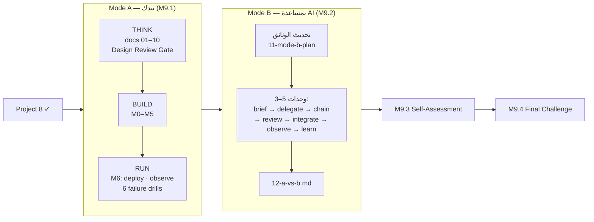

# Capstone — تطبيق SaaS كامل، مرّتين: بقيادة بشرية ثم بمساعدة AI
## Capstone — "TeamDocs" multi-tenant SaaS, Mode A (human-led) then Mode B (AI-assisted), full SDLC, no code before the design is complete

> **المستوى:** Level 9 | **بعد:** [Checkpoint 8](../../level-8-ai-native-engineering/checkpoint-8.md) و[Project 8](../project-8-ai-assisted/README.md) | **قبل:** [M9.3 التقييم الذاتي النهائي](../../level-9-capstone/module-9.3-final-self-assessment.md)
> **المدة المقترحة:** المسار A: 6–10 أسابيع بدوام جزئي · المسار B: 3–5 أسابيع.
> **قاعدة:** هذا المجلّد فهرس. **الدليل الكامل** لكل مسار في وحدتَي Level 9: [M9.1 — Mode A](../../level-9-capstone/module-9.1-capstone-mode-a.md) و[M9.2 — Mode B](../../level-9-capstone/module-9.2-capstone-mode-b.md). المنتج والميزات الـ 18 الإلزامية في [`09-capstone-overview.md`](../../00-course-overview/09-capstone-overview.md).

---

## الخريطة

---

## ما تُسلّمه (ملخّص — التفاصيل في الوحدتين)

### المسار A
- [ ] `docs/01…10` بسطر `Reviewed-by:` في كلٍّ، و`npm run gate:docs` = 0 فجوات
- [ ] `src/tools/traceability.ts` (M9.1 §7) و`boundaries.ts` في CI قبل الاختبارات
- [ ] المعالم M0–M6 بـ DoD الكامل (AC + تزامن + تهديدات مغلقة + تدهور + توثيق)
- [ ] اختبار العزل: 3 منظّمات × كل endpoint × كل worker
- [ ] `docs/failure-drills.md` — 6 تدريبات قبل/بعد؛ `docs/runbook.md`؛ postmortem واحد على الأقل
- [ ] نشر على بيئتين بـ HTTPS وLB ولوحة وتنبيه حقيقي، وتراجع مُجرَّب
- [ ] `docs/07-architecture.md#deviations` و`docs/ai-usage-log.md`

### المسار B
- [ ] `docs/11-mode-b-plan.md` (+ `.json`) يمرّ `checkDelegationPlan` (M9.2 §7): 3–5 وحدات، لا حدود صلبة، موجزات ≥ 90، اختبارات مسبقة موجودة ومحمية
- [ ] `docs/briefs/B-nn.md` لكل وحدة + `.loop/cycle-B-nn.yml` + traces
- [ ] `docs/ai-review-log.md` يمرّ `judgeReviewLog`: ≥ 1 finding لكل وحدة، وقاية مُلتزَمة لكلٍّ
- [ ] نفس بوّابة الإطلاق ونفس تدريبات الفشل لـ A — بلا تخفيف
- [ ] `docs/12-a-vs-b.md` بالجدول الكامل واستنتاج بفقرتين

---

## معايير التقييم الذاتي

| المحور | السؤال | أين تُجيب |
|---|---|---|
| Requirements | هل كل feature مرتبطة بمشكلة مستخدم وAC؟ | `traceability` = 0 |
| Security | هل كل تهديد له دفاع مُحال ومُختبَر؟ | `05-threat-model.md` + `traceability` |
| Data | هل يمكن أن يرى مستأجر بيانات آخر بأي طريقة — بما فيها الـ worker؟ | اختبار العزل |
| Reliability | ماذا يحدث إذا سقط Redis؟ الـ worker؟ مزوّد البريد؟ | `failure-drills.md` |
| Observability | هل تتبّع طلبًا واحدًا من المتصفّح إلى DB إلى الـ worker؟ | لوحة + `requestId` |
| Testing | هل تكسر الاختبارات عندما تكسر الكود عمدًا؟ | درجة الطفرة |
| Evolution | هل تُضيف ميزة دون لمس 10 ملفات غير مرتبطة؟ | `boundaries` + `deviations` |
| AI (Mode B) | كم مشكلة اكتشفت في كود AI وأين؟ (صفر = لم تُراجع) | `ai-review-log.md` |

> **ابدأ من:** [M9.1 — Mode A](../../level-9-capstone/module-9.1-capstone-mode-a.md)
