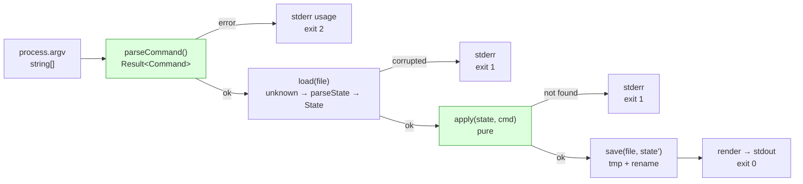

# Project 1 — تطبيق سطر أوامر: مدير مهام
## Project 1 — CLI Application: `todo`

> **المستوى:** Level 1 | **بعد:** [M1.15](../../level-1-programming/module-1.15-typescript-types.md) | **قبل:** [Project 2](../project-2-data-processing/README.md) → [Checkpoint 1](../../level-1-programming/checkpoint-1.md)
> **المدة المقترحة:** 4–6 ساعات صافية، على مدى 2–3 أيام (لتترك وقتًا للنوم بين المشكلة والحل).
> **قاعدة:** تكتبه **بيدك**. يُسمح بسؤال AI "لماذا" بعد أن تحاول 20 دقيقة. لا تطلب منه كودًا.

---

## 1. المشكلة (Problem)

أنت الشخص الذي يسجّل مهامه في ملف نصي ويفقد تتبّعها. تريد أداة في الطرفية — لأنك تعيش فيها الآن (L0-M0.4) — تضيف وتعرض وتُنهي وتحذف مهامًا، وتحفظها بين التشغيلات، وتندمج مع أدوات الـ shell الأخرى (أنابيب، exit codes).

ليس الهدف "تطبيق todo" (العالم لا يحتاج آخر). الهدف: **أول برنامج كامل** تمرّ فيه من مدخل خام إلى حالة محفوظة إلى مخرج، مع أخطاء محترمة، وتاريخ Git نظيف — بنفس البنية التي سيحملها خادم HTTP في Project 3.

## 2. المتطلبات (Requirements)

### Functional
| # | المتطلب |
|---|---|
| F1 | `todo add "<title>" [--due YYYY-MM-DD]` يضيف مهمة بمعرّف تسلسلي ويطبع المهمة المضافة |
| F2 | `todo list [--all \| --pending \| --done]` يعرض المهام (الافتراضي `--pending`) بتنسيق ثابت سطر لكل مهمة |
| F3 | `todo done <id>` يعلّم مهمة منجزة |
| F4 | `todo remove <id>` يحذف مهمة |
| F5 | `todo --help` يطبع الاستخدام ويخرج بـ 0 |
| F6 | البيانات تُحفظ في ملف JSON؛ مساره: `--file <path>` ثم `TODO_FILE` ثم `./todos.json` |
| F7 | `--json` على `list` يطبع JSON بدل النص (لتعمل مع `jq` والأنابيب) |

### Non-Functional
- **Exit codes:** 0 نجاح؛ 1 خطأ متوقع (مهمة غير موجودة، ملف تالف)؛ 2 خطأ استخدام (وسائط ناقصة/خاطئة).
- **stdout للنتائج، stderr للأخطاء والتشخيص** — `todo list | wc -l` يجب أن يعدّ المهام فقط.
- الكتابة **ذرّية** (مؤقت ثم `rename`) — لا ملف نصف مكتوب.
- `npm run typecheck` يمرّ بصفر أخطاء مع `strict` + `noUncheckedIndexedAccess`.
- **لا `any`، لا `as`** خارج المحقّقات الموثّقة، لا `!`.
- لا مكتبات خارجية وقت التشغيل (فقط `typescript`, `tsx` كـ devDependencies).

### Constraints
- Node 22، ESM، TypeScript strict (إعداد M1.0).
- ملف JSON واحد؛ لا قاعدة بيانات.

### Assumptions
- مستخدم واحد، عملية واحدة في كل مرة (لا تزامن — سنكسر هذا الافتراض في Project 4).
- حجم المهام صغير (مئات) — تحميل الملف كله مقبول.

### Out of scope
- أولويات، وسوم، بحث، مزامنة، واجهة تفاعلية.

## 3. معايير القبول (Acceptance Criteria)

| # | Given | When | Then |
|---|---|---|---|
| AC1 | لا يوجد ملف | `todo add "milk"` | يُنشأ الملف، يُطبع `1. milk`، exit 0 |
| AC2 | مهمتان | `todo list` | سطران بالترتيب `[ ] 1. milk` ثم `[ ] 2. eggs`، exit 0 |
| AC3 | مهمة 1 موجودة | `todo done 1` ثم `todo list` | `list` الافتراضي لا يُظهرها؛ `list --done` يُظهر `[x] 1. milk` |
| AC4 | لا مهمة 99 | `todo done 99` | stderr: `error: todo 99 not found`؛ stdout فارغ؛ exit 1 |
| AC5 | أي حالة | `todo add` (بلا عنوان) | stderr يحوي usage؛ exit 2 |
| AC6 | ملف يحوي `{not json` | `todo list` | stderr: `error: todos.json is corrupted (…)`؛ exit 1؛ **الملف لا يُمسّ** |
| AC7 | أي حالة | `todo add "x" --due 2026-13-45` | stderr: `error: invalid date "2026-13-45"`؛ exit 2 |
| AC8 | مهام موجودة | `todo list --json \| jq length` | عدد المهام الصحيح (stdout JSON صالح فقط) |
| AC9 | `TODO_FILE=/tmp/t.json` | `todo add "a"` | يُكتب إلى `/tmp/t.json` وليس `./todos.json` |
| AC10 | مهمتان | `todo remove 1` ثم `todo add "c"` | المهمة الجديدة تحصل على `3` (المعرّفات لا تُعاد) |

## 4. المفاهيم المطبّقة (Concepts Applied)

| المفهوم | الوحدة | أين يظهر |
|---|---|---|
| `string \| undefined` من argv، تحويل + تحقق | M1.1, M1.10 | `parseCommand` |
| guard clauses, `??`, اتحادات حرفية | M1.2, M1.15 | تحليل الخيارات |
| map/filter، لا mutation | M1.5, M1.7 | `apply(state, command)` |
| قيمة vs مرجع، JSON | M1.6 | load/save |
| نواة نقية + قشرة I/O | M1.7, M1.8 | `core/` vs `io/` vs `main.ts` |
| Result على الحدود، استثناءات للنظام، exit codes | M1.9 | `main(): number` |
| `node:fs/promises`, `path`, كتابة ذرّية، stderr | M1.10 | `io/storage.ts` |
| `await` صحيح (لا floating promises) | M1.11 | كل I/O |
| breakpoint على النواة | M1.12 | أثناء التحدي |
| فروع + commits ذرّية + PR على نفسك | M1.13, M1.14 | التسليم |
| اتحاد مميَّز + `never` + محقّق `unknown → State` | M1.15 | `types.ts`, `parseState` |

## 5. التصميم (Design)

**النموذج:** `Input → Logic → State → Output`



**هيكل الملفات:**
```
todo-cli/
├── package.json  tsconfig.json  .gitignore  .vscode/launch.json  README.md
├── src/
│   ├── main.ts            تركيب فقط: argv → parse → load → apply → save → render → exit code
│   ├── types.ts           Todo, State, Command, Result, TodoId
│   ├── core/
│   │   ├── commands.ts    parseCommand(argv): Result<Command>        (نقي)
│   │   ├── todo.ts        apply(state, cmd): Result<State>           (نقي؛ "not found" كـ Result)
│   │   └── render.ts      renderList(todos, {json}): string          (نقي)
│   └── io/
│       └── storage.ts     load(path): Promise<State>, save(path, s)  (الآثار الجانبية فقط)
└── tests/
    └── core.test.ts       (node:test — انظر §6 خطوة 7)
```

**قرارات (Decisions) وبدائلها:**
| قرار | البديل المرفوض | لماذا |
|---|---|---|
| "not found" كـ `Result` من النواة | `throw` من النواة | النواة لا تقرر exit code؛ `main` يقرر — وهذا متوقع لا bug (M1.9) |
| المعرّفات لا تُعاد (`nextId` منفصل) | `max(id)+1` | بعد حذف الأخير يُعاد استخدام معرّفه → ارتباك المستخدم |
| تحميل الملف كاملًا | streaming | الافتراض: مئات المهام؛ موثّق في Assumptions |
| `--json` بدل تنسيق جديد | طباعة جدول جميل | التكامل مع الأنابيب أهم من الجمال هنا |

## 6. خطة التنفيذ (Implementation Plan)

كل خطوة = commit واحد على فرع `feature/...` (M1.13). شغّل `npm run typecheck` قبل كل commit.

1. **Bootstrap:** مشروع من M1.0 + `.gitignore` + `README.md` بالاستخدام المخطط. commit: `Bootstrap todo CLI`.
2. **types.ts:** الأنواع من M1.15 (`Command` اتحاد مميَّز). لا منطق بعد.
3. **core/commands.ts:** `parseCommand`. اختبرها في REPL/ملف مؤقت بمدخلات AC5/AC7 **قبل** كتابة أي I/O.
4. **core/todo.ts:** `apply` مع `never` في `default`. اختبر AC10 ذهنيًا بجدول تتبّع (M1.3).
5. **io/storage.ts:** `load` (ENOENT → حالة أولية؛ JSON سيئ → خطأ `CorruptedFile` مع `cause`؛ `parseState` للتحقق)، `save` ذرّي.
6. **main.ts:** التركيب + exit codes + `--help`. مرّ على AC1–AC10 يدويًا وسجّل النتيجة في جدول في README.
7. **tests/core.test.ts** بـ `node:test` (مدمج، بلا تثبيت):
   ```typescript
   import { test } from "node:test";
   import assert from "node:assert/strict";
   import { apply } from "../src/core/todo.js";
   import { parseCommand } from "../src/core/commands.js";

   test("add assigns sequential ids and never reuses them", () => {
     const s0 = { todos: [], nextId: 1 } as const;
     const r1 = apply(s0, { kind: "add", title: "a" });
     assert.ok(r1.ok);
     const r2 = apply(r1.value, { kind: "remove", id: r1.value.todos[0]!.id });
     assert.ok(r2.ok);
     const r3 = apply(r2.value, { kind: "add", title: "c" });
     assert.ok(r3.ok && r3.value.todos[0]?.id === 2);
   });

   test("done on missing id is an expected failure", () => {
     const r = apply({ todos: [], nextId: 1 }, { kind: "done", id: 99 as never });
     assert.equal(r.ok, false);
   });

   test("parseCommand rejects missing title", () => {
     assert.equal(parseCommand(["add"]).ok, false);
   });
   ```
   أضف `"test": "node --import tsx --test tests/"` إلى scripts. (الاختبارات تُشرح بعمق في L4-M11؛ هنا تكفي 5–8 اختبارات على **النواة** فقط.)
8. **PR على نفسك:** ادفع الفرع، افتح PR، اقرأ الـ diff كاملًا كمراجع، اكتب تعليقين على الأقل لنفسك، ادمج.
9. **Tag:** `git tag -a v1.0.0 -m "Project 1 complete"`.

## 7. التحديات المدمجة (Built-in Challenges)

### 7.1 Debugging — النسخة المعطوبة
بعد أن يعمل مشروعك، انسخ هذا الملف **بدل** `core/todo.ts` مؤقتًا (فرع `challenge/broken`) وأصلح الأخطاء الثلاثة **بالمصحّح**، لا بالقراءة فقط. سجّل لكل خطأ: العرض، الفرضية، التجربة، السبب الجذري.

```typescript
// core/todo.ts — BROKEN on purpose: 1 type error, 1 logic error, 1 runtime error
import type { State, Command, Result, Todo } from "../types.js";

export function apply(state: State, c: Command): Result<State> {
  switch (c.kind) {
    case "add": {
      const todo: Todo = { id: state.nextId, title: c.title, done: "false" };
      return { ok: true, value: { todos: [...state.todos, todo], nextId: state.nextId++ } };
    }
    case "done": {
      const t = state.todos.find(t => t.id === c.id);
      t.done = true;
      return { ok: true, value: state };
    }
    case "remove":
      return { ok: true, value: { ...state, todos: state.todos.filter(t => t.id === c.id) } };
    case "list":
      return { ok: true, value: state };
  }
}
```
<details><summary>💡 تلميحات (افتحها بعد 30 دقيقة)</summary>

- خطأ النوع يظهر في `typecheck` فورًا (3 مواضع في الواقع: `done: "false"`, `t` قد يكون `undefined`, `nextId` نوعه `TodoId`؟). اقرأ الرسائل حرفيًا.
- `state.nextId++` يعيد القيمة **القديمة** ويعدّل الحالة في مكانها — انتهاك الثبات + معرّفات مكررة. ضع breakpoint وراقب `nextId` عبر `add` مرتين.
- `filter(t => t.id === c.id)` يبقي **ما يجب حذفه**. تتبّع بجدول.
- `t.done = true` يعدّل في المكان ويفشل وقت التشغيل إن لم يوجد.
</details>

### 7.2 Architecture — "ماذا لو؟"
اكتب صفحة (Assumption/Constraint/Tradeoff/Risk/Recommendation) لكل سؤال:
1. **×1000 مستخدم** يشاركون نفس الملف على قرص شبكي. أين ينكسر التصميم أولًا؟ (تلميح: read-modify-write من L0-M0.7.)
2. أردنا واجهة HTTP (Project 3) **بنفس النواة**. ما الذي يتغير؟ ما الذي لا يجب أن يتغير؟ هل يعرف `core/` كلمة "HTTP"؟
3. **100,000 مهمة**: ما تكلفة `list` الآن؟ هل التحميل الكامل لا يزال مقبولًا؟ ماذا تقيس قبل أن تقرر؟

### 7.3 Code review — راجع نفسك
افتح الـ PR وابحث عن: `any`/`as`/`!`؛ دالة أطول من 30 سطرًا؛ شيء في `core/` يستورد `node:`؛ Promise بلا `await`؛ رسالة خطأ لا تقول **ماذا** و**كيف تصلح**.

## 8. المخرجات (Deliverables)

- مستودع Git بتاريخ نظيف (≥ 8 commits ذات معنى، فرع + PR مدموج، tag `v1.0.0`).
- `README.md` فيه: الاستخدام، جدول AC1–AC10 مع "✅/❌ + ملاحظة"، قسم "قرارات التصميم".
- `npm run typecheck` و`npm test` يمرّان.
- ملف `CHALLENGES.md` بتقارير التصحيح الثلاثة والصفحات المعمارية الثلاث.

## 9. قائمة المراجعة الذاتية (Self-Review Checklist)

- [ ] أستطيع رسم تدفق البيانات (argv → … → exit code) من الذاكرة.
- [ ] `core/` لا يحتوي أي `import "node:…"` ولا `console`.
- [ ] كل مدخل خارجي (argv، env، ملف) يمرّ عبر محقّق يعيد `Result`.
- [ ] لا `any`, `as` (إلا الموثّق), `!`, `@ts-ignore`.
- [ ] `todo list | wc -l` و`todo list --json | jq` يعملان.
- [ ] الكتابة ذرّية؛ جرّبت ملفًا تالفًا ولم يُستبدل.
- [ ] كل Promise منتظَرة؛ `process.exit` بعد اكتمال الكتابة.
- [ ] أصلحت الأخطاء الثلاثة بالمصحّح ووثّقت المنهج.
- [ ] رسائل commit تقول ماذا ولماذا؛ راجعت PR نفسي.
- [ ] أستطيع شرح **لماذا** كل قرار في §5 لشخص آخر.

> **التالي:** [Project 2 — Data-Processing Program](../project-2-data-processing/README.md)
