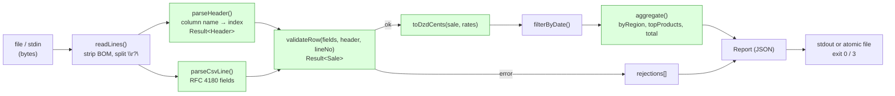

# Project 2 — برنامج معالجة بيانات: CSV → تقرير
## Project 2 — Data-Processing Program: `sales-report`

> **المستوى:** Level 1 | **بعد:** [Project 1](../project-1-cli/README.md) | **قبل:** [Checkpoint 1](../../level-1-programming/checkpoint-1.md)
> **المدة المقترحة:** 5–8 ساعات صافية.
> **قاعدة:** بيدك. AI للسؤال "لماذا" فقط. يُسمح بمكتبة واحدة اختيارية في النهاية (انظر §7.4) — بعد أن تكتب المحلل بنفسك.

---

## 1. المشكلة (Problem)

قسم المبيعات يصدّر كل شهر ملف `sales.csv` من نظام قديم (آلاف إلى عشرات آلاف الصفوف) ويحسب الأرقام في Excel يدويًا: الإيراد لكل منطقة، أفضل المنتجات، وكم صفًا كان "مكسورًا" (كميات سالبة، أسعار فارغة، تواريخ غريبة). يستغرق ذلك يومًا ويخطئون فيه.

المطلوب: برنامج يقرأ الملف، **يرفض الصفوف غير الصالحة بوضوح دون أن يتوقف**، ويُخرج تقرير JSON يمكن لبرنامج آخر (أو إنسان) استهلاكه — ويقول بصدق كم صفًا تجاهل ولماذا.

**النموذج:** `Data → Transformation → Result`. هنا لا توجد "حالة" تُحفظ؛ توجد **خطوط أنابيب** تحويل، وأول اختباراتك الحقيقية.

## 2. المتطلبات (Requirements)

### Functional
| # | المتطلب |
|---|---|
| F1 | `sales-report <input.csv> [-o report.json] [--min-date YYYY-MM-DD] [--max-date YYYY-MM-DD]` |
| F2 | يقرأ CSV بالأعمدة: `date,region,product,qty,unit_price,currency` (الترويسة إلزامية؛ ترتيب الأعمدة **قد يختلف** — اعتمد على الأسماء) |
| F3 | يقبل الاقتباسات وفق RFC 4180 (فواصل داخل اقتباس، `""` مهرَّب)، `\r\n` و`\n`، BOM اختياري |
| F4 | قواعد الصلاحية: `date` ISO صالح؛ `region` و`product` غير فارغين؛ `qty` عدد صحيح > 0؛ `unit_price` عدد ≥ 0 بمنزلتين كحد أقصى؛ `currency` من `{DZD, EUR, USD}` |
| F5 | يحوّل الأسعار إلى **سنتات صحيحة** (integer cents) ويحوّل كل العملات إلى DZD بجدول أسعار ثابت في ملف `rates.json` |
| F6 | التقرير: `totalRevenueCents`, `totalByRegion`, `topProducts` (أعلى 5 بالإيراد)، `rowsRead`, `rowsValid`, `rowsRejected`, `rejections` (أول 50، كل واحد: `line`, `reason`) |
| F7 | `--min-date/--max-date` يرشّحان الصفوف الصالحة (شاملَين) |
| F8 | بلا `-o` يطبع التقرير على stdout؛ مع `-o` يكتبه ذرّيًا |
| F9 | `-` كاسم مدخل = اقرأ من stdin (للأنابيب) |

### Non-Functional
- Exit codes: 0 كل الصفوف صالحة؛ **3** نجاح جزئي (توجد مرفوضات)؛ 1 لا صف صالح/ملف تالف/ترويسة ناقصة؛ 2 خطأ استخدام.
- stdout: التقرير فقط. stderr: ملخص سطر واحد (`read=10000 valid=9950 rejected=50`) + التحذيرات.
- 10,000 صف في أقل من ثانية على جهاز عادي (قِس بـ `console.time` على stderr أو `time`).
- **لا أرقام عشرية للمال**؛ كل الحسابات بالسنتات الصحيحة (M1.1).
- `strict` + `noUncheckedIndexedAccess`؛ لا `any`/`as` خارج المحقّقات.
- **اختبارات وحدة** للنواة: محلل CSV، التحقق من الصف، التحويل، التجميع (≥ 15 اختبارًا).

### Constraints
- Node 22، ESM، TypeScript. وقت التشغيل: الوحدات المدمجة فقط (باستثناء §7.4 الاختياري).

### Assumptions
- الملف يدخل في الذاكرة (≤ ~100MB). (**التحدي 7.2** يكسر هذا.)
- جدول أسعار الصرف ثابت للشهر (في `rates.json`)؛ ليس مطلوبًا جلبه من الشبكة.

### Out of scope
- واجهة رسومية؛ رسوم بيانية؛ قراءة Excel `.xlsx`؛ قواعد بيانات.

## 3. معايير القبول (Acceptance Criteria)

| # | Given | When | Then |
|---|---|---|---|
| AC1 | ملف بـ 3 صفوف صالحة | تشغيل بلا خيارات | JSON على stdout بـ `rowsValid: 3`, `rowsRejected: 0`؛ exit 0 |
| AC2 | صف فيه `qty = -2` | تشغيل | `rowsRejected: 1`، `rejections[0] = { line: N, reason: "qty must be a positive integer" }`؛ exit 3 |
| AC3 | منتج `"Keyboard, Mechanical"` (باقتباس) | تشغيل | يُقرأ كحقل واحد؛ يظهر باسمه الصحيح في `topProducts` |
| AC4 | ملف بـ BOM و`\r\n` | تشغيل | يُعالج بشكل طبيعي؛ لا عمود `"\uFEFFdate"` ولا قيم تنتهي بـ `\r` |
| AC5 | أعمدة بترتيب مختلف (`product,date,qty,...`) | تشغيل | نفس النتائج (اعتماد على أسماء الأعمدة) |
| AC6 | ترويسة تنقصها `currency` | تشغيل | stderr: `error: missing column "currency"`؛ exit 1 |
| AC7 | `unit_price = 12.345` | تشغيل | مرفوض: `"unit_price must have at most 2 decimals"` |
| AC8 | صف بـ `EUR`, `qty 2`, `unit_price 10.00`, سعر الصرف 145.00 | تشغيل | يساهم بـ `290000` سنت DZD بالضبط (لا `289999.99…`) |
| AC9 | 10 صفوف، 4 منها قبل `--min-date` | `--min-date` | `rowsValid: 10` لكن التجميعات تحسب 6 فقط، و`rowsFiltered: 4` |
| AC10 | `cat sales.csv \| sales-report -` | أنبوب | نفس التقرير؛ stdout JSON صالح فقط (`\| jq .totalRevenueCents` يعمل) |
| AC11 | `-o out.json` ثم قتل العملية أثناء الكتابة (محاكاة) | — | لا يوجد `out.json` نصف مكتوب (ذرّية) |
| AC12 | ملف فارغ تمامًا | تشغيل | stderr: `error: empty input`؛ exit 1 |

## 4. المفاهيم المطبّقة (Concepts Applied)

| المفهوم | الوحدة | أين |
|---|---|---|
| المال كسنتات صحيحة؛ `0.1 + 0.2` | M1.1 | `parseMoney` |
| حلقات، تتبّع، off-by-one (أرقام الأسطر!) | M1.3 | محلل CSV، `line` في rejections |
| دوال نقية صغيرة قابلة للتركيب | M1.4 | كل `core/` |
| `map/filter/reduce`، تجميع إلى `Record`، `toSorted` | M1.5 | `aggregate` |
| كائنات، `Object.entries`، JSON | M1.6 | التقرير |
| لا mutation؛ خط أنابيب | M1.7 | كل مرحلة تعيد قيمة جديدة |
| core/io/main | M1.8 | الهيكل |
| Result لكل صف؛ أخطاء النظام استثناءات؛ exit 3 | M1.9 | `validateRow`, `main` |
| CSV/BOM/`\r\n`، stdin، كتابة ذرّية، stdout vs stderr | M1.10 | `io/` |
| `await`، `for await` على stdin | M1.11 | `readLines` |
| اختبارات كأصغر إعادة إنتاج؛ breakpoint شرطي على `line === N` | M1.12 | التحدي |
| فروع/PR/bisect | M1.13–14 | التسليم + التحدي 7.3 |
| اتحادات حرفية (`Currency`)، `unknown → Row`، generics (`Result<T>`) | M1.15 | `types.ts` |

## 5. التصميم (Design)



**الأنواع المركزية:**
```typescript
export type Currency = "DZD" | "EUR" | "USD";
export type Sale = { readonly line: number; readonly date: string; readonly region: string; readonly product: string;
                     readonly qty: number; readonly unitCents: number; readonly currency: Currency };
export type Rejection = { readonly line: number; readonly reason: string };
export type Rates = Readonly<Record<Currency, number>>;      // DZD per 1 unit, مثال { DZD: 1, EUR: 145, USD: 134.5 }
export type Report = {
  readonly rowsRead: number; readonly rowsValid: number; readonly rowsRejected: number; readonly rowsFiltered: number;
  readonly totalRevenueCents: number;
  readonly totalByRegion: Readonly<Record<string, number>>;
  readonly topProducts: ReadonlyArray<{ product: string; revenueCents: number }>;
  readonly rejections: ReadonlyArray<Rejection>;
};
```

**هيكل:**
```
sales-report/
├── rates.json
├── fixtures/           ملفات CSV للاختبار: clean.csv, quoted.csv, bom-crlf.csv, reordered.csv, broken.csv, empty.csv
├── src/
│   ├── main.ts
│   ├── types.ts
│   ├── core/  csv.ts  header.ts  validate.ts  money.ts  aggregate.ts
│   └── io/    lines.ts  output.ts  rates.ts
└── tests/     csv.test.ts  validate.test.ts  money.test.ts  aggregate.test.ts
```

**قرارات:**
| قرار | البديل | لماذا |
|---|---|---|
| السعر كسنتات صحيحة + سعر صرف يُضرب ثم `Math.round` مرة واحدة في النهاية | float طوال الطريق | AC8: الدقة؛ التقريب مرة واحدة في أبعد نقطة يمنع تراكم الخطأ |
| رفض الصف، لا إيقاف البرنامج | fail على أول خطأ | المستخدم يريد التقرير **و** قائمة المكسور؛ لكن "0 صالح" = فشل كامل (exit 1) |
| `rejections` محدودة بـ 50 + عدّاد | كل المرفوضات | ملف بـ 100k صف مكسور لا يجب أن يُنتج تقرير 20MB؛ العدّاد يحفظ الحقيقة |
| اعتماد على أسماء الأعمدة | على الترتيب | AC5؛ النظام القديم يغيّر الترتيب |
| التحليل كمرحلتين (أسطر ثم حقول) | محلل حرفًا بحرف للملف كله | أبسط للفهم الآن؛ **لا** يدعم `\n` داخل اقتباس — موثّق كقيد في README (التحدي 7.2) |

## 6. خطة التنفيذ (Implementation Plan)

1. **Bootstrap + fixtures أولًا.** اكتب الملفات الستة في `fixtures/` يدويًا (بما فيها BOM: `printf '\xEF\xBB\xBF'`). commit.
2. **`core/csv.ts`: `parseCsvLine`** + 6 اختبارات: عادي، اقتباس بفاصلة، `""` مهرَّب، حقل فارغ، اقتباس غير مغلق (قرّر السلوك ووثّقه)، سطر بفاصلة أخيرة.
3. **`core/header.ts`:** `parseHeader(fields): Result<Header>` يعيد خريطة اسم→فهرس ويرفض الأعمدة الناقصة/المكررة. اختبارات AC5/AC6.
4. **`core/money.ts`:** `parseMoney("12.30") → Result<1230>`; يرفض 3 منازل، سالب، `"1,5"`, `""`, `"abc"`. **8 اختبارات** على الأقل — هنا تعيش أكثر الأخطاء.
5. **`core/validate.ts`:** `validateRow(fields, header, lineNo): Result<Sale>` يجمع الفحوص؛ رسائل سبب **ثابتة** (ستُختبر حرفيًا).
6. **`core/aggregate.ts`:** `aggregate(sales, rates, range): Report` نقية. اختبر AC8 وAC9 ومصفوفة فارغة.
7. **`io/`:** قراءة الأسطر (ملف/stdin) + BOM + `\r?\n`؛ تحميل `rates.json` **بمحقّق** (`unknown → Rates`)؛ كتابة ذرّية.
8. **`main.ts`:** `parseArgs`، التركيب، exit codes، ملخص stderr، `console.time` خلف `--timing`.
9. **ولّد ملف 10,000 صف** بسكربت صغير (`scripts/gen.ts`) مع ~2% صفوف مكسورة عشوائيًا. قِس. سجّل الرقم في README.
10. PR على نفسك، مراجعة، دمج، tag `v1.0.0`.

## 7. التحديات المدمجة (Built-in Challenges)

### 7.1 Debugging — ثلاثة bugs خفية
ضَع هذه النسخة من `parseMoney` و`aggregate` في فرع `challenge/broken` وشغّل اختباراتك: **الاختبارات الجيدة يجب أن تكشفها كلها.** إن لم تكشفها، فاختباراتك ناقصة — أضف ما يلزم أولًا، ثم أصلح.

```typescript
export function parseMoney(s: string): Result<number> {
  const n = parseFloat(s);
  if (isNaN(n) || n < 0) return { ok: false, error: "unit_price must be a number >= 0" };
  return { ok: true, value: n * 100 };
}

export function aggregate(sales: readonly Sale[], rates: Rates): Report {
  const byRegion: Record<string, number> = {};
  let total = 0;
  for (let i = 0; i <= sales.length; i++) {
    const s = sales[i]!;
    const cents = s.qty * s.unitCents * rates[s.currency];
    byRegion[s.region] += cents;
    total += cents;
  }
  const top = Object.entries(byRegion).sort().slice(0, 5).map(([product, revenueCents]) => ({ product, revenueCents }));
  return { /* ... */ totalRevenueCents: total, totalByRegion: byRegion, topProducts: top } as Report;
}
```
<details><summary>💡 ما يجب أن تجده</summary>

`parseFloat("12abc") = 12` (يقبل قمامة)، `"1.005" * 100 = 100.49999…` (float)، لا فحص للمنازل؛ `<=` off-by-one → `sales[length]` undefined ثم `!` يخفيه → انهيار؛ `byRegion[s.region] += cents` على `undefined` → `NaN` (يحتاج `?? 0`)؛ `rates[...]` قد يعيد عشريًا دون تقريب نهائي؛ `.sort()` نصي بلا مقارن (M1.5) **ويعدّل في المكان**؛ `topProducts` حُسبت من **المناطق** لا المنتجات؛ `as Report` يخفي الحقول الناقصة. ثمانية في الواقع — كم كشفت اختباراتك؟
</details>

### 7.2 Performance / Architecture — "10,000,000 صف"
ملف 10M صف ≈ 600MB. اكتب صفحة ACTRR:
- أين ينهار التصميم الحالي أولًا (الذاكرة؟ الوقت؟) وكيف **تقيس** بدل أن تخمّن؟ (`process.memoryUsage()`، `--max-old-space-size`.)
- ما الذي يجب أن يصبح **streaming** (تذكّر `for await` سطرًا سطرًا من M1.10) وما الذي يجب أن يبقى في الذاكرة حتمًا (التجميعات) وكم حجمه؟
- كيف تعالج اقتباسًا يحوي `\n` في وضع streaming؟ (محلل بحالة عبر الأسطر.)
- نفّذ النسخة الـ streaming إن استطعت وقارن الذاكرة/الوقت بجدول. (الحل الكامل والتحليل بـ Big-O في L3.)

### 7.3 Git — bisect حقيقي
على فرع منفصل، اصنع 12 commit صغيرًا تُدخل في أحدها (لا تتذكر أيها — نفّذ تغييرات كثيرة في جلسة واحدة) كسرًا لـ AC8. بعد يوم، استخدم `git bisect run npm test` لإيجاده. وثّق عدد الخطوات.

### 7.4 اختياري — المكتبة بعد اليد
ثبّت `csv-parse` واستبدل محللك به خلف **نفس الواجهة** (`parseCsvLine`/`readRows`). هل تمرّ اختباراتك؟ ما الذي كان محللك يخطئ فيه؟ هذا هو الدرس: المكتبة لحل مشكلة **تفهمها**، لا بديلًا عن فهمها.

## 8. المخرجات (Deliverables)

- المستودع مع `fixtures/`، `tests/` (≥ 15 اختبارًا تمرّ)، `scripts/gen.ts`.
- `README.md`: الاستخدام، جدول AC1–AC12، **قيود معروفة** (`\n` داخل اقتباس)، قياس 10k صف (وقت/ذاكرة)، قرارات التصميم.
- `CHALLENGES.md`: تقرير 7.1 (الـ bugs التي كشفتها اختباراتك قبل/بعد)، صفحة 7.2، عدد خطوات 7.3.
- Git: فرع/PR/tag؛ `.gitignore` يستثني `report.json` والملفات المولَّدة الكبيرة.

## 9. قائمة المراجعة الذاتية (Self-Review Checklist)

- [ ] لا `number` عشري يمثل مالًا في أي مكان؛ `Math.round` مرة واحدة في النهاية.
- [ ] كل سبب رفض يحمل رقم السطر **الصحيح** (اختبرت off-by-one مع BOM وترويسة).
- [ ] `parseCsvLine` يمرّ على الحالات الست؛ `header` يعتمد على الأسماء.
- [ ] `rates.json` يمرّ عبر محقّق؛ عملة غير معروفة = رفض صف واضح.
- [ ] stdout = JSON فقط (جرّبت `| jq`)؛ stderr = ملخص.
- [ ] exit 0/1/2/3 موثّقة في `--help` ومختبرة.
- [ ] الاختبارات كشفت ≥ 6 من 8 في التحدي 7.1 قبل أن أقرأ التلميح.
- [ ] قِست 10k صف وسجّلت الرقم؛ أعرف أين سينهار 10M **وقِستُه** لا خمّنت.
- [ ] `core/` بلا `node:`، بلا `console`، بلا mutation لمدخلاته.
- [ ] أستطيع شرح الفرق بين "صف مرفوض" و"صف مرشَّح" و"ملف فاشل" ولماذا لكل منها معاملة مختلفة.

> **التالي:** [Checkpoint 1 — Programming + Computational Thinking](../../level-1-programming/checkpoint-1.md)
