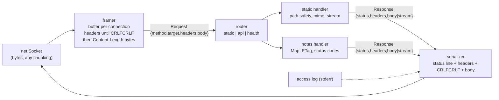

# Project 3 — خادم HTTP من الصفر: TCP خام → تحليل يدوي → `node:http`
## Project 3 — HTTP Server from scratch: `tinyhttp`

> **المستوى:** Level 2 | **بعد:** [Project 2](../project-2-data-processing/README.md) و[M2.13](../../level-2-computer-systems/module-2.13-web-app-architecture.md) | **قبل:** [Checkpoint 2](../../level-2-computer-systems/checkpoint-2.md)
> **المدة المقترحة:** 10–14 ساعة صافية على ثلاث مراحل.
> **قاعدة:** بيدك. لا frameworks (Express/Fastify) ولا مكتبات HTTP حتى المرحلة 3 (حيث تستخدم `node:http` فقط). AI للسؤال "لماذا" ولمراجعة كودك **بعد** أن يعمل.

---

## 1. المشكلة (Problem)

كل ما ستبنيه لاحقًا (Projects 4–8 والـ Capstone) يقف فوق HTTP. معظم المهندسين يستخدمونه عبر framework **دون أن يروه قط**: لا يعرفون لماذا يتجمد الخادم، لماذا طلب يُقرأ ناقصًا، لماذا `Content-Length` خاطئ يعلّق العميل، أو ماذا يفعل `keep-alive` فعلًا. هذا المشروع يجعلك **ترى البايتات** ثم تبني الطبقات واحدة واحدة حتى تصل إلى ما يفعله `node:http` — فتفهم ما يخفيه.

تبني `tinyhttp`: خادم ملفات ثابتة + API صغير لـ "ملاحظات" في الذاكرة، على **ثلاث مراحل**، كل مرحلة تُسلَّم على حدة:

| المرحلة | ما تستخدم | الهدف |
|---|---|---|
| **S1 — Raw TCP** | `node:net` فقط | استقبل بايتات، اطبعها hex/نص، أعد ردًا HTTP **مكتوبًا يدويًا** |
| **S2 — HTTP/1.1 يدوي** | `node:net` + محلّلك | تأطير صحيح (headers حتى `\r\n\r\n`، `Content-Length`)، keep-alive، توجيه، رموز حالة، ملفات ثابتة، API JSON |
| **S3 — `node:http`** | `node:http` | نفس الميزات بالمكتبة القياسية + ما لم تستطع فعله يدويًا بسهولة (chunked، مهلات، إغلاق رشيق) |

**النموذج:** `bytes → frames → messages → semantics → application`. (M2.9 → M2.12 → M2.13.)

## 2. المتطلبات (Requirements)

### Functional
| # | المتطلب | المرحلة |
|---|---|---|
| F1 | `tinyhttp [--port 3000] [--host 127.0.0.1] [--root ./public]` | S1–S3 |
| F2 | **S1:** لكل اتصال اطبع على stderr: الرباعية (IP:port الطرفين)، كل chunk بطوله وبـ hex أول 64 بايت + نص؛ أعد `HTTP/1.1 200 OK` بجسم `hello` بترويسات صحيحة يدويًا؛ أغلق | S1 |
| F3 | **S2:** محلّل طلب: سطر الطلب (method, target, version)، ترويسات (غير حساسة للحالة، `key: value`، تكرار → دمج)، جسم بـ `Content-Length` بالضبط؛ يتعامل مع **أي تقسيم للـ chunks** (رسالة في 5 chunks، أو طلبان في chunk) | S2 |
| F4 | **S2:** keep-alive: طلبات متتالية على نفس الاتصال؛ `Connection: close` يغلق بعد الرد؛ مهلة خمول 5s تغلق | S2 |
| F5 | توجيه: `GET /` و`GET /static/*` ملفات من `--root` بـ `Content-Type` من الامتداد (html, css, js, json, png, svg, txt) و`Content-Length` بالبايتات؛ منع **path traversal** (`/static/../../etc/passwd` → 403) | S2–S3 |
| F6 | API: `GET /api/notes`, `GET /api/notes/:id`, `POST /api/notes` (JSON `{text}` → 201 + `Location`), `PUT /api/notes/:id` (idempotent)، `DELETE /api/notes/:id` (204 حتى لو غير موجود)؛ تخزين في `Map` بالذاكرة | S2–S3 |
| F7 | رموز حالة صحيحة: 400 (طلب مشوّه)، 404، 405 (+`Allow`)، 411 (POST بلا `Content-Length` في S2)، 413 (> 1MB)، 415 (ليس JSON)، 422 (text فارغ/ليس نصًا)، 500 (بلا تسريب تفاصيل) | S2–S3 |
| F8 | `GET /api/notes` يرسل `ETag`؛ `If-None-Match` مطابق → 304؛ `Cache-Control: no-store` لكل `/api/*`، `public, max-age=60` للملفات الثابتة | S2–S3 |
| F9 | `GET /health` → `{"status":"ok","uptime":…,"connections":N}`؛ أثناء الإغلاق → 503 | S3 (اختياري S2) |
| F10 | **S3:** إغلاق رشيق على SIGTERM/SIGINT (وصفة M2.5 الست)؛ مهلات `headersTimeout`/`requestTimeout`؛ `HEAD` يرد كـ GET بلا جسم؛ جسم رد كبير (ملف > 64KB) يُرسل **بتدفق** (stream) لا بتحميله كاملًا | S3 |
| F11 | سجل وصول سطر لكل طلب على stderr: `<ISO time> <method> <path> <status> <bytes> <ms>` | S2–S3 |

### Non-Functional
- بلا تبعيات وقت تشغيل. Node 22، ESM، TypeScript `strict` + `noUncheckedIndexedAccess`.
- **لا حجب لحلقة الأحداث** > 10ms في أي مسار (تحقق بـ `monitorEventLoopDelay`، M2.7).
- يتحمل 200 اتصال متزامن خامل بلا تدهور، و1,000 طلب/ثانية للملفات الصغيرة على جهاز عادي (قِس بـ `autocannon` أو `wrk` أو `ab` — كأداة قياس فقط).
- أي خطأ على سوكت واحد **لا يُسقط العملية** (`ECONNRESET`, `EPIPE`).
- اختبارات: محلّل الطلب (≥ 12 حالة تشمل التقسيم/الدمج/الترويسات المكررة/CRLF/جسم ناقص)، الموجّه، منع traversal، ETag/304 (≥ 20 اختبارًا إجمالًا) بـ `node:test`.

### Constraints
- S1 وS2 بـ `node:net` **فقط**. S3 بـ `node:http` **فقط** (لا `http2`، لا TLS — TLS عند proxy في الواقع، M2.11؛ تحدٍّ اختياري في §7.5).
- HTTP/1.1 فقط؛ لا دعم لـ `Transfer-Encoding: chunked` في **الطلبات** (أعد 411/501) في S2 — في S3 تحصل عليه مجانًا.

### Assumptions
- العملاء: curl، المتصفح، سكربت `node:net` خاص بك للاختبار. لا proxy أمامك (لذلك `remoteAddress` هو العميل).
- الملاحظات تضيع عند إعادة التشغيل (Project 4 يضع DB).

### Out of scope
- TLS، HTTP/2/3، WebSocket، ضغط، مصادقة (Project 5)، CORS (أضفه إن أردت، M2.12 يشرحه).

## 3. معايير القبول (Acceptance Criteria)

| # | Given | When | Then |
|---|---|---|---|
| AC1 | S1 يعمل | `curl -v localhost:3000/` | stderr يُظهر الرباعية وchunk بـ hex يبدأ بـ `47 45 54 20` (`GET `)؛ curl يستلم `200` وجسم `hello` بلا تعليق |
| AC2 | S2 | عميل `net` يرسل `GET / HTTP/1.1\r\nHost: x\r\n\r\n` **بايتًا بايتًا** بفاصل 5ms | رد 200 صحيح (التأطير يعمل مع التقسيم) |
| AC3 | S2 | عميل يرسل طلبين كاملين في `write` واحد | ردّان بالترتيب على نفس الاتصال |
| AC4 | S2 | `POST /api/notes` بـ `Content-Length: 300` لكن يرسل 100 بايت ثم يصمت | لا يُعالَج الطلب؛ بعد 5s يُغلق الاتصال؛ لا حجب لطلبات اتصالات أخرى في الأثناء |
| AC5 | S2–S3 | `curl -i localhost:3000/static/../../etc/passwd` (مع `--path-as-is`) | `403`؛ ولا يُقرأ أي ملف خارج `--root` |
| AC6 | S2–S3 | ملف `public/عربي.txt` بمحتوى `مرحبا` | `Content-Length: 10` (بايتات لا 5 أحرف)؛ curl يعرض النص صحيحًا |
| AC7 | S2–S3 | `POST /api/notes` بـ `{"text":"a"}` ثم `GET /api/notes` مع `If-None-Match` من الرد | الأول `201` + `Location: /api/notes/1`؛ الثاني `304` بلا جسم؛ بعد `PUT` يتغير ETag |
| AC8 | S2–S3 | `DELETE /api/notes/999` مرتين | `204` مرتين (idempotent) |
| AC9 | S2–S3 | `PATCH /api/notes/1` | `405` + `Allow: GET, PUT, DELETE` |
| AC10 | S2–S3 | جسم 2MB | `413` **قبل** قراءة الجسم كاملًا (لا تخصيص 2MB) |
| AC11 | S2–S3 | 200 اتصال خامل مفتوح + `curl /health` | يرد خلال 50ms؛ `connections: 201` |
| AC12 | S3 | طلب لملف 5MB، وأثناءه `kill -TERM` | التنزيل يكتمل؛ `/health` يعطي 503 أو refused؛ العملية تخرج بـ 0 خلال < 10s؛ لا اتصال جديد يُقبل |
| AC13 | S3 | عميل يفتح اتصالًا ويرسل ترويسات ببطء شديد (slowloris: بايت كل ثانية) | يُقطع عند `headersTimeout` (≤ 10s) |
| AC14 | S2–S3 | `node --expose-gc` + 10,000 طلب keep-alive | heap مستقر بعد GC (لا تسرّب في `Map` الاتصالات/المستمعين — M2.3) |

## 4. المفاهيم المطبّقة (Concepts Applied)

| المفهوم | الوحدة | أين |
|---|---|---|
| بايتات/hex/UTF-8، `Buffer.byteLength` | M2.1 | S1 dump، `Content-Length` |
| ذاكرة لكل اتصال، تسرّب المستمعين | M2.3 | `connections` Set، AC14 |
| fds، `ulimit -n`، `EMFILE` | M2.4 | 200 اتصال، التحدي 7.2 |
| إشارات، إغلاق رشيق، exit code | M2.5 | F10، AC12 |
| خيط واحد؛ لا حجب | M2.6–2.7 | NFR، التحدي 7.1 |
| epoll/حلقة الأحداث، مهلات، `unref` | M2.7 | مهلة الخمول، slowloris |
| الرباعية، `127.0.0.1` vs `0.0.0.0` | M2.8 | S1 log، `--host` |
| **TCP تيار → تأطير**؛ `ECONNRESET`؛ keep-alive | M2.9 | المحلّل، F4 |
| بنية الرسالة، الطرق/الرموز، ETag/304، Cache-Control، `Allow`، `HEAD` | M2.12 | F5–F8 |
| ميزانية الزمن، مراقبة، سجل وصول | M2.13 | F11، القياس |
| streams وbackpressure | L1-M1.10 | F10 تدفق الملفات |
| اختبارات كأصغر إعادة إنتاج | L1-M1.12 | المحلّل |

## 5. التصميم (Design)



```
src/
  main.ts            # argv، إنشاء الخادم، الإشارات (S3)
  server-s1.ts       # المرحلة 1: dump + رد ثابت
  server-s2.ts       # المرحلة 2: net + framer + router
  server-s3.ts       # المرحلة 3: node:http + نفس router
  core/
    framer.ts        # pure-ish: (state, chunk) → { requests[], state } — قابل للاختبار بلا سوكت
    request.ts       # أنواع Request/Response، parseRequestLine، parseHeaders
    router.ts        # (Request) → Promise<Response>
    static.ts        # resolveSafe(root, target)، mime، stat
    notes.ts         # Map + etag
    http-status.ts   # الرموز والأسباب
  io/
    serialize.ts     # Response → Buffer | stream
    log.ts
test/
  framer.test.ts  router.test.ts  static.test.ts  notes.test.ts  e2e.test.ts (يفتح الخادم على port 0)
public/  index.html  style.css  app.js  عربي.txt
```

**قرار تصميمي يجب أن تحتفظ به:** الـ framer **لا يعرف السوكت** — دالة تأخذ حالة + chunk وتعيد طلبات مكتملة + حالة جديدة. هذا ما يجعل AC2/AC3 قابلة للاختبار بوحدات بلا شبكة (M1.7 نواة نقية + قشرة).

**حالة الاتصال (S2):**
```
IDLE ──bytes──▶ HEADERS (buffer until \r\n\r\n; > 16KB → 431) ──Content-Length──▶ BODY (until N bytes; > 1MB → 413)
   ▲                                                                                    │
   └──────────── response written; keep-alive? stay : socket.end() ◀────────────────────┘
   idle 5s → destroy; parse error → 400 + close; socket error → cleanup (never throw)
```

## 6. خطة التنفيذ (Implementation Plan)

| الخطوة | المخرج | تحقق |
|---|---|---|
| 1 | S1: `net.createServer`، طباعة الرباعية وhex، رد ثابت يدوي | AC1؛ جرّب المتصفح أيضًا — لاحظ طلب `/favicon.ico` وترويساته |
| 2 | `framer.ts` + اختبارات التقسيم/الدمج/الترويسات المكررة/`\r\n` فقط/جسم ناقص | ≥ 12 اختبارًا تمرّ **قبل** أي سوكت |
| 3 | S2: ربط framer بالسوكت، keep-alive، مهلة خمول، معالجة `error` | AC2–AC4 بعميل `net` خاص |
| 4 | `static.ts`: `path.resolve` + فحص البادئة، mime، `Content-Length` بالبايتات | AC5، AC6 |
| 5 | `notes.ts` + router + الرموز + ETag | AC7–AC10 |
| 6 | سجل الوصول، `/health`، قياس lag تحت حمل (`autocannon -c 200`) | AC11، NFR |
| 7 | S3: أعد الربط بـ `node:http` مع **نفس** `router.ts` (الدليل أن الفصل صحيح)؛ مهلات؛ تدفق الملفات؛ إغلاق رشيق | AC12–AC13 |
| 8 | AC14 + مراجعة ذاتية + README بالقياسات | تسليم |

## 7. التحديات المدمجة (Built-in Challenges)

### 7.1 Debugging — "الخادم يتجمد عند طلب معيّن"
نعطيك `server-s2-broken.ts`: يعمل، لكن `GET /api/notes?q=<نص>` يبحث بـ `new RegExp(q)` على كل الملاحظات، و`GET /static/big.json` (30MB) يُقرأ بـ `readFileSync` ثم `JSON.parse` ثم `JSON.stringify` "للتحقق"، و`POST` يجمع الجسم بـ `body += chunk.toString()` ثم `Buffer.byteLength` في كل chunk. الأعراض: أثناء هذه الطلبات **كل** الاتصالات الأخرى تنتظر، و`/health` يفشل. المطلوب: أثبت الحجب بـ `monitorEventLoopDelay` **قبل** إصلاح أي شيء، اربط كل عرض بسببه (M2.7)، أصلح الثلاثة (regex هروب/حد، تدفق الملف بلا parse، تجميع Buffers بعدّاد)، وأعد القياس. أضف اختبارًا يفشل لو عاد الحجب.

### 7.2 Resources — "EMFILE بعد ساعة"
شغّل `ulimit -n 256` ثم 300 اتصال خامل. ماذا يحدث للاتصالات الجديدة؟ لسجل الملفات الثابتة (`open` يفشل أيضًا!)؟ طبّق: حد أقصى للاتصالات (`server.maxConnections`) مع رد `503 + Retry-After` أو رفض مبكر، وتنظيف الخاملة. ثم ارفع ulimit وقِس الفرق. وثّق في ACTRR ما الحد "الصحيح" لخادمك وكيف تحسبه من الذاكرة لكل اتصال (M2.3/M2.4).

### 7.3 Protocol — "عميل يكذب"
اكتب عميل `net` خبيثًا يرسل: (أ) `Content-Length: -1`، (ب) `Content-Length: 10` وجسم 50 بايت ثم طلب ثانٍ (هل يُقرأ جزء من الجسم كطلب تالٍ؟ — هذا هو smuggling)، (ج) ترويسة بطول 100KB، (د) سطر طلب بلا `HTTP/1.1`، (هـ) `GET /` بـ `\n` فقط بلا `\r`. حدّد السلوك الصحيح لكل حالة (400/431/إغلاق)، ونفّذه، واكتب اختبارًا لكلٍّ. **القاعدة:** كل بايت من العميل مدخل غير موثوق (L0-M0.7).

### 7.4 Architecture — "من S2 إلى S3 بلا تغيير في router"
إن اضطررت لتغيير `router.ts` عند الانتقال إلى `node:http`، فالفصل مسرّب. اكتب ACTRR: ما الذي يجب أن يكون في "النواة" (مستقل عن النقل) وما في "القشرة"؟ ماذا يحدث إن أردت لاحقًا HTTP/2 أو اختبار الـ router بلا شبكة؟ ما التكلفة (طبقة تجريد إضافية)؟ هذا هو أول لقاء لك مع **Ports & Adapters** الذي يعود في L4.

### 7.5 اختياري — TLS بيدك
استخدم `node:tls` بشهادة mkcert (M2.11) بدل `net` في S2. ثم افحص بـ `openssl s_client` وcurl. ماذا تغيّر في كودك؟ (يجب: لا شيء فوق طبقة السوكت.) ماذا يحدث لـ `curl http://` على منفذ TLS؟ (M2.11 `EPROTO`.)

## 8. المخرجات (Deliverables)

1. مستودع Git بفروع/وسوم `s1`, `s2`, `s3` (أو PRs ثلاثة) — تاريخ يُظهر المراحل.
2. `README.md` للمشروع: كيفية التشغيل، **جدول القياسات** (طلب/ثانية، p99، lag تحت 200 اتصال) قبل وبعد التحدي 7.1، وقرارات التصميم.
3. اختبارات ≥ 20 تمرّ بـ `npm test`؛ `tsc --noEmit` نظيف.
4. ملف `CHALLENGES.md`: إجابات 7.1–7.4 (الأدلة: مخرجات `monitorEventLoopDelay`، `ss`، `lsof`؛ ACTRR لـ 7.2 و7.4).
5. سكربت `scripts/evil-client.ts` من التحدي 7.3.

## 9. قائمة المراجعة الذاتية (Self-Review Checklist)

- [ ] هل يصمد الـ framer أمام **أي** تقسيم؟ (اختبار يرسل بايتًا بايتًا، وآخر يرسل 3 طلبات في chunk)
- [ ] `Content-Length` دائمًا بالبايتات (`Buffer.byteLength`)؟ اختبرت بنص عربي؟
- [ ] هل يمكن لأي طلب أن يحجب الحلقة > 10ms؟ (regex من مدخل؟ `*Sync`؟ JSON ضخم؟)
- [ ] كل سوكت له `error` handler؟ هل يُحذف من المجموعة على `close` (لا `end` فقط)؟
- [ ] حدود: ترويسات 16KB، جسم 1MB، خمول 5s، اتصالات قصوى؟ وهل تُرفض **قبل** التخصيص؟
- [ ] `/static/..` مستحيل؟ (`path.resolve` + `startsWith(root + sep)`) و`--path-as-is` مُختبَر؟
- [ ] الرموز دلالية: 405 مع `Allow`، 204 لـ DELETE المكرر، 201 مع `Location`، 304 بلا جسم، `no-store` على API؟
- [ ] S3: SIGTERM أثناء تنزيل كبير → يكتمل ثم خروج 0؛ إشارة ثانية → خروج فوري؟
- [ ] هل غيّرت `router.ts` بين S2 وS3؟ لماذا؟
- [ ] هل قست قبل أن تحسّن؟ (أرقام في README)
- [ ] هل تستطيع شرح ما يفعله `node:http` نيابةً عنك في S3 **بالتحديد** (تأطير، chunked، مهلات، keep-alive، HEAD)؟

> بعد التسليم: [Checkpoint 2](../../level-2-computer-systems/checkpoint-2.md). ثم Level 3 حيث تضع قاعدة بيانات حقيقية خلف هذا الخادم (Project 4).
