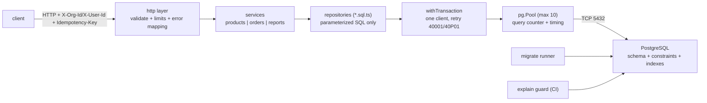

# Project 4 — واجهة متجر مدعومة بقاعدة بيانات: PostgreSQL + SQL خام + معاملات + فهارس
## Project 4 — DB-backed Store API: `storeapi`

> **المستوى:** Level 3 | **بعد:** [Project 3](../project-3-http-server/README.md) و[M3.14](../../level-3-core-computer-science/module-3.14-transactions-acid.md) | **قبل:** [Checkpoint 3](../../level-3-core-computer-science/checkpoint-3.md)
> **المدة المقترحة:** 14–20 ساعة صافية على أربع مراحل.
> **قاعدة:** SQL **خام** عبر `pg` — لا ORM ولا query builder (ستستخدمها في L5 وأنت تعرف ما تولّده). إطار HTTP مسموح الآن (`node:http` من Project 3 أو Fastify/Hono) لأن HTTP لم يعد موضوع التعلّم؛ قاعدة البيانات هي. AI لشرح `EXPLAIN` ومراجعة schema **بعد** أن تكتبه.

---

## 1. المشكلة (Problem)

في Project 3 عاشت الملاحظات في `Map` وضاعت عند إعادة التشغيل، ولم يكن هناك مستخدمون ولا تزامن حقيقي ولا بيانات أكبر من الذاكرة. كل تطبيق حقيقي يضع **قاعدة بيانات** خلف الخادم — ومعظم المهندسين يتعاملون معها عبر ORM دون أن يعرفوا: لماذا يصبح endpoint بطيئًا عند 2M صف، لماذا بيعت القطعة الأخيرة مرتين، لماذا أسقط migration الموقع، أو ما الذي يعنيه `Seq Scan` في خطة. هذا المشروع يجعلك تبني **API متجر متعدد المؤسسات على PostgreSQL** بيدك: schema وmigrations وSQL واستعلامات صفحات وفهارس ومعاملات — ثم تثبت كل قرار بـ `EXPLAIN` واختبارات تزامن.

تبني `storeapi` على **أربع مراحل**:

| المرحلة | الموضوع | الهدف |
|---|---|---|
| **S1 — Schema & Migrations** | M3.10, M3.12 | migrations runner بيدك، schema المتجر بقيوده، seed بـ 1M صف |
| **S2 — Read API** | M3.11, M3.9 | قوائم بـ keyset pagination وفلاتر، تفاصيل بـ `json_agg`، صفر N+1 |
| **S3 — Write API & Transactions** | M3.14 | إنشاء/إلغاء طلب كمعاملة، خصم ذري، idempotency، بلا deadlock |
| **S4 — Performance & Proof** | M3.13, M3.8 | فهارس من الاستعلامات، `EXPLAIN` قبل/بعد، اختبار خطط في CI، تقرير قياس |

**النموذج:** `requirements → schema → queries → indexes → transactions → proof`. (M3.10 → M3.14.)

## 2. المتطلبات (Requirements)

### Functional
| # | المتطلب | المرحلة |
|---|---|---|
| F1 | `storeapi migrate` يطبّق `migrations/NNNN_*.sql` مرة واحدة بالترتيب، كل ملف في معاملة (إلا `CONCURRENTLY`)، مع `schema_migrations` وadvisory lock و`lock_timeout` | S1 |
| F2 | Schema: `organizations, users, roles, user_roles, categories (شجرة parent_id), products (attributes jsonb), addresses, orders, order_items, order_status_history, audit_events, idempotency_keys` — بالأنواع والقيود من M3.10/M3.12 (bigint identity، timestamptz، المال بالسنتات، `CHECK` على الحالات والمخزون، فهرس فريد `lower(email)` جزئي، `organization_id` في كل جدول خاص بالمستأجر) | S1 |
| F3 | `storeapi seed --orgs 20 --users 50000 --products 200000 --orders 1000000` يولّد بيانات واقعية (توزيع غير منتظم: 5% من المستخدمين يملكون 60% من الطلبات) بإدراج دفعات (`unnest`/`COPY`)، ≤ 3 دقائق | S1 |
| F4 | كل طلب HTTP يحمل `X-Org-Id` و`X-User-Id` (محاكاة للمصادقة — Project 5 يستبدلها)؛ كل استعلام مقيّد بـ `organization_id` | S2–S3 |
| F5 | `GET /products?cursor&limit&category&q&sort=(created_at\|price_cents)&dir` — keyset pagination بـ cursor غير شفّاف، `limit ≤ 100`، فلتر فئة **يشمل الفئات الفرعية** (`WITH RECURSIVE`)، بحث بادئة `q` على الاسم، فرز بقائمة بيضاء | S2 |
| F6 | `GET /products/:id`، `GET /orders?status&cursor&limit` (طلبات المستخدم بالأحدث)، `GET /orders/:id` يعيد الطلب + المستخدم + البنود مع **اسم المنتج الحالي والسعر التاريخي** في **استعلام واحد** (`json_agg`) | S2 |
| F7 | `GET /reports/top-products?month=YYYY-MM&limit=10` (أفضل المنتجات مبيعًا بالإيراد) و`GET /reports/revenue?from&to` — مجمّعة في SQL، بلا fan-out | S2 |
| F8 | `POST /orders` بـ `Idempotency-Key` إلزامي: معاملة واحدة تقفل المنتجات `ORDER BY id FOR UPDATE`، تخصم المخزون ذريًا بشرط، تدرج الطلب/البنود (لقطة السعر)/التاريخ/المفتاح؛ نفس المفتاح → نفس الاستجابة (200 بدل 201)؛ نفاد مخزون → 409 مع المنتج؛ منتج من مؤسسة أخرى → 404 | S3 |
| F9 | `POST /orders/:id/cancel`: مسموح فقط من `pending`/`paid`؛ يعيد المخزون؛ يسجّل التاريخ؛ إلغاءان متزامنان → واحد ينجح والثاني 409 (أو 200 idempotent — قرّر ووثّق) | S3 |
| F10 | `PATCH /products/:id` (سعر/مخزون/اسم) بقفل تفاؤلي: `If-Match: <version>` → `UPDATE ... WHERE version = $n`؛ تعارض → 412 | S3 |
| F11 | كل كتابة تسجّل `audit_events` في نفس المعاملة؛ أخطاء DB تُترجم: 23505 → 409، 23503 → 404/422، 23514 → 422، 40001/40P01 → إعادة محاولة ثم 503 | S3 |
| F12 | `GET /health` يتحقق من DB بـ `SELECT 1` بمهلة 500ms؛ أثناء الإغلاق 503؛ إغلاق رشيق (وصفة M2.5) ينتظر الطلبات الجارية ثم `pool.end()` | S2–S4 |
| F13 | ترويسة `Server-Timing: db;dur=…;desc="3 queries"` على كل استجابة: زمن DB الكلي وعدد الاستعلامات لكل طلب (عدّاد يلفّ `pool.query`) | S2–S4 |
| F14 | `npm run explain` يشغّل الاستعلامات الحرجة بـ `EXPLAIN (ANALYZE, BUFFERS, FORMAT JSON)` ويفشل إن وُجد `Seq Scan` على جدول كبير، فرز على القرص، أو > 500 صفحة | S4 |

### Non-Functional
- Node 22، TypeScript `strict` + `noUncheckedIndexedAccess`، `pg` فقط للوصول إلى DB. PostgreSQL 16+ في Docker.
- **صفر N+1**: أي endpoint ≤ 3 استعلامات (اختبار آلي بعدّاد الاستعلامات).
- **لا تركيب نصي للقيم** في أي SQL (مراجعة: `grep -n '\${' src/**/*.sql.ts` فارغ إلا القوائم البيضاء).
- بعد S4 على بيانات F3: p99 ≤ 30ms لـ F5/F6 و≤ 80ms لـ F8 عند 200 طلب/ثانية (`autocannon`)، وDB `shared_blks_read` لكل استعلام حرج < 100 صفحة.
- اختبارات بـ `node:test` على DB حقيقية (قاعدة اختبار تُنشأ وتُهاجَر في `beforeAll`): ≥ 30 اختبارًا تشمل: قيود schema، keyset pagination (استقرار الصفحات مع إدراج متزامن)، N+1 guard، تزامن `POST /orders` × 50 على مخزون 3، deadlock بترتيب معكوس، idempotency replay، 412 تفاؤلي، EXPLAIN guard.

### Constraints
- SQL خام في ملفات `*.sql.ts` (نص + معاملات) — لا ORM/query builder. Migrations بملفات SQL خالصة.
- لا كاش في الذاكرة لنتائج DB في هذا المشروع (ستضيفه في Project 6 وأنت تعرف لماذا) — باستثناء LRU صغيرة لشجرة الفئات إن قست حاجتها ووثّقتها.
- لا `SELECT *` في كود التطبيق.

### Assumptions
- مستأجر = `organizations`؛ المصادقة محاكاة بترويسات (Project 5 يضيف الحقيقية، Row-Level Security في L5).
- الدفع خارج النطاق: الطلب يُنشأ `pending` ويمكن تحويله `paid` بـ endpoint إداري بسيط.

### Out of scope
- المصادقة/التفويض الحقيقيان، Redis، طوابير خارجية، النسخ المتماثل، البحث النصي الكامل (`pg_trgm` تحدٍّ اختياري).

## 3. معايير القبول (Acceptance Criteria)

| # | Given | When | Then |
|---|---|---|---|
| AC1 | DB فارغة | `storeapi migrate` مرتين، ومن عمليتين **متزامنتين** | الجداول موجودة؛ `schema_migrations` يحوي كل الإصدارات مرة واحدة؛ لا خطأ "already exists" |
| AC2 | S1 | `INSERT` بريد `Ali@X.com` ثم `ali@x.com` في نفس المؤسسة؛ منتج بـ `stock = -1`؛ طلب بـ `user_id` غير موجود | 23505، 23514، 23503 على التوالي — DB ترفض بلا كود تطبيق |
| AC3 | seed F3 | `SELECT count(*)` وتوزيع الطلبات | 1M طلب، ≥ 2.5M بند، أعلى 5% من المستخدمين ≥ 55% من الطلبات؛ الـ seed ≤ 3 دقائق |
| AC4 | S2 | `GET /products?limit=20` ثم المتابعة بـ cursor حتى النهاية، **بينما** سكربت يدرج 1000 منتج جديد | لا منتج يتكرر ولا يُفقد من المجموعة الأصلية؛ cursor معدَّل يدويًا → 400 |
| AC5 | S2 | `GET /products?category=<جذر>` حيث المنتجات في أحفاد بعمق 3 | تظهر منتجات كل الشجرة الفرعية؛ استعلام واحد (`WITH RECURSIVE`) |
| AC6 | S2 | `GET /orders/:id` لطلب بـ 7 بنود | استجابة واحدة بالبنود متداخلة، `total_cents` = مجموع البنود، `Server-Timing` يُظهر `1 query` |
| AC7 | S2 | `GET /orders?limit=50` لمستخدم بـ 10k طلب | ≤ 2 استعلام؛ p99 ≤ 30ms؛ ليس `Seq Scan` |
| AC8 | S3 | منتج بمخزون 3؛ 50 طلب `POST /orders` متزامن بكمية 1 | بالضبط 3 × 201 و47 × 409؛ `stock = 0`؛ لا deadlock؛ `order_items` = 3 |
| AC9 | S3 | طلبان متزامنان: الأول للمنتجات (1,2) والثاني (2,1) ×100 تكرار | 0 أخطاء 40P01 تصل العميل (إما لا تحدث بفضل الترتيب أو تُعاد المحاولة) |
| AC10 | S3 | `POST /orders` بنفس `Idempotency-Key` مرتين (الثانية أثناء الأولى أو بعدها) | طلب واحد في DB؛ الاستجابتان متطابقتان (`orderId`)؛ الثانية 200 |
| AC11 | S3 | `POST /orders` حيث البند الثالث نافد | 409؛ **لا** طلب ولا بنود ولا خصم للبندين الأولين (الذرية) |
| AC12 | S3 | `PATCH /products/:id` بـ `If-Match: 3` من عميلين | الأول 200 و`version = 4`؛ الثاني 412 |
| AC13 | S3 | إلغاء طلب `shipped` | 409؛ المخزون لم يتغيّر؛ لا سجل تاريخ جديد |
| AC14 | S4 | `npm run explain` قبل إضافة الفهارس ثم بعدها | قبل: يفشل مع ذكر الجداول الممسوحة؛ بعد: ينجح؛ README يحوي الخطط قبل/بعد لـ 4 استعلامات |
| AC15 | S4 | `autocannon -c 50 -d 20` على F5 وF8 (بيانات F3) | p99 ضمن NFR؛ `pg_stat_statements` يُظهر `shared_blks_read` < 100 للاستعلامات الحرجة |
| AC16 | S2–S4 | SIGTERM أثناء `POST /orders` جارٍ | الطلب يكتمل (201 أو 409)، المعاملة لا تُترك مفتوحة، `pool.end()` ينجح، خروج 0 < 10s |
| AC17 | S2–S4 | DB متوقفة | `/health` 503 خلال ≤ 600ms؛ endpoints تعيد 503 لا تعليقًا (connectionTimeout)؛ عند عودة DB يتعافى بلا إعادة تشغيل |

## 4. المفاهيم المطبّقة (Concepts Applied)

| المفهوم | الوحدة | أين |
|---|---|---|
| `Map` لربط النتائج، hash join في DB | M3.1, M3.11 | `json_agg`، DataLoader (إن احتجت) |
| الطابور المحدود/السياسات | M3.2 | حدود `limit`، pool كطابور محدود (`connectionTimeoutMillis`) |
| الشجرة في جدول، `WITH RECURSIVE`، حد العمق | M3.4 | الفئات (F5)، حد عمق JSON في الجسم |
| top-K / top-N heapsort | M3.5 | F7 بـ `ORDER BY ... LIMIT` |
| الترتيب الطوبولوجي ضمنيًا | M3.6 | ترتيب migrations، ترتيب التهيئة/الإغلاق |
| lower bound، مؤشران (merge join) | M3.7 | keyset، خطط JOIN |
| Big-O، N+1 مخفي، حدود المدخلات | M3.8 | عدّاد الاستعلامات، `limits` |
| keyset pagination، retry+jitter، idempotency، المعرّفات | M3.9 | F5, F8, F11 |
| القيود، الأنواع، pool | M3.10 | F2, AC2, F12 |
| JOIN/GROUP BY/fan-out، `$1`، قائمة بيضاء | M3.11 | F6, F7, F5 sort |
| التطبيع، اللقطات، migrations expand/contract | M3.12 | F2, التحدي 7.3 |
| `EXPLAIN`، الفهارس المركّبة/الجزئية/التغطية، `CONCURRENTLY` | M3.13 | S4, F14 |
| المعاملات، `FOR UPDATE` بترتيب، تحديث ذري، 40001/40P01، تفاؤلي | M3.14 | F8–F11 |
| الإغلاق الرشيق، fds، مهلات تنازلية | L2-M2.5, M2.13 | F12, AC16–17 |

## 5. التصميم (Design)



```
src/
  main.ts                 # argv: serve | migrate | seed | explain ; الإشارات ; ترتيب التهيئة (DB → HTTP) والإغلاق (عكسه)
  db/
    pool.ts               # Pool + عدّاد الاستعلامات لكل طلب (AsyncLocalStorage) + Server-Timing
    tx.ts                 # withTransaction(fn, {isolation, retries}) — من M3.14
    migrate.ts            # runner — من M3.12
    errors.ts             # SQLSTATE → HttpError (23505→409, 23503→404/422, 23514→422, 40001/40P01→retry/503)
  repos/
    products.sql.ts       # listProducts(keyset, filters, sort allowlist), getProduct, updateProductOptimistic
    categories.sql.ts     # subtreeIds(categoryId) — WITH RECURSIVE
    orders.sql.ts         # listOrders(keyset), getOrderWithItems(json_agg), createOrder(tx), cancelOrder(tx)
    reports.sql.ts        # topProducts(month), revenue(from,to)
  http/
    server.ts  routes.ts  cursor.ts (encode/decode/validate)  limits.ts  errors.ts
migrations/
  0001_init.sql  0002_indexes.sql (S4!)  0003_products_version.sql  …
scripts/
  seed.ts  explain-guard.ts  concurrency-lab.ts (AC8/AC9)  evil-cursor.ts
test/
  schema.test.ts  pagination.test.ts  nplus1.test.ts  orders.concurrency.test.ts  idempotency.test.ts  explain.test.ts
```

**قرارات تصميمية يجب أن تحتفظ بها:**
1. **الـ repositories تعيد بيانات مجرّدة، لا كائنات حية** — ولا تعرف HTTP. الخدمات تنسّق المعاملات؛ HTTP يترجم الأخطاء.
2. **كل قاعدة عمل لها حكم في DB** (قيد أو شرط في `UPDATE`) حتى لو تحقق منها الكود أيضًا — الكود للرسائل الجيدة، DB للصحة.
3. **لا I/O خارجي داخل معاملة.** إن احتجت إشعارًا: بعد COMMIT (أو صف في `outbox` — تحدٍّ 7.4).
4. **الفهارس تأتي في S4 من الاستعلامات، لا من التخمين** — لذلك `0002_indexes.sql` يُكتب بعد أن ترى `EXPLAIN` يفشل.

**تدفق `POST /orders` (S3):**
```
validate body (limits: ≤100 lines, depth, ints) → require Idempotency-Key
withTransaction(READ COMMITTED, retries 3):
  key exists? → return stored response (200)
  SELECT products … WHERE id = ANY($ids) AND org = $org ORDER BY id FOR UPDATE   (ترتيب ثابت)
  for each line: UPDATE products SET stock = stock - q WHERE id AND stock >= q → 0 rows ⇒ throw OutOfStock(409)
  INSERT orders (…, total_cents) RETURNING id ; INSERT order_items via unnest (لقطة السعر) ; history ; audit ; idempotency_keys
COMMIT → 201 {orderId}
on 23505(idempotency_keys): سباق إعادة إرسال → اقرأ المفتاح وأعد 200
```

## 6. خطة التنفيذ (Implementation Plan)

| الخطوة | المخرج | تحقق |
|---|---|---|
| 1 | Docker Compose لـ PostgreSQL 16 + `pg_stat_statements`؛ `db/pool.ts` مع `DATABASE_URL`؛ `migrate.ts` + `0001_init.sql` | AC1، AC2 (اختبارات القيود أولًا — قبل أي HTTP) |
| 2 | `seed.ts` بدفعات `unnest`/`COPY` وتوزيع منحرف | AC3؛ سجّل الزمن |
| 3 | `cursor.ts` + `listProducts` keyset + فلتر الفئات التكراري + قائمة الفرز البيضاء | AC4، AC5؛ اختبار "إدراج أثناء التصفح" |
| 4 | `getOrderWithItems` بـ `json_agg`، `listOrders`، التقارير؛ عدّاد الاستعلامات + `Server-Timing` | AC6، AC7، اختبار N+1 guard |
| 5 | `tx.ts` + `createOrder` + idempotency + ترجمة الأخطاء | AC8، AC10، AC11 بـ `concurrency-lab.ts` |
| 6 | `cancelOrder`، `PATCH` تفاؤلي بـ `version` (migration 0003 expand-only) | AC9، AC12، AC13 |
| 7 | `explain-guard.ts` → يفشل؛ اكتب `0002_indexes.sql` (`CONCURRENTLY`) فهرسًا فهرسًا مع خطة قبل/بعد | AC14 |
| 8 | `autocannon`، `pg_stat_statements`، ضبط `max` الـ pool، الإغلاق الرشيق، DB down | AC15–AC17؛ README بالقياسات؛ تسليم |

## 7. التحديات المدمجة (Built-in Challenges)

### 7.1 Debugging — "صفحة الطلبات تنهار للعملاء الكبار فقط"
نعطيك `orders.sql.ts` نسخة "تعمل": `OFFSET`، `ORDER BY created_at` بلا tie-break، وفهرس `(user_id)` فقط. على بيانات F3: الصفحة 200 لمستخدم كبير تستغرق 2s وتكرّر صفوفًا. المطلوب: أثبت السببين بـ `EXPLAIN (ANALYZE, BUFFERS)` (الصفحات المقروءة، `Sort Method`) وبسكربت يُظهر التكرار، ثم أصلح بـ keyset + فهرس `(user_id, created_at DESC, id DESC)`، وأرفق الخطتين. **سؤال:** لماذا لم يظهر هذا في التطوير؟ (M3.8: التربيعي يختبئ عند n الصغير.)

### 7.2 Concurrency — "البيع المزدوج"
`concurrency-lab.ts`: شغّل نسخة من `createOrder` **بلا** `FOR UPDATE` وبخصم `SET stock = $1` (قيمة محسوبة في Node) ضد 50 طلبًا متزامنًا على مخزون 3. سجّل كم بيع. ثم: (أ) بتحديث ذري بشرط فقط، (ب) بـ `FOR UPDATE` فقط، (ج) بـ SERIALIZABLE + retry بلا أقفال. قارن الصحة والزمن وعدد إعادات المحاولة في جدول. أيها تختار ولماذا (ACTRR)؟

### 7.3 Migration — "إعادة تسمية عمود بلا توقف"
حوّل `products.price_cents` إلى `products.unit_price_cents` مع **نسختين من الخادم تعملان معًا** (شغّل النسخة القديمة والجديدة على منفذين وأرسل حملًا على كليهما طوال الوقت). ثلاث migrations (expand/backfill بدفعات/contract) وصفر أخطاء 500 خلال العملية. وثّق ما حدث عندما جرّبت `RENAME COLUMN` مباشرة أولًا (افعلها على نسخة اختبار لترى الانقطاع).

### 7.4 Architecture — "الإشعار بعد الطلب"
المنتج يطلب "بريد تأكيد بعد كل طلب". الخيارات: داخل المعاملة (لماذا لا؟)، بعد COMMIT مباشرة (ماذا لو ماتت العملية بينهما؟ SIGTERM؟)، جدول `outbox` يُدرَج في نفس المعاملة وعامل يسحبه بـ `FOR UPDATE SKIP LOCKED` ويُرسل ويحذف (ماذا عن الإرسال المكرر؟ idempotency في المرسل). اكتب ACTRR، ونفّذ outbox + عامل داخل نفس العملية (worker loop بمهلة) — تمهيد لـ Project 6.

### 7.5 اختياري — بحث نصي وشجرة أسرع
(أ) `q` كـ `ILIKE '%term%'` على 200k منتج: قِس، ثم `pg_trgm` + GIN، قِس. (ب) الفئات: `WITH RECURSIVE` مقابل materialized path (`ltree` أو `text` بادئة) — قِس الاستعلام والنقل.

## 8. المخرجات (Deliverables)

1. مستودع Git بوسوم `s1`–`s4`؛ `docker-compose.yml`؛ `npm run migrate | seed | serve | explain | test`.
2. `README.md`: كيفية التشغيل، **ERD** (Mermaid)، **جدول الفهارس** (الاستعلام الذي يخدمه كل فهرس + حجمه من `pg_relation_size`)، **خطط EXPLAIN قبل/بعد** لـ 4 استعلامات، **جدول القياسات** (p50/p99، queries/request، blks_read) قبل S4 وبعده.
3. اختبارات ≥ 30 تمرّ على DB حقيقية في CI (GitHub Actions بخدمة postgres)؛ `tsc --noEmit` نظيف؛ `npm run explain` ضمن CI.
4. `CHALLENGES.md`: 7.1–7.4 بالأدلة (خطط، أرقام التزامن، سجل migration بلا توقف، ACTRR).
5. `scripts/concurrency-lab.ts` بجدول النتائج الأربعة.

## 9. قائمة المراجعة الذاتية (Self-Review Checklist)

- [ ] هل كل قاعدة عمل (مخزون ≥ 0، بريد فريد، حالات صالحة، تفرّد المفتاح) لها حكم في DB؟ ماذا يحدث لو حذفت كل فحوصات الكود — هل تبقى البيانات صحيحة؟
- [ ] هل يوجد أي `${}` داخل SQL غير القوائم البيضاء؟ هل `sort`/`dir` من قائمة بيضاء؟
- [ ] هل أي endpoint > 3 استعلامات؟ هل يتناسب عدد الاستعلامات مع حجم النتيجة في أي مكان؟
- [ ] هل كل `ORDER BY` له tie-break؟ هل الـ cursor غير قابل للتعديل ويُرفض عند العبث؟
- [ ] هل كل FK تستعلم به مفهرَس؟ هل كل فهرس يخدم استعلامًا مسمّى؟ هل أُنشئت بـ `CONCURRENTLY`؟
- [ ] المعاملات: client واحد؟ `release` في `finally`؟ أقفال بترتيب `id`؟ لا `await` لشيء خارج DB داخلها؟ retry على 40001/40P01؟
- [ ] هل اختبرت التزامن بـ `Promise.all × 50` لا بطلب واحد؟ وdeadlock بترتيب معكوس؟
- [ ] المال `bigint` سنتات؟ الأزمنة `timestamptz`؟ لا `SELECT *`؟
- [ ] SIGTERM أثناء معاملة: تكتمل أم تُرجَع؟ `pool.end()` بعد إغلاق HTTP؟ DB متوقفة → 503 لا تعليق؟
- [ ] هل تستطيع شرح خطة `EXPLAIN` لكل استعلام حرج سطرًا سطرًا، وما سيحدث عند ×10 بيانات؟

> بعد التسليم: [Checkpoint 3](../../level-3-core-computer-science/checkpoint-3.md). ثم Level 4 حيث تتعلم كيف يُبنى مثل هذا النظام **كفريق وعبر الزمن** (SDLC، تصميم، اختبار، refactoring) — وProject 5 يضيف المصادقة والتفويض فوق هذا المتجر.
