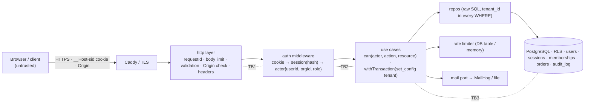

# Project 5 — تطبيق مُصادَق: هويات وجلسات وصلاحيات ونموذج تهديد فوق متجر Project 4
## Project 5 — Authenticated Application: `storeapi` + authN + authZ + security hardening

> **المستوى:** Level 5 | **بعد:** [Project 4](../project-4-db-api/README.md) و[M5.1](../../level-5-building-real-software/module-5.1-api-design.md)–[M5.6](../../level-5-building-real-software/module-5.6-concurrency-business-logic.md) | **قبل:** [Project 6](../project-6-production-backend/README.md)
> **المدة المقترحة:** 18–25 ساعة صافية على أربع مراحل.
> **قاعدة:** تكتب المصادقة والتفويض **بيدك** هذه المرة الوحيدة (`node:crypto` scrypt/argon2، جلسات في PostgreSQL، كوكيز بيدك) — لتعرف ما تفعله المكتبات التي ستستخدمها لاحقًا (Lucia/Passport/Auth.js/Keycloak). إطار HTTP مسموح. **ممنوع**: JWT للجلسات في هذا المشروع (ستكتب ACTRR عن ذلك)، تخزين كلمات المرور بأي شكل غير hash بطيء مملّح، أي `userId` يأتي من العميل. AI لمراجعة نموذج التهديد وكتابة اختبارات سلبية **بعد** أن تكتب الأولى بنفسك.

---

## 1. المشكلة (Problem)

`storeapi` من Project 4 يعرف المستأجر والمستخدم من رأسين (`X-Org-Id`, `X-User-Id`) **يرسلهما العميل**. أي شخص يغيّر الرأس يصبح شخصًا آخر. لا كلمات مرور، لا جلسات، لا فرق بين موظف ومدير، ولا شيء يمنع 10,000 محاولة تسجيل دخول في الدقيقة. هذا المشروع يحوّله إلى تطبيق **مُصادَق ومُفوَّض ومُحصَّن**: هوية حقيقية (تسجيل، دخول، إعادة تعيين)، جلسات بكوكيز صحيحة، صلاحيات بالأدوار والملكية والمستأجر مع RLS كشبكة أمان، حدود معدّل، تحقق من المدخلات وترميز المخرجات، ونموذج تهديد **مكتوب قبل الكود** وتُشتق منه الاختبارات السلبية. وفي النهاية تهاجم نظامك بنفسك.

تبني على **أربع مراحل**:

| المرحلة | الموضوع | الهدف |
|---|---|---|
| **S1 — Threat model & API contract** | M5.5, M5.1 | DFD بحدود الثقة، STRIDE، SEC-xx بمعايير قبول، `openapi.yaml` لمسارات الهوية، Problem Details موحّد |
| **S2 — Authentication** | M5.2 | تسجيل/دخول/خروج، scrypt + rehash، جلسات في DB، `__Host-sid`، إعادة تعيين بمفتاح لمرة واحدة، rate limiting، تسجيل الأحداث |
| **S3 — Authorization & tenancy** | M5.3, M5.6 | `can()` خالصة deny-by-default، الملكية، RBAC (customer/support/admin)، tenant_id في كل WHERE + RLS، audit log، سباقات الهوية |
| **S4 — Hardening & attack** | M5.4 | تحقق allow-list، ترميز، CSRF، SSRF في webhook URL، رفع آمن للصورة الرمزية، رؤوس أمنية، أسرار، ثم **هجوم ذاتي** موثّق |

**النموذج:** `Assets → Entry points → Trust boundaries → Threats → Mitigations → Tests`. (M5.5 أولًا، ثم M5.2 → M5.3 → M5.4.)

## 2. المتطلبات (Requirements)

### Functional
| # | المتطلب | المرحلة |
|---|---|---|
| F1 | `docs/threat-model.md` + `threat-model.json` (نموذج كبيانات، M5.5 §7) يُتحقّق منه في CI: كل تدفّق يعبر حدًّا له تهديد، كل تهديد له معالجة أو قبول بمالك وتاريخ مراجعة | S1 |
| F2 | `openapi.yaml` لمسارات `/v1/auth/*`, `/v1/me`, `/v1/orgs/{orgId}/members`؛ كل خطأ `application/problem+json` مع `requestId`؛ لا تسريب لـ stack/SQL | S1 |
| F3 | `POST /v1/auth/register` (بريد مطبّع lower-case، كلمة مرور ≥ 12 حرفًا تُفحص ضد قائمة الشائع)، `POST /v1/auth/login`, `POST /v1/auth/logout` (الحالية) و`/logout-all` | S2 |
| F4 | كلمات المرور بـ scrypt (`N=2^15, r=8, p=1`، ملح 16 بايت) أو argon2id؛ `rehash` تلقائي عند الدخول إن تغيّرت المعاملات؛ مقارنة ثابتة الزمن؛ `DUMMY_HASH` عند بريد غير موجود | S2 |
| F5 | جلسات في جدول `sessions(id_hash, user_id, org_id, created_at, last_seen_at, expires_at, ip, ua)`: المعرّف 32 بايت عشوائي، يُخزَّن **hash**ـه فقط؛ كوكي `__Host-sid` HttpOnly Secure SameSite=Lax Path=/؛ تدوير المعرّف عند الدخول وعند تغيير الصلاحية؛ انتهاء مطلق 30 يومًا وخامل 7 أيام | S2 |
| F6 | إعادة تعيين كلمة المرور: `POST /v1/auth/password/forgot` يعيد 202 دائمًا؛ رمز 32 بايت يُخزَّن hash، صلاحية 15 دقيقة، **يُستهلك مرة** بـ `DELETE … RETURNING`؛ النجاح يُبطل كل الجلسات الأخرى | S2 |
| F7 | حدود معدّل: 10 محاولات دخول/15 دقيقة لكل (بريد) و100/ساعة لكل IP؛ 429 بـ `Retry-After`؛ 5 طلبات forgot/ساعة لكل بريد | S2 |
| F8 | `authEvents` في جدول: login_ok, login_fail (بلا كلمة المرور!), logout, reset_requested, reset_done, session_revoked — مع requestId/IP/UA | S2 |
| F9 | الأدوار داخل المستأجر: `customer` (طلباته فقط)، `support` (قراءة طلبات المستأجر، لا إلغاء)، `admin` (كل شيء + إدارة الأعضاء)؛ عضوية متعدّدة المستأجرين لنفس المستخدم؛ `X-Org-Id` **يُستبدل** بـ `org_id` الجلسة، واختيار المستأجر عبر `POST /v1/auth/switch-org` (يدوّر الجلسة) | S3 |
| F10 | `can(actor, action, resource)` خالصة deny-by-default مع `hide` (404 لا 403 لما لا يجب أن يُعرف وجوده)؛ تُستدعى في use case لا في HTTP فقط؛ جدول قرارات في README | S3 |
| F11 | `tenant_id` في كل `WHERE`/`INSERT` + **RLS** على `orders`, `order_items`, `products`, `memberships` بـ `set_config('app.tenant_id', …, true)` داخل المعاملة، ودور DB للتطبيق `NOBYPASSRLS` | S3 |
| F12 | `audit_log` append-only لتغييرات الأدوار/الأعضاء/إلغاء الطلبات (actor, tenant, action, target, before/after, ip, ua, requestId) في نفس المعاملة | S3 |
| F13 | سباقات الهوية (M5.6): تسجيل مزدوج لنفس البريد متزامنًا → واحد (UNIQUE)؛ استهلاك رمز إعادة التعيين متزامنًا → واحد؛ `switch-org` متزامن لا يترك جلسة بلا org | S3 |
| F14 | تحقق allow-list لكل مدخل (مخطّطات؛ `additionalProperties: false`؛ حدود طول/عمق؛ تطبيع Unicode للبريد)؛ ترميز HTML لأي صفحة تُولَّد (صفحة إعادة التعيين) + CSP بـ nonce؛ `Origin` check + SameSite للـ CSRF | S4 |
| F15 | `PUT /v1/me/avatar`: ≤ 2 MB، magic bytes (PNG/JPEG)، اسم عشوائي، يُخدَم بـ `Content-Disposition: attachment` + `nosniff` من مسار منفصل؛ ممنوع SVG | S4 |
| F16 | `POST /v1/orgs/{id}/webhook` (admin): URL يُفحص ضد SSRF (https فقط، لا IP خاص بعد حلّ DNS، لا redirects، مهلة 5s) — الاختبار الفعلي للـ webhook في Project 6 | S4 |
| F17 | الرؤوس: HSTS, `X-Content-Type-Options`, `Referrer-Policy`, CSP, بلا `Server`/`X-Powered-By`؛ الأسرار من البيئة فقط (`SESSION_PEPPER`, `DATABASE_URL`) بتحقق fail-fast | S4 |
| F18 | `docs/attack-report.md`: 10 هجمات ذاتية موثّقة (IDOR، تعداد المستخدمين عبر التوقيت، إعادة استخدام رمز، CSRF، تثبيت الجلسة، brute force، mass assignment، SSRF، رفع ملف تنفيذي، تسريب stack) — كل واحدة: المحاولة، النتيجة، الدليل | S4 |

### Non-Functional
| # | المتطلب |
|---|---|
| N1 | p99 لـ `GET /v1/me/orders` ≤ 40ms (RLS + فهارس بـ `tenant_id` أولًا)؛ hash كلمة المرور 80–150ms على جهازك (مقاس ومسجّل) |
| N2 | لا كلمة مرور أو رمز أو معرّف جلسة في أي سجل/خطأ/URL — اختبار يفحص مخرجات السجل |
| N3 | كل تغيير صلاحية يسري خلال ≤ 5 ثوانٍ (لا كاش للتفويض أطول من ذلك) |
| N4 | الاختبارات السلبية ≥ 40% من اختبارات S2–S4؛ كل SEC-xx له اختبار واحد على الأقل |

### Constraints
- PostgreSQL 16 (نفس Project 4)، Node 22، TypeScript strict؛ `pg` خام؛ لا مكتبة مصادقة جاهزة؛ `node:crypto` فقط للتشفير (argon2 عبر حزمة native مسموح كبديل لـ scrypt).
- واجهة SPA/صفحات غير مطلوبة إلا صفحة إعادة التعيين (HTML بسيط مولَّد بالخادم) لتمرين الترميز وCSP.

### Assumptions
- TLS ينهيه proxy أمام التطبيق (Caddy في التطوير أو `mkcert`)؛ الكوكي `Secure` تُختبر خلفه.
- بريد إعادة التعيين "يُرسل" إلى سجل/صندوق محلي (MailHog أو ملف) — المزوّد الحقيقي في Project 6.

### Out of scope
- OAuth/OIDC تسجيل الدخول بطرف ثالث (ACTRR فقط)، MFA (تصميم فقط في نموذج التهديد)، SSO للمؤسسات، إدارة مفاتيح API.

## 3. معايير القبول (Acceptance Criteria)

| # | Given | When | Then |
|---|---|---|---|
| AC1 | S1 | `npm run threat-model:check` | يفشل إن وُجد تدفّق يعبر حدًّا بلا تهديد، أو قبول بلا مالك/تاريخ، أو خطر ≥ 9 مقبول؛ ينجح على النموذج النهائي ويطبع جدول التهديدات مرتّبًا بالخطر |
| AC2 | S1 | أي خطأ (400/401/403/404/409/429/500) | `application/problem+json` بـ `type`, `title`, `status`, `requestId`؛ 500 بلا `stack`/`message` داخلي؛ الرسالة الكاملة في السجل بنفس `requestId` |
| AC3 | S2 | تسجيل بـ `Ali@X.com` ثم دخول بـ `ali@x.com` | ينجح؛ `Set-Cookie: __Host-sid=…; HttpOnly; Secure; SameSite=Lax; Path=/`؛ لا `Expires` أطول من 30 يومًا |
| AC4 | S2 | دخول ببريد غير موجود مقابل كلمة مرور خاطئة لبريد موجود ×200 | نفس 401 ونفس الجسم؛ فرق متوسط الزمن < 10% (DUMMY_HASH) |
| AC5 | S2 | 11 محاولة دخول فاشلة لنفس البريد خلال دقيقة | الحادية عشرة 429 بـ `Retry-After`؛ `authEvents` يحوي 10 `login_fail` بلا كلمات مرور |
| AC6 | S2 | دخول ناجح بينما جلسة قديمة موجودة في الكوكي | معرّف جديد (تدوير)؛ القديم لا يعمل؛ `sessions` لا يحوي المعرّف الخام (بحث نصي في الجدول عن قيمة الكوكي → 0) |
| AC7 | S2 | رمز إعادة تعيين يُستخدم مرتين، ومتزامنًا ×20 | الأول 200 ويغيّر كلمة المرور ويُبطل الجلسات الأخرى؛ الباقي 400 "invalid or expired"؛ `password_resets` فارغ لذلك المستخدم |
| AC8 | S2 | `forgot` لبريد موجود وغير موجود | 202 في الحالتين بنفس الجسم والزمن التقريبي؛ بريد واحد فقط "أُرسل" |
| AC9 | S3 | عميل A يطلب `GET /v1/orders/{id}` لطلب العميل B في نفس المستأجر | **404** (hide)؛ `support` يحصل 200؛ `support` يحاول `POST /cancel` → 403 بسبب `support cannot cancel` |
| AC10 | S3 | مستخدم عضو في Org 1 وOrg 2؛ جلسته على Org 1؛ يرسل `X-Org-Id: 2` | يُتجاهل؛ النتائج من Org 1 فقط؛ بعد `switch-org` إلى 2: معرّف جلسة جديد ونتائج Org 2 فقط |
| AC11 | S3 | حذف شرط `tenant_id` من استعلام `listOrders` عمدًا (اختبار يحقن SQL بلا tenant) | RLS تُعيد 0 صف لمستأجرين آخرين؛ الاختبار يثبت أن الشبكة تعمل بدور `NOBYPASSRLS` |
| AC12 | S3 | admin يغيّر دور عضو؛ 50 تسجيلًا متزامنًا لنفس البريد | `audit_log` سطر واحد بالقبل/البعد وactor؛ مستخدم واحد في `users` و49 × 409 |
| AC13 | S3 | سحب عضوية مستخدم له جلسة نشطة | خلال ≤ 5s أي طلب منه على ذلك المستأجر → 401/404؛ جلساته على مستأجرات أخرى تعمل |
| AC14 | S4 | `PATCH /v1/me` بجسم `{ "role": "admin", "name": "x" }` | 400 (`additionalProperties`) أو تجاهل آمن موثّق؛ الدور لم يتغيّر |
| AC15 | S4 | طلب `POST` بكوكي صالح من `Origin: https://evil.example` | 403 CSRF؛ من الأصل الصحيح يعمل؛ `GET` لا يغيّر حالة أبدًا (اختبار يمسح المسارات) |
| AC16 | S4 | رفع `evil.php` باسم `.png`، وSVG، وPNG 3 MB، وPNG صالح | 415، 415، 413، 201 بعنوان عشوائي؛ تنزيله يأتي بـ `attachment` و`nosniff` |
| AC17 | S4 | webhook URL = `http://169.254.169.254/`, `https://localhost`, اسم يحلّ إلى 10.0.0.5, رابط يعيد 302 إلى IP خاص | 400 لكلها؛ `https://hooks.example.com/x` يُقبل |
| AC18 | S4 | `curl -I` على أي مسار | رؤوس F17 موجودة؛ لا `X-Powered-By`؛ صفحة إعادة التعيين تحمل CSP بـ nonce ومحاولة حقن `<script>` في معامل تظهر نصًا |
| AC19 | S4 | `docs/attack-report.md` | 10 هجمات بأدلة (أوامر، استجابات)، ≥ 8 منها فشلت، وما نجح أُصلح ومعه اختبار ارتداد |

## 4. المفاهيم المطبّقة (Concepts Applied)

| المفهوم | الوحدة | أين |
|---|---|---|
| Problem Details + requestId، 404 بدل 403، `/v1`، OpenAPI | M5.1 | F2, AC2, AC9 |
| scrypt + rehash، DUMMY_HASH، جلسات مُهشَّرة، `__Host-sid`، تدوير، رموز لمرة واحدة، 429 | M5.2 | F3–F8, AC3–AC8 |
| `can()` خالصة، hide، tenant في كل WHERE، RLS، عضوية متعدّدة، audit log، اختبارات سلبية أولًا | M5.3 | F9–F12, AC9–AC13 |
| allow-list/ترميز، CSP nonce، CSRF (SameSite + Origin)، SSRF، رفع آمن، أسرار، رؤوس | M5.4 | F14–F17, AC14–AC18 |
| DFD، STRIDE، خطر، SEC-xx، النموذج كبيانات في CI، قبول بمالك | M5.5 | F1, AC1 |
| UNIQUE كحَكَم، `DELETE … RETURNING` ذري، سباقات الهوية، `Promise.all × N` | M5.6 | F13, AC7, AC12 |
| المعاملات، pool، الإغلاق الرشيق، keyset، الفهارس | Project 4 | كل شيء موروث |
| Ports/use cases، fake > mock، six dimensions | L4 | بنية الكود والاختبارات |

## 5. التصميم (Design)



**القرارات الرئيسية (اكتب ACTRR لكل منها في `docs/decisions.md`):**
1. **جلسات في DB لا JWT**: إبطال فوري، تدوير، قائمة الجلسات للمستخدم، وبساطة؛ الثمن استعلام لكل طلب (مع فهرس على `id_hash` وcache ≤ 5s اختياري).
2. **المستأجر من الجلسة لا من الرأس/المسار**: `orgId` في المسار يُقارن بـ `actor.orgId` ويُرفض الاختلاف بـ 404.
3. **`can()` خالصة + RLS**: الأولى للقرار والرسالة، الثانية شبكة أمان حين ينسى أحد `WHERE`.
4. **Hide**: كل ما يتعلّق بموارد مستأجر/مستخدم آخر 404؛ 403 فقط حين يُسمح بمعرفة الوجود (support يحاول الإلغاء).
5. **الرمز/المعرّف يُخزَّن hash**: تسريب DB لا يعطي جلسات صالحة.

**المخطّط الإضافي (expand فوق Project 4):**
```sql
CREATE TABLE users (id bigserial PRIMARY KEY, email citext UNIQUE NOT NULL, password_hash text NOT NULL, password_params jsonb NOT NULL, created_at timestamptz NOT NULL DEFAULT now(), disabled_at timestamptz);
CREATE TABLE memberships (user_id bigint REFERENCES users, org_id bigint REFERENCES orgs, role text NOT NULL CHECK (role IN ('customer','support','admin')), PRIMARY KEY (user_id, org_id));
CREATE TABLE sessions (id_hash bytea PRIMARY KEY, user_id bigint NOT NULL REFERENCES users ON DELETE CASCADE, org_id bigint NOT NULL, created_at timestamptz NOT NULL DEFAULT now(), last_seen_at timestamptz NOT NULL DEFAULT now(), expires_at timestamptz NOT NULL, ip inet, ua text);
CREATE INDEX ON sessions (user_id); CREATE INDEX ON sessions (expires_at);
CREATE TABLE password_resets (token_hash bytea PRIMARY KEY, user_id bigint NOT NULL REFERENCES users ON DELETE CASCADE, expires_at timestamptz NOT NULL);
CREATE TABLE auth_events (id bigserial PRIMARY KEY, at timestamptz NOT NULL DEFAULT now(), kind text NOT NULL, user_id bigint, email_hash bytea, ip inet, ua text, request_id text);
CREATE TABLE audit_log (id bigserial PRIMARY KEY, at timestamptz NOT NULL DEFAULT now(), tenant_id bigint NOT NULL, actor_id bigint NOT NULL, action text NOT NULL, target text NOT NULL, before jsonb, after jsonb, ip inet, ua text, request_id text);
ALTER TABLE orders ENABLE ROW LEVEL SECURITY; ALTER TABLE orders FORCE ROW LEVEL SECURITY;
CREATE POLICY tenant_isolation ON orders USING (tenant_id = current_setting('app.tenant_id', true)::bigint);
-- دور التطبيق: CREATE ROLE app_rw LOGIN NOBYPASSRLS; GRANT … ; (المالك/المهاجر دور آخر)
```

**جدول قرارات `can()` (نقطة البداية — أكمله):**
| action | customer | support | admin |
|---|---|---|---|
| order.read (own) | ✅ | ✅ | ✅ |
| order.read (other, same tenant) | ❌ hide | ✅ | ✅ |
| order.cancel (own, pending) | ✅ | ❌ 403 | ✅ |
| member.role.change | ❌ hide | ❌ hide | ✅ (not self-demote last admin) |
| webhook.set | ❌ hide | ❌ hide | ✅ |

## 6. خطة التنفيذ (Implementation Plan)

| الخطوة | المخرج | تحقق |
|---|---|---|
| 1 | DFD + STRIDE + `threat-model.json` + `SEC-xx` قبل أي كود؛ `openapi.yaml` للهوية | AC1؛ مراجعة النموذج مع زميل/AI كـ "مهاجم" |
| 2 | هجرة expand (الجداول أعلاه)؛ `password.ts` (hash/verify/needsRehash + قياس الزمن)؛ اختبارات الوحدة | N1؛ AC4 لاحقًا |
| 3 | `sessions.ts` (create/rotate/revoke/touch)، كوكي، middleware؛ register/login/logout | AC3, AC6؛ اختبار "المعرّف الخام غير موجود في DB" |
| 4 | إعادة التعيين + mail port + rate limiter + auth_events | AC5, AC7, AC8 (التزامن أولًا) |
| 5 | `can()` + جدول القرارات + اختبارات سلبية لكل خلية ❌ **قبل** الإيجابية؛ actor من الجلسة؛ switch-org | AC9, AC10 |
| 6 | RLS + دور `NOBYPASSRLS` + `set_config` داخل `withTransaction`؛ audit_log؛ اختبار "حذف WHERE" | AC11, AC12, AC13 |
| 7 | التحقق allow-list، CSRF Origin، صفحة إعادة التعيين + CSP، الرفع، SSRF، الرؤوس، تهيئة fail-fast | AC14–AC18 |
| 8 | الهجوم الذاتي (10 هجمات) → تقرير → إصلاحات + اختبارات ارتداد؛ تحديث نموذج التهديد (الحالة) | AC19؛ تسليم |

## 7. التحديات المدمجة (Built-in Challenges)

### 7.1 Security — "IDOR عبر مسار ثانوي"
بعد S3 كل شيء 404 صحيح على `/v1/orders/{id}`. لكن `GET /v1/orders/{id}/invoice.pdf` (مسار قديم من Project 4) يقرأ الطلب بـ `SELECT … WHERE id = $1` بلا tenant ولا `can()`. اكتشفه **بأداة**: اكتب `scripts/authz-sweep.ts` يأخذ كل المسارات من `openapi.yaml` + الراوتر، وينفّذها بثلاثة فاعلين (مالك، عميل آخر، مستأجر آخر) ويطبع مصفوفة الحالات؛ أي 200 في خلية "آخر" = فشل. أضفه إلى CI. ثم اسأل: لماذا لم تلتقطه RLS؟ (تلميح: المسار القديم يستخدم اتصال pool بلا `set_config` — أغلق هذا الباب أيضًا: اجعل الوصول إلى pool خارج `withTransaction` مستحيلًا بالنوع.)

### 7.2 Security — "تعداد المستخدمين بالتوقيت"
قِس بـ `autocannon`/سكربت زمن `login` لبريد موجود مقابل غير موجود **قبل** DUMMY_HASH (ستجد فرقًا ~100ms). أصلح، أعد القياس، وأرفق الهستوغرام. ثم المسار الثاني: `register` ببريد موجود يعيد 409 فورًا — هل هذا تعداد؟ اكتب ACTRR: 409 واضح (UX) مقابل 202 + بريد "لديك حساب" (أمن) — وقرّر حسب نموذج التهديد (ما الأصل؟ هل قائمة العملاء سرّ في متجر؟).

### 7.3 Concurrency — "رمز إعادة التعيين ×20"
نفّذ أولًا بـ `SELECT` ثم `DELETE` ثم تحديث كلمة المرور، وشغّل 20 طلبًا متزامنًا بنفس الرمز: كم نجح؟ ثم `DELETE … WHERE token_hash=$1 AND expires_at > now() RETURNING user_id` ذري. وثّق الأرقام (M5.6 السلّم درجة 1). نفس التمرين على `switch-org` متزامن مع `logout-all`.

### 7.4 Architecture — "الجلسات مقابل JWT للتطبيق الجوّال"
المنتج يريد تطبيق جوّال وSPA على نطاق آخر. اكتب ACTRR لثلاثة خيارات: (أ) الجلسات نفسها عبر كوكي مع BFF (M5.2)؛ (ب) JWT قصير + refresh token مدوَّر في DB؛ (ج) OIDC مع مزوّد هوية خارجي. لكل خيار: الإبطال الفوري (AC13)، CSRF، التخزين على الجهاز، التعقيد، ما يتغيّر في نموذج التهديد (تهديدات جديدة: سرقة refresh token، replay). نفّذ (ب) كـ **spike** في فرع (بلا دمج) لتقيس ما يكلّف فعلًا.

### 7.5 اختياري — MFA بـ TOTP
نفّذ TOTP (RFC 6238) بـ `node:crypto` فقط: تسجيل بسر 20 بايت + QR، تحقق بنافذة ±1، رموز احتياطية مُهشَّرة لمرة واحدة، step-up قبل تغيير الدور/البريد. حدّث نموذج التهديد (ما الذي لا يزال MFA لا يمنعه؟ — phishing الجلسة بعد الدخول).

## 8. المخرجات (Deliverables)

1. مستودع Git بوسوم `s1`–`s4`؛ Compose لـ PostgreSQL + MailHog + Caddy (TLS محلي)؛ `npm run migrate | serve | test | threat-model:check | authz-sweep`.
2. `docs/threat-model.md` + `threat-model.json` (DFD Mermaid بحدود الثقة، جدول STRIDE، SEC-xx، سجل القبول)؛ `docs/decisions.md` بـ ACTRR للقرارات الخمسة + 7.4.
3. `openapi.yaml` كامل للهوية والأعضاء؛ README بجدول قرارات `can()`، جدول الرؤوس، وقياس زمن الـ hash وAC4.
4. اختبارات ≥ 60 على DB حقيقية في CI، منها ≥ 25 سلبية وكلها تربط `SEC-xx` في اسمها؛ `authz-sweep` في CI.
5. `docs/attack-report.md` (AC19) و`CHALLENGES.md` (7.1–7.4 بالأدلة).

## 9. قائمة المراجعة الذاتية (Self-Review Checklist)

- [ ] هل يوجد أي مكان يأتي فيه `userId`/`orgId`/`role` من الطلب بدل الجلسة؟ ابحث عن `req.body.userId`, `headers["x-org-id"]`, معاملات المسار بلا مقارنة بالفاعل.
- [ ] هل كل استعلام على جدول متعدّد المستأجرين يحوي `tenant_id`؟ وهل RLS مفعّلة **وبدور لا يتجاوزها**؟ هل اختبرت "حذف WHERE"؟
- [ ] هل يُخزَّن أي رمز/معرّف جلسة/كلمة مرور بشكل يمكن استخدامه لو سُرّب الجدول؟ هل يظهر أي منها في سجل أو URL أو رسالة خطأ؟
- [ ] هل الرسائل والأزمنة متطابقة بين "بريد غير موجود" و"كلمة مرور خاطئة"؟ وبين `forgot` للموجود وغير الموجود؟
- [ ] هل كل انتقال صلاحية يدوّر الجلسة؟ هل سحب العضوية يسري خلال 5 ثوانٍ؟ هل `logout-all` يلغي إعادة التعيين الجارية؟
- [ ] هل كل خلية ❌ في جدول `can()` لها اختبار سلبي؟ هل `authz-sweep` يغطي **كل** المسارات بما فيها القديمة؟
- [ ] هل أي مسار `GET` يغيّر حالة؟ هل كل `POST/PATCH/DELETE` يفحص `Origin`؟
- [ ] الرفع: magic bytes؟ اسم عشوائي؟ `attachment` + `nosniff`؟ لا SVG؟ حدّ الحجم أثناء القراءة؟
- [ ] SSRF: الفحص **بعد** حلّ DNS وعلى الـ IP المتصل به؟ لا redirects؟ مهلة؟
- [ ] هل حدّثت نموذج التهديد بعد الهجوم الذاتي (الحالة، المالك، تاريخ المراجعة)؟ هل كل تهديد ≥ 6 له معالجة لا قبول؟

> بعد التسليم: [Project 6](../project-6-production-backend/README.md) يأخذ هذا التطبيق إلى الإنتاج: كاش، طابور وعامل، Docker Compose، CI/CD، وسلوك تحت الفشل. ثم [Checkpoint 5](../../level-5-building-real-software/checkpoint-5.md).
