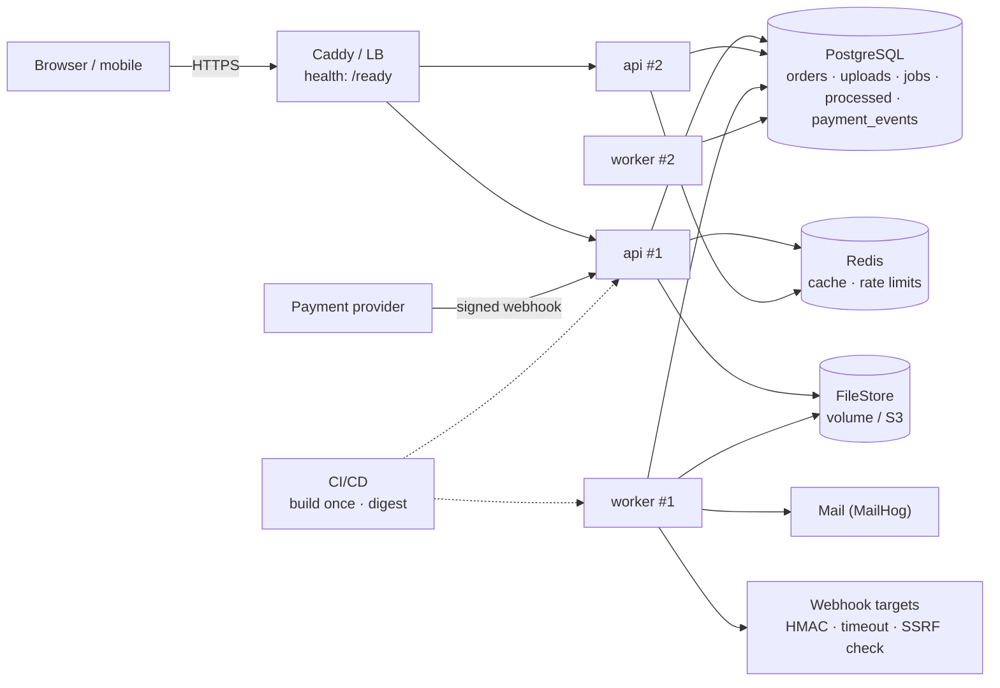
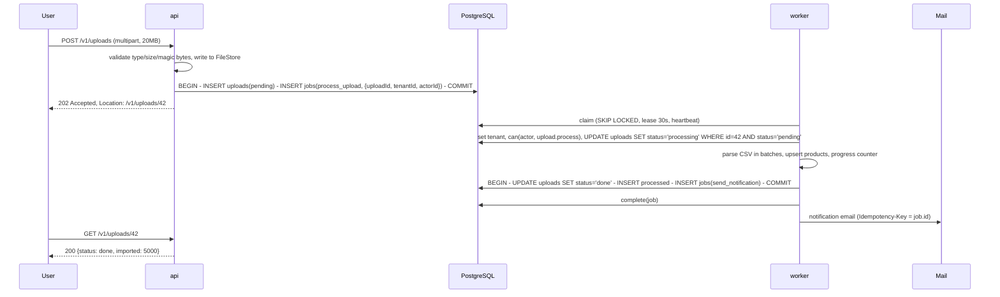

# Project 6 — Backend بمواصفات إنتاج: كاش وطابور وعامل وحاويات وCI/CD وسلوك تحت الفشل
## Project 6 — Production-style Backend: `storeapi` + Redis cache + jobs/worker + Docker Compose + pipeline + observability basics

> **المستوى:** Level 5 | **بعد:** [Project 5](../project-5-auth-app/README.md) و[M5.6](../../level-5-building-real-software/module-5.6-concurrency-business-logic.md)–[M5.13](../../level-5-building-real-software/module-5.13-cloud-fundamentals.md) | **قبل:** [Checkpoint 5](../../level-5-building-real-software/checkpoint-5.md)
> **المدة المقترحة:** 25–35 ساعة صافية على خمس مراحل.
> **قاعدة:** الطابور على **PostgreSQL** أولًا (M5.9) — Redis للكاش وحدود المعدّل فقط؛ لا BullMQ/SQS قبل أن تكتب ACTRR يبرّرهما. كل شيء يعمل بـ `docker compose up` من صفر على جهاز نظيف. **السيناريو المحوري**: `User uploads file → API accepts → queue → worker processes → notify`. AI مفيد لتوليد سيناريوهات الفشل ومراجعة Dockerfile/pipeline **بعد** أن تمرّ على lint الذي تكتبه.

---

## 1. المشكلة (Problem)

Project 5 تطبيق صحيح وآمن… على جهازك، بعملية واحدة، مع DB تعمل دائمًا. الإنتاج مختلف: نسخ متعدّدة تُطلق وتُقتل عند كل نشر، DB تبطئ أحيانًا، مزوّد البريد يسقط ساعة، Redis يختفي، webhook يصل مرتين، worker ينهار منتصف وظيفة، والمستخدم يرفع ملف 50 MB ولا يريد الانتظار. هذا المشروع يحوّل `storeapi` إلى **backend إنتاجي**: هيكل M5.7 (تهيئة، مهل، pool، health/ready، إيقاف رشيق)، كاش بسياسة، عمل خلفي بـ outbox وat-least-once وDLQ، صورة Docker إنتاجية وCompose للنظام كله، pipeline يبني مرة وينشر بالـ digest، وسجلات/مقاييس تكفي لتشخيص الحوادث. ثم تُجري **تمارين فشل** موثّقة تثبت أن النظام يتدهور بلطف بدل أن ينهار.

تبني على **خمس مراحل**:

| المرحلة | الموضوع | الهدف |
|---|---|---|
| **S1 — Production skeleton** | M5.7 | config مُتحقَّقة، مهل كل طبقة، pool محسوب، `/health` ≠ `/ready`، SIGTERM رشيق، سجلات JSON بـ requestId، مقاييس أساسية |
| **S2 — Cache** | M5.8 | `KV` port + Redis adapter، cache-aside بمفاتيح بالمستأجر والإصدار، SWR + single-flight، إبطال بعد COMMIT، تدهور عند سقوط Redis، HTTP caching |
| **S3 — Jobs & worker** | M5.9, M5.6 | جدول `jobs` + outbox، claim بـ SKIP LOCKED + lease، retry/backoff/DLQ، معالجات idempotent تحمل السياق، worker بإيقاف رشيق، سيناريو الرفع كاملًا |
| **S4 — Containers & pipeline** | M5.11, M5.12, M5.10 | Dockerfile multi-stage غير root مع tini وHEALTHCHECK، Compose (api/worker/postgres/redis/migrate/mailhog)، CI بخدمات حقيقية، بناء الصورة مرة، نشر staging بالـ digest + smoke، deploy.sh/rollback |
| **S5 — Failure drills & ops** | M5.7–M5.13 | 8 تمارين فشل موثّقة بالأرقام، runbook، لوحة SQL للطابور، نموذج تكلفة وقرار منصّة (ADR) |

**النموذج:** `Application → Database → Cache → Queue → Worker → External Services`، وكل سهم فيه له مهلة وسلوك فشل معروف.

## 2. المتطلبات (Requirements)

### Functional
| # | المتطلب | المرحلة |
|---|---|---|
| F1 | `config.ts` بمخطّط (M5.7 §6): كل متغيّر بنوع ونطاق وافتراضي؛ فشل بكل الأخطاء دفعة واحدة؛ `redacted()` في سجل الإقلاع | S1 |
| F2 | مهل: `headersTimeout`/`requestTimeout`/`keepAliveTimeout` (> LB)، حدّ الجسم أثناء القراءة، `connectionTimeoutMillis`، `statement_timeout`/`lock_timeout`/`idle_in_transaction_session_timeout` على الجلسة، `AbortSignal.timeout` لكل `fetch` خارجي، مهلة لكل وظيفة | S1 |
| F3 | `/health` (حيّ، بلا تبعيات، يعيد loop lag وrss) و`/ready` (DB `SELECT 1` بمهلة 1s + إصدار المخطّط ≥ المطلوب؛ Redis **ليس** شرطًا)؛ 503 أثناء الإيقاف | S1 |
| F4 | SIGTERM: ready=false → drain (3s في الإنتاج) → close + sweep keep-alive → انتظار الجاري ≤ 20s → worker ينهي وظيفته الحالية أو يُرجعها → `pool.end()` → exit 0/1 | S1 |
| F5 | سجلات JSON إلى stdout: `t, level, msg, requestId, tenantId?, userId?, ms, status`؛ لا PII/أسرار؛ access log لكل طلب؛ `X-Build-SHA` في رأس الاستجابة ومن التهيئة | S1 |
| F6 | مقاييس (`/metrics` بصيغة Prometheus نصية بسيطة أو سجل دوري): طلبات/ثانية وp50/p99 لكل مسار، أخطاء 5xx، pool total/idle/waiting، cache hit ratio، عمق الطابور وعمر أقدم وظيفة، DLQ | S1–S3 |
| F7 | `KV` port + `MemoryKV` + `RedisKV` (ioredis: `commandTimeout: 100`, `enableOfflineQueue: false`, `maxRetriesPerRequest: 1`)؛ أي خطأ من Redis = miss مسجَّل ومعدود، لا فشل للطلب | S2 |
| F8 | cache-aside لـ `GET /v1/products` (قائمة/تفاصيل) و`GET /v1/me` بمفاتيح `v{n}:t:{tenant}:…` مع TTL + jitter + SWR + single-flight؛ negative caching للتفاصيل غير الموجودة؛ إبطال `DEL` **بعد COMMIT** في كل كتابة على المنتجات؛ bump إصدار للمستأجر عند الاستيراد الجماعي | S2 |
| F9 | حدود المعدّل (من Project 5) تنتقل إلى Redis `INCR`+`EXPIRE` لتعمل عبر النسخ؛ عند سقوط Redis: fail-open مع تسجيل (ACTRR: لماذا ليس fail-closed هنا؟ وأين يجب أن يكون fail-closed؟) | S2 |
| F10 | HTTP caching: `Cache-Control: private, no-store` افتراضيًا لكل مسار مصادق؛ `public, max-age=300, stale-while-revalidate=60` + `ETag`/304 لكتالوج عام؛ اختبار يمسح المسارات ويتحقق من الرؤوس | S2 |
| F11 | جدول `jobs` (M5.9 §6) + `processed`؛ `enqueue(client, …)` داخل نفس معاملة الكتابة التجارية؛ `PgQueue` بـ claim ذري، lease، heartbeat، `fail` بتصنيف عابر/دائم وbackoff+jitter بسقف، `dead`، `retryDead`، `metrics()` | S3 |
| F12 | `Worker` بتزامن محدود، مهلة لكل وظيفة، إيقاف رشيق، سجل لكل وظيفة (jobId, type, attempt, ms, outcome)؛ يعمل كعملية منفصلة (`dist/worker.js`) من نفس الصورة | S3 |
| F13 | معالجات idempotent تحمل `{tenantId, actorId, requestId}` وتعيد التفويض بـ `can()` وتضبط RLS: `send_receipt` (بريد عبر MailHog، `Idempotency-Key = job.id`)، `process_upload` (أدناه)، `deliver_webhook` (HMAC `ts.body`، مهلة 5s، SSRF check من Project 5، إعادة على 5xx/مهلة، DLQ على 4xx)، `export_orders` (CSV إلى تخزين الملفات) | S3 |
| F14 | **سيناريو الرفع**: `POST /v1/uploads` يتحقق (نوع/حجم/magic bytes، Project 5) ويحفظ الملف في تخزين (مجلد volume محليًا خلف port `FileStore`؛ S3 presigned كـ adapter اختياري) ويدرج `uploads(status='pending')` + وظيفة `process_upload` في معاملة واحدة ويعيد **202** مع `Location: /v1/uploads/{id}`؛ العامل يعالج (مثلًا توليد thumbnail/تحليل CSV للمنتجات)، يحدّث `status` بانتقال بشرط، ويُدرج `send_notification`؛ `GET /v1/uploads/{id}` يعرض الحالة والنتيجة أو الخطأ | S3 |
| F15 | استقبال webhook من "مزوّد دفع" وهمي: `POST /v1/webhooks/payments` بتوقيع HMAC + نافذة ±5 دقائق + `event_id` فريد (`ON CONFLICT DO NOTHING`) → وظيفة؛ التكرار يعيد 200 بلا أثر | S3 |
| F16 | Dockerfile (M5.11 §6) يمرّ على `dockerfile-lint`: multi-stage، أساس بالـ digest، `npm ci`، `USER node`، tini، exec-form، HEALTHCHECK، `--max-old-space-size` من حدّ الحاوية؛ الصورة < 200 MB؛ نفس الصورة لـ api/worker/migrate | S4 |
| F17 | `compose.yaml` (+ override للتطوير): postgres (volume، healthcheck)، redis (allkeys-lru)، migrate (خطوة منفصلة)، api (ports، `stop_grace_period: 30s`، `read_only`, `cap_drop`, حدود ذاكرة)، worker ×2 (`stop_grace_period: 60s`)، mailhog؛ `docker compose up` من صفر → `/ready` 200 خلال ≤ 60s | S4 |
| F18 | CI (M5.12 §6/§7): فحوص سريعة متوازية (typecheck/lint/unit/dockerfile-lint/secrets)، متكاملة بخدمات postgres+redis، `npm audit --audit-level=high`، بناء الصورة مرة بالـ SHA على `main`، فحص الصورة، دفع، نشر staging بالـ **digest** عبر `deploy.sh` + `smoke.sh` (مسار حقيقي + بوابة أمن + `X-Build-SHA`)، `permissions` دنيا، actions بالـ SHA، `concurrency` صحيح | S4 |
| F19 | `migrate.ts` بقفل `try_advisory_lock`، checksum، `lock_timeout`، `-- no-transaction` لـ CONCURRENTLY؛ `deploy.sh` ذري بالرابط الرمزي مع rollback بأمر (VM) **أو** نشر إلى PaaS بالـ digest — أحدهما فعليًا على staging حقيقي (VPS رخيص أو طبقة مجانية) | S4 |
| F20 | `docs/failure-drills.md`: 8 تمارين (§7) كل منها: الفرضية، كيفية الحقن، الملاحظة بالأرقام (p99، أخطاء، عمق الطابور)، ما تدهور وما انهار، الإصلاح إن لزم، واختبار آلي يعيد إنتاجه حيث أمكن | S5 |
| F21 | `docs/runbook.md`: كيف تقرأ `/ready` وpool وطابور وDLQ، 10 أعراض شائعة → أوامر التشخيص → الإجراء؛ لوحة SQL للطابور؛ أوامر إعادة DLQ؛ إجراء rollback | S5 |
| F22 | `docs/platform-adr.md`: نموذج تكلفة (M5.13 §7) لليوم و×10، خريطة النظام على لبنات السحابة، جدول IAM بأقل صلاحية مفحوص بـ `lintPolicy`، قرار المنصّة بـ ACTRR | S5 |

### Non-Functional
| # | المتطلب |
|---|---|
| N1 | `autocannon -c 100 -d 30` على `GET /v1/products` (كاش دافئ): p99 ≤ 25ms، hit ratio ≥ 90%، صفر 5xx؛ بكاش بارد/Redis ساقط: p99 ≤ 120ms، صفر 5xx |
| N2 | نشر rolling محلي (نسختان خلف Caddy) تحت `autocannon` مستمرّ: **0 أخطاء** غير 2xx/4xx متوقّعة |
| N3 | عمر أقدم وظيفة في الحالة الطبيعية ≤ 5s؛ 1,000 وظيفة `send_receipt` تُستهلك بعاملين خلال ≤ 60s؛ صفر ازدواج في `processed` |
| N4 | pipeline للـ PR ≤ 8 دقائق؛ CD إلى staging ≤ 15 دقيقة؛ rollback ≤ 2 دقيقة |
| N5 | لا سر في الصورة (`docker history` + grep)، لا PII في السجلات (اختبار يمسح السجل)، الصورة بلا ثغرات HIGH/CRITICAL ذات إصلاح |

### Constraints
- Node 22، TypeScript strict، PostgreSQL 16، Redis 7؛ `pg` خام؛ `ioredis`؛ لا إطار طوابير؛ إطار HTTP حرّ (نفس Project 5).
- الاختبارات المتكاملة على خدمات حقيقية (Compose محليًا، services في CI) — لا mocks لـ DB/Redis؛ fakes للـ ports الخارجية (بريد، webhook target، FileStore).

### Assumptions
- بيئة staging حقيقية واحدة متاحة (VPS ~5$ أو PaaS مجاني)؛ الإنتاج الفعلي اختياري.
- التخزين المحلي للملفات (volume) مقبول؛ S3 adapter اختياري.

### Out of scope
- Kubernetes (قراءة manifest فقط في M5.13)، تتبّع موزّع (L6-M6.6)، multi-region، autoscaling حقيقي، BullMQ/SQS (ACTRR فقط).

## 3. معايير القبول (Acceptance Criteria)

| # | Given | When | Then |
|---|---|---|---|
| AC1 | S1 | إقلاع بلا `DATABASE_URL` وبـ `PORT=abc` | خروج 1 فورًا برسالة تذكر **كلا** الخطأين؛ سجل الإقلاع لا يحوي أي سر |
| AC2 | S1 | `POST /slow` جارٍ (pg_sleep 2s) ثم SIGTERM | `/ready` → 503 فورًا؛ الطلب الجاري يكتمل 200؛ اتصال جديد يُرفض؛ `pool.end()` ثم exit 0 خلال < 5s؛ السجل يُظهر `shutdown: start … done` |
| AC3 | S1 | DB موقوفة | `/health` 200؛ `/ready` 503 خلال ≤ 1.2s؛ `GET /v1/products` 503 Problem Details خلال ≤ 2.5s (connectionTimeout) لا تعليق؛ عند عودة DB يتعافى بلا إعادة تشغيل |
| AC4 | S1 | استعلام يتجاوز `statement_timeout` | 504 خلال ≤ 1.5× المهلة؛ الاتصال يعود سليمًا إلى pool (`/ready` 200 بعدها) |
| AC5 | S2 | 200 طلب متزامن لمفتاح بارد | استعلام DB **واحد** (عدّاد الاستعلامات/`pg_stat_statements`)؛ `coalesced = 199` |
| AC6 | S2 | `PATCH /v1/products/{id}` ثم `GET` فورًا من نسخة أخرى | القيمة الجديدة (إبطال بعد COMMIT عبر Redis المشترك)؛ اختبار "DEL قبل COMMIT" المعاكس يُظهر القيمة القديمة (أبقه كاختبار توثيقي معطّل بـ `skip` مع الشرح) |
| AC7 | S2 | `docker compose stop redis` أثناء `autocannon` | صفر 5xx؛ p99 يرتفع لكن ≤ 120ms؛ `cache.errors` يزيد؛ السجل يُظهر "cache get failed → miss" بلا طوفان (معدّل ≤ 1/ثانية لكل نوع) ؛ `/ready` يبقى 200؛ عند عودة Redis يعود hit ratio ≥ 90% خلال دقيقة |
| AC8 | S2 | مستخدم عضو في مستأجرين يبدّل المستأجر | لا قيمة من المستأجر الأول تظهر (المفتاح يحوي tenant)؛ اختبار يؤكد اختلاف المفتاح |
| AC9 | S3 | `POST /v1/orders` حيث يفشل الإدراج في `jobs` عمدًا (قيد) | لا طلب ولا وظيفة (معاملة واحدة)؛ والعكس: ROLLBACK بعد enqueue لا يترك وظيفة |
| AC10 | S3 | 1,000 وظيفة + 3 عمّال × تزامن 5 | كل وظيفة `done` مرة؛ `processed` بلا تكرار؛ عمر أقدم وظيفة يعود إلى ~0 |
| AC11 | S3 | `kill -9` لعامل منتصف `process_upload` (lease 30s) | بعد ≤ 35s تُستعاد وتُنفَّذ بعامل آخر؛ الأثر النهائي مرة واحدة (`uploads.status` انتقال بشرط + `processed`)؛ السجل يُظهر `[lease expired]` |
| AC12 | S3 | مزوّد البريد (MailHog) موقوف 2 دقيقة ثم يعود | الوظائف تفشل عابرًا بـ backoff (المحاولات 1→2→3 بفواصل متزايدة)، لا DLQ، ثم تنجح كلها؛ طلبات `POST /orders` طوال ذلك 201 بزمن طبيعي |
| AC13 | S3 | `deliver_webhook` إلى هدف يعيد 500 ×5 ثم 200؛ وآخر يعيد 400 | الأول ينجح في المحاولة 6؛ الثاني `dead` بعد محاولة واحدة بـ `PermanentError`؛ الهدف يستلم توقيع HMAC صالحًا ويرفض المعدَّل |
| AC14 | S3 | رفع CSV 20 MB بـ 5,000 منتج | 202 خلال ≤ 500ms؛ `GET /v1/uploads/{id}` يتدرّج pending → processing → done مع عدّاد؛ المنتجات موجودة؛ إشعار واحد؛ إعادة الرفع لنفس الملف (نفس hash) 200 بلا معالجة مزدوجة |
| AC15 | S3 | نفس حدث webhook الدفع يصل 3 مرات (منها متزامنتان) | 200 ×3؛ صف واحد في `payment_events`؛ وظيفة واحدة؛ توقيع قديم (> 5 دقائق) أو خاطئ → 401 |
| AC16 | S3 | SIGTERM للعامل أثناء وظيفة 10s | يكمل الوظيفة (أو يُرجعها بـ `release` إن تجاوزت المهلة) ثم يخرج 0؛ لا وظيفة تبقى `running` بعد خروجه |
| AC17 | S4 | `docker compose up -d --build` على جهاز نظيف | خلال ≤ 60s: migrate نجح، api healthy، worker ×2، `curl localhost:8080/ready` 200؛ `docker compose stop api` يُظهر إيقافًا رشيقًا؛ الصورة < 200 MB؛ `whoami` = node |
| AC18 | S4 | PR يكسر النوع / يضيف `FROM node:latest` / يطبع سرًّا | يفشل في الوظيفة الصحيحة خلال ≤ 3 دقائق برسالة واضحة؛ PR سليم: أخضر ≤ 8 دقائق |
| AC19 | S4 | دمج في `main` | صورة واحدة بالـ SHA تُبنى وتُفحص وتُدفع؛ staging يُنشر بالـ **digest** (السجل يُظهره)؛ `smoke.sh` يتحقق من `X-Build-SHA` = SHA الـ commit؛ إعادة تشغيل `workflow_dispatch` بـ SHA سابق تُرجع الإصدار السابق خلال ≤ 2 دقيقة |
| AC20 | S4 | نسختان محليًا خلف Caddy + `autocannon` 60s + نشر rolling (أوقف/حدّث واحدة ثم الأخرى) | 0 أخطاء اتصال/5xx؛ `X-Build-SHA` يتبدّل تدريجيًا |
| AC21 | S5 | `docs/failure-drills.md` | 8 تمارين بأرقام قبل/بعد؛ ≥ 2 منها كشفا عيبًا حقيقيًا أُصلح مع اختبار؛ كل تمرين يذكر ما يراه المستخدم |
| AC22 | S5 | زميل يقرأ `runbook.md` فقط ويواجه "عمر أقدم وظيفة 20 دقيقة" | يصل إلى الأمر الصحيح والإجراء خلال ≤ 10 دقائق بلا سؤالك |

## 4. المفاهيم المطبّقة (Concepts Applied)

| المفهوم | الوحدة | أين |
|---|---|---|
| تهيئة fail-fast، مهل كل طبقة، pool محسوب، `/health` ≠ `/ready`، SIGTERM رشيق، 12-Factor | M5.7 | S1, AC1–AC4 |
| `KV` port، cache-aside، مفاتيح بالمستأجر/الإصدار، SWR + single-flight، `DEL` بعد COMMIT، تدهور، HTTP caching | M5.8 | S2, AC5–AC8, N1 |
| outbox، claim SKIP LOCKED، lease/heartbeat، at-least-once ⇒ idempotent، تصنيف الأخطاء، DLQ، worker رشيق | M5.9 | S3, AC9–AC16, N3 |
| تحديث ذري بشرط، `ON CONFLICT`, `processed`, سباقات webhook | M5.6 | AC11, AC14, AC15 |
| HMAC webhook ±5 دقائق + event-id، T-15 العامل يعيد التفويض، SSRF | M5.5, M5.4 | F13, F15, AC13 |
| Dockerfile إنتاجي، Compose بـ healthchecks/grace/limits، 0.0.0.0، volumes | M5.11 | S4, AC17 |
| build once بالـ digest، بوابات، services حقيقية، OIDC/permissions/SHA pins، smoke | M5.12 | S4, AC18–AC19 |
| artifact، هجرات بقفل وchecksum، deploy ذري، rolling، rollback، feature flags | M5.10 | F19, AC19–AC20 |
| خريطة السحابة، IAM أقل صلاحية، التكلفة كمقياس، ADR المنصّة | M5.13 | F22 |
| Problem Details/requestId، المصادقة والتفويض وRLS، نموذج التهديد | M5.1–M5.5, Project 5 | موروث ومُمدَّد (العامل) |

## 5. التصميم (Design)

**القرارات الرئيسية (ACTRR في `docs/decisions.md`):**
1. الطابور على PostgreSQL (outbox أصيل، بلا مكوّن إضافي، مرئي بـ SQL) — ومتى تنتقل إلى وسيط (حجم، fan-out، عزل الحمل).
2. Redis اختياري بالتصميم: ليس في `/ready`، كل خطأ miss، rate limit fail-open مع تسجيل.
3. نفس الصورة لثلاث عمليات (api/worker/migrate) بأوامر مختلفة — artifact واحد، تهيئة مختلفة.
4. الهجرات خطوة منفصلة قبل api/worker في Compose وفي CD؛ readiness مرتبط بإصدار المخطّط.
5. التدفّق الحساس (الدفع) يمرّ بـ webhook موقّع + event-id + وظيفة؛ المعالجة لا تثق بالحمولة بل تقرأ من المزوّد/DB طازجًا.

## 6. خطة التنفيذ (Implementation Plan)

| الخطوة | المخرج | تحقق |
|---|---|---|
| 1 | `config.ts` + `app.ts` (مهل، حدود، health/ready، shutdown) + `main.ts` + `createPool` بمهل الجلسة؛ سجل JSON؛ `X-Build-SHA` | AC1–AC4 (اختبارات M5.7 §7 مُكيَّفة) |
| 2 | مقاييس أساسية + عدّاد الاستعلامات (من Project 4) + `/metrics` | F6؛ لوحة بسيطة (حتى `watch curl`) |
| 3 | `kv.ts` + `RedisKV` + `cache.ts` (SWR/single-flight/negative/degrade) + مفاتيح؛ cache-aside على المنتجات و`/me`؛ إبطال بعد COMMIT في use cases | AC5, AC6, AC8؛ N1 بـ autocannon |
| 4 | rate limiter على Redis fail-open؛ `Cache-Control`/ETag بحسب المسار + اختبار المسح | F9, F10 |
| 5 | `schema` للطابور + `outbox.ts` + `queue.ts` + `worker.ts` + `handlers/*`؛ `dist/worker.js`؛ `send_receipt` أولًا | AC9, AC10, AC12, AC16 |
| 6 | سيناريو الرفع كاملًا (`FileStore` port + volume adapter، `uploads`، `process_upload` بدفعات وتقدّم، `send_notification`) | AC11 (kill -9)، AC14 |
| 7 | webhooks: استقبال موقّع (`payment_events` + event-id) وإرسال (`deliver_webhook` بـ HMAC/SSRF/تصنيف) | AC13, AC15 |
| 8 | Dockerfile + `.dockerignore` + `dockerfile-lint` + `compose.yaml` + override + mailhog؛ `--max-old-space-size`؛ اختبار "من صفر" | AC17, N5 |
| 9 | `ci.yml` (fast matrix + integration services + audit) و`cd.yml` (build once → scan → push → staging بالـ digest → smoke)؛ `migrate.ts` بقفل/checksum؛ `deploy.sh`/PaaS + `smoke.sh` | AC18, AC19, N4 |
| 10 | rolling محلي بنسختين خلف Caddy تحت حمل؛ rollback بـ SHA | AC20, N2 |
| 11 | 8 تمارين فشل (§7) → إصلاحات → اختبارات؛ `runbook.md`؛ لوحة SQL | AC21, AC22 |
| 12 | نموذج التكلفة + خريطة السحابة + IAM + ADR المنصّة؛ تسليم | F22 |

## 7. التحديات المدمجة (Built-in Challenges) — تمارين الفشل

لكل تمرين: **فرضية مكتوبة قبل الحقن** ("أتوقّع: p99 ≤ X، صفر 5xx، الطابور يتراكم ثم يُصرَّف")، ثم الحقن تحت `autocannon`، ثم الأرقام، ثم "ما يراه المستخدم"، ثم الإصلاح + اختبار.

### 7.1 Failure — "DB بطيئة" (M5.7)
`docker compose exec postgres` + `pg_sleep` عبر `ALTER ROLE app SET statement_timeout`؟ لا — احقن تأخيرًا حقيقيًا: `tc qdisc` داخل حاوية postgres (أو proxy مثل Toxiproxy بـ latency 800ms). راقب: pool waiting، p99، هل تتراكم الطلبات حتى تنفد الاتصالات؟ هل تعيد 503/504 بسرعة أم تعلّق؟ الإصلاح المتوقّع: `connectionTimeoutMillis` و`statement_timeout` يحوّلان التعليق إلى فشل سريع؛ الكاش يحمي القراءات.

### 7.2 Failure — "Redis ساقط" (M5.8)
`docker compose stop redis` 3 دقائق تحت حمل. راقب 5xx (يجب صفر)، p99، سجل الأخطاء (طوفان؟ أضف تحديد معدّل للتسجيل)، rate limiter (fail-open مسجَّل)، `/ready` (يبقى 200). ثم `start` وراقب التعافي وتدافع التسخين (هل احتجت SWR أطول أو تسخينًا؟).

### 7.3 Failure — "مزوّد البريد ساقط ساعة" (M5.9)
أوقف MailHog، أرسل 500 طلب. راقب: الطلبات 201 بزمن طبيعي؛ الطابور يتراكم؛ backoff يمنع عاصفة إعادة (عدّ المحاولات/دقيقة)؛ لا DLQ؛ `oldest_queued_s` يرتفع (تنبيه!). أعد التشغيل: كم أخذ التصريف؟ هل احتجت رفع التزامن مؤقتًا؟ ماذا لو كان الحدّ 5 محاولات وbackoff يصل سقفه قبل الساعة؟ (اضبط max_attempts/السقف لهذا النوع.)

### 7.4 Failure — "webhook مكرّر ومتأخّر" (M5.5/M5.6)
أرسل نفس حدث الدفع 10 مرات متزامنة + مرة بعد 6 دقائق + مرة بتوقيع معدَّل. النتيجة: صف واحد، وظيفة واحدة، 401 للمتأخّر والمعدَّل. ثم العكس: webhook **صادر** إلى هدف يعيد 200 بعد 6 ثوانٍ (أطول من مهلتك 5s): ستعيد المحاولة ويستلم الهدف مرتين — هل يستطيع الهدف التمييز؟ (event-id في الحمولة + توثيق "idempotent consumers" في `openapi.yaml` للعملاء.)

### 7.5 Failure — "العامل ينهار منتصف الوظيفة" (M5.9)
`docker compose kill -s KILL worker` أثناء `process_upload` لملف كبير (بعد أن استورد 2,000 من 5,000). راقب: الاستعادة بعد الـ lease، هل المنتجات 2,000 الأولى تتكرّر؟ (upsert بمفتاح طبيعي `sku` + دفعات في معاملات = idempotent)، هل عدّاد التقدّم صحيح؟ ثم جرّب SIGTERM بدل KILL وقارن (رشيق: يكمل أو يُرجع).

### 7.6 Failure — "المهلة في المكان الخطأ" (M5.7)
اضبط مهلة الـ LB (Caddy `read_timeout`) على 2s ومهلة الطلب الداخلي 15s. أرسل طلب تصدير يأخذ 5s: العميل يرى 502/504 بينما العمل مستمرّ ويُكمل (أثر بلا استجابة). أصلح بقاعدة "الخارجي > مجموع الداخلي" أو بتحويل التصدير إلى 202 + وظيفة (الأصح). وثّق لماذا الثانية أفضل.

### 7.7 Failure — "نشر منتصف الذروة" (M5.10)
rolling بنسختين تحت حمل مع وظيفة طويلة في العامل: هل تسقط طلبات (drain غير كافٍ؟ keep-alive sweep؟)، هل تُقتل الوظيفة (grace 60s كافٍ؟)، هل الهجرة (أضف عمودًا) كسرت النسخة القديمة؟ اجعل التمرين اختبار CI إن أمكن (نسختان في Compose + autocannon + تبديل).

### 7.8 Failure — "امتلاء القرص/الذاكرة" (M5.7/M5.11)
حدّ ذاكرة الحاوية 256M وارفع ملفات كبيرة متوازية: هل يُقتل الـ api بـ 137 (الجسم يُقرأ كاملًا في الذاكرة؟ → تيّار إلى FileStore مع حدّ أثناء القراءة)؛ وامتلاء volume الملفات: هل يفشل الرفع برسالة واضحة 507 أم يترك `uploads` معلّقة؟ أضف فحص مساحة إلى `/ready`؟ (ACTRR: لا — تنبيه لا readiness.)

### 7.9 اختياري — Architecture — "الانتقال إلى وسيط رسائل"
صمّم (بلا تنفيذ كامل) نقل `deliver_webhook` إلى SQS/RabbitMQ مع الإبقاء على outbox: relay، visibility timeout = lease، DLQ المُدار، ما يتغيّر في runbook والمقاييس، والتكلفة. ونفّذ relay بسيطًا إلى Redis Streams كـ spike لقياس الفرق.

## 8. المخرجات (Deliverables)

1. مستودع Git بوسوم `s1`–`s5`؛ `docker compose up` من صفر يعمل؛ `npm run migrate | serve | worker | test | test:integration | drill:<name>`.
2. `Dockerfile`, `.dockerignore`, `compose.yaml` (+ override), `.github/workflows/{ci,cd}.yml`, `scripts/{deploy.sh,smoke.sh,dockerfile-lint}`; staging حقيقي يعمل (رابط في README) بـ `X-Build-SHA`.
3. `docs/decisions.md` (ACTRR ×5 + 7.9)، `docs/failure-drills.md` (8 تمارين بالأرقام)، `docs/runbook.md`، `docs/platform-adr.md` (تكلفة/خريطة/IAM/قرار)، تحديث `threat-model.json` بالعامل والويبهوك.
4. اختبارات ≥ 90 (منها ≥ 30 متكاملة على postgres+redis، ≥ 10 تزامن/فشل) تمرّ في CI؛ تقرير `autocannon` قبل/بعد الكاش ومع Redis ساقط؛ قياس 1,000 وظيفة.
5. تسجيل شاشة/أسطر أوامر قصيرة لـ: إيقاف رشيق، kill -9 للعامل والاستعادة، rolling بلا أخطاء، rollback بـ SHA.

## 9. قائمة المراجعة الذاتية (Self-Review Checklist)

- [ ] هل يوجد انتظار بلا مهلة في أي طبقة (`fetch`، pg، redis، وظيفة، LB)؟ هل الخارجي > مجموع الداخلي؟ هل keepAlive > LB؟
- [ ] `/health` بلا تبعيات؟ `/ready` بالتبعيات الحرجة فقط (Redis ليس منها)؟ SIGTERM يصرّف ويغلق keep-alive ويُنهي الوظيفة؟
- [ ] هل كل مفتاح كاش يحوي المستأجر وكل ما يغيّر النتيجة والإصدار؟ `DEL` بعد COMMIT؟ TTL + jitter؟ SWR + single-flight على الساخن؟ هل أي قرار كتابة يُتخذ من قيمة كاش؟
- [ ] هل كل `enqueue` داخل نفس معاملة الكتابة؟ هل كل معالج يجيب "ماذا لو نُفّذ مرتين؟" بآلية ملموسة؟ هل يصنّف الأخطاء؟ هل يعيد التفويض ويقرأ طازجًا؟
- [ ] lease > أسوأ زمن تنفيذ أو heartbeat؟ مهلة لكل وظيفة أقل من الـ lease؟ DLQ له تنبيه ومالك وأمر إعادة في runbook؟
- [ ] الصورة: digest، multi-stage، node، tini، exec-form، HEALTHCHECK، < 200 MB، بلا أسرار في `history`؟ 0.0.0.0؟ `stop_grace_period` كافٍ للعامل؟
- [ ] pipeline: build once؟ النشر بالـ digest؟ `permissions` دنيا؟ actions بالـ SHA؟ services حقيقية؟ smoke يمثّل المستخدم ويتحقق من `X-Build-SHA`؟ rollback مجرّب؟
- [ ] الهجرات: خطوة منفصلة، متوافقة للخلف، بقفل وchecksum وlock_timeout؟ readiness مرتبط بإصدار المخطّط؟
- [ ] السجلات: JSON، requestId في كل سطر، لا PII/أسرار، معدّل محدود عند الأعطال؟ المقاييس تجيب "أين الانتظار؟" خلال دقيقة؟
- [ ] هل كل تمرين فشل له **فرضية قبل** الحقن ورقم بعده؟ هل ما كشفه صار اختبارًا؟ هل يستطيع زميل تشغيل كل شيء من README وrunbook وحدهما؟

> بعد التسليم: [Checkpoint 5](../../level-5-building-real-software/checkpoint-5.md). ثم Level 6 حيث تتعلم تشغيل هذا النظام **مع فريق**: مراجعات الكود، RFC/ADR، الملاحظية (observability) الكاملة، والاستجابة للحوادث — وProject 7 يفكّكه إلى خدمات مع فشل مقصود.
